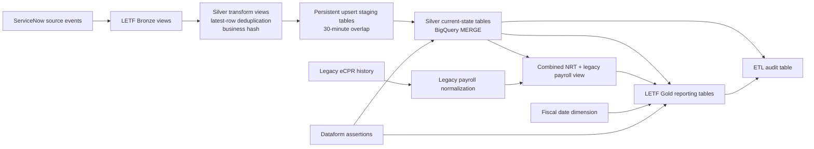

# LETF Data Warehouse Reference Implementation

This directory contains the **Labor Enforcement Task Force (LETF)** Dataform implementation. It transforms ServiceNow-aligned Bronze views and legacy eCPR payroll history into standardized Silver entities and Gold reporting tables for contractor registration, payroll submission, compliance, awarding-body compliance, and user-account analytics.

LETF is the repository's first complete project implementation and serves as a **reference for other projects**. Its structure, dependency practices, audit patterns, and assertions may be reused. Its entity schemas, Type 1 upsert pattern, business rules, source-system assumptions, and reporting logic are LETF-specific and must not be copied to another project without requirements analysis.

For shared repository conventions, see the [root README](../../README.md). For the project-folder contract, see [`definitions/README.md`](../README.md).

---

## Table of contents

- [Scope](#scope)
- [Architecture](#architecture)
- [LETF datasets and environment naming](#letf-datasets-and-environment-naming)
- [Directory structure](#directory-structure)
- [Processing pattern](#processing-pattern)
- [Bronze source declarations](#bronze-source-declarations)
- [Silver modules](#silver-modules)
- [Legacy eCPR payroll](#legacy-ecpr-payroll)
- [Gold data products](#gold-data-products)
- [Audit and assertions](#audit-and-assertions)
- [Tags and execution order](#tags-and-execution-order)
- [Maintaining LETF entities](#maintaining-letf-entities)
- [Adding a new LETF entity](#adding-a-new-letf-entity)
- [Testing](#testing)
- [Backfill and recovery](#backfill-and-recovery)
- [Operational runbook](#operational-runbook)
- [Known issues and improvement priorities](#known-issues-and-improvement-priorities)
- [LETF release checklist](#letf-release-checklist)

---

## Scope

### In scope

- declarations for ten LETF Bronze source views;
- current-state Silver entities for contractor, account, contact, project, registration, transaction, classification, craft, and payroll data;
- normalization of legacy eCPR payroll history;
- a combined legacy and near-real-time payroll view;
- Gold tables supporting registration, renewal, fees, penalties, late payroll, lapsed registration, contractor compliance, awarding-body compliance, and user accounts;
- Dataform assertions for uniqueness, nulls, values, audit counts, and selected referential integrity;
- ETL audit records used for operational history and Silver incremental watermarks.

### Out of scope

- physical creation of Bronze source views by ingestion pipelines;
- Dataflow/Data Fusion source ingestion;
- Terraform infrastructure and BigQuery IAM provisioning;
- Looker semantic models and dashboards;
- source-system correction and operational transaction processing;
- comprehensive historical Type 2 tracking for Silver entities.

---

## Architecture



### Current action inventory

The LETF directory contains 101 Dataform actions. The shared audit definition adds one more repository action.

| LETF action type | Count | Purpose |
|---|---:|---|
| Declarations | 10 | Register external Bronze source views. |
| Views | 11 | Silver transform views and the combined payroll view. |
| Operations | 28 | Silver create/upsert scripts and Gold full replacements. |
| Assertions | 50 | Data-quality checks. |
| Incremental tables | 1 | Legacy eCPR payroll normalization. |
| Tables | 1 | Fiscal date dimension. |

---

## LETF datasets and environment naming

LETF variables are currently defined in the root `dataform.json`.

| Variable | Base dataset/project | Purpose |
|---|---|---|
| `letf_source_project_id` | `prj-gcp-dir-data-whouse` | Source warehouse project base. |
| `letf_source_schema` | `ds_snow_raw_letf` | Bronze source dataset. |
| `letf_target_schema` | `dw_snow_stg_letf` | Silver target dataset. |
| `letf_curated_schema` | `dw_snow_curated_letf` | Gold LETF dataset. |
| `letf_audit_schema` | `ds_audit_letf` | ETL audit dataset. |
| `letf_audit_table` | `bq_audit_letf` | Configured audit table variable. |
| `letf_ecpr_history_schema` | `ds_ecpr_history_letf` | Legacy eCPR source-history dataset. |
| `letf_ecpr_schema` | `dw_ecpr_stg_letf` | Normalized legacy eCPR dataset. |
| `letf_ecpr_curated_schema` | `dw_ecpr_curated_letf` | Combined payroll curated dataset. |

Cloud Build passes a one-character schema suffix:

| Environment | Suffix | Example Silver dataset |
|---|---|---|
| Development | `d` | `dw_snow_stg_letf_d` |
| Test | `t` | `dw_snow_stg_letf_t` |
| Production | `p` | `dw_snow_stg_letf_p` |

### Naming caution

LETF declarations call `env.addEnv(..., "schema")`, while Dataform is also compiled with `--schema-suffix`. Inspect compiled relation names to ensure suffixes are not duplicated. The current `env.whouseCorrection()` also contains project-specific production logic and supports only `d`, `t`, and `p`.

---

## Directory structure

```text
definitions/letf/
├── README.md
├── bronze/
│   └── 10 source declarations
├── silver/
│   ├── business_profile/
│   ├── core_classification/
│   ├── core_craft/
│   ├── customer_account/
│   ├── customer_account_lookup/
│   ├── customer_contact/
│   ├── ecpr_payroll_legacy/
│   ├── ecpr_payroll_run/
│   ├── project/
│   ├── registration_dates/
│   └── transactions/
└── gold/
    ├── fiscal_date_dim.sqlx
    ├── ecpr_payroll_legacy_snow.sqlx
    ├── 8 aggregate/full-replace operations
    └── 9 uniqueness assertions
```

LETF also uses the project-specific column dictionary at:

```text
includes/letf_column_definitions.js
```

As the repository is generalized, this file should move into an LETF-owned include namespace or be split by LETF entity.

---

## Processing pattern

### Standard Silver entity

Most LETF Silver modules contain:

| File | Responsibility |
|---|---|
| `*_create.sqlx` | Creates the Silver target if it does not exist. |
| `*_transform.sqlx` | Normalizes fields, computes `business_hash`, and retains the latest row. |
| `*_upsert.sqlx` | Selects an incremental window, stages changes, MERGEs the target, and logs audit results. |
| `*_not_null_assertion.sqlx` | Checks selected required values. |
| `*_column_value_assertion.sqlx` | Detects configured invalid/null-equivalent values. |
| `*_unique_check_assertion.sqlx` | Detects duplicate configured keys. |
| `*_count_check_assertion.sqlx` | Checks audit row-balance arithmetic. |

`business_profile` also has a referential-integrity assertion.

### Current-state behavior

The standard LETF pattern is **Type 1 current state**. A target record is updated when its business fields change; prior values are not retained as historical versions.

### Business hash

Transform views calculate `business_hash` with `FARM_FINGERPRINT(TO_JSON_STRING(...))`. The following metadata is nulled before hashing so metadata-only changes normally do not trigger business updates:

- source keys/system audit fields;
- source application and business object;
- schema version;
- publish and ingestion timestamps;
- event type;
- audit processing identifiers.

When a new column is added, determine deliberately whether it is a business field that should affect the hash.

### Latest-row deduplication

Most transforms select one latest row per `sys_id`, ordered by:

1. `publish_time` descending;
2. `sys_updated_on` descending;
3. `audit_load_timestamp` descending.

Payroll uses the composite grain `sys_id + employee_row_key`.

### Incremental window

Upserts read the latest successful pipeline execution timestamp from the audit table and rescan from 30 minutes before that watermark through the current execution time.

The overlap handles modest out-of-order arrival, but events that arrive more than 30 minutes late can be missed unless separately backfilled.

### Staging and MERGE

Upserts create or replace a persistent staging table, reject duplicate MERGE keys, and execute a BigQuery `MERGE`. Persistent staging makes concurrent executions unsafe unless scheduling prevents overlap.

### Deletions

Although `event_type` is retained, the current MERGE pattern does not apply physical or soft deletes. Source deletion events can leave records in Silver indefinitely.

---

## Bronze source declarations

Bronze declarations register external views; Dataform does not create them.

| Declaration file | Source action/view | Silver module |
|---|---|---|
| `business_profile_sources.sqlx` | `v_sn_gsm_business_profile` | `business_profile` |
| `core_classification_sources.sqlx` | `v_x_cdoi2_letf_core_classification` | `core_classification` |
| `core_craft_sources.sqlx` | `v_x_cdoi2_letf_core_craft` | `core_craft` |
| `customer_account_sources.sqlx` | `v_customer_account` | `customer_account` |
| `customer_account_lookup_sources.sqlx` | `v_x_cdoi2_csm_portal_customer_account_lookup` | `customer_account_lookup` |
| `customer_contact_sources.sqlx` | `v_customer_contact` | `customer_contact` |
| `ecpr_payroll_run_sources.sqlx` | `v_x_cdoi2_letf_ecpr_payroll_run` | `ecpr_payroll_run` |
| `project_sources.sqlx` | `v_x_cdoi2_csm_portal_project` | `project` |
| `registration_dates_sources.sqlx` | `v_x_cdoi2_csm_portal_his_reg_dates` | `registration_dates` |
| `transactions_sources.sqlx` | `v_x_cdoi2_csm_portal_transaction_record` | `transactions` |

### Bronze contract maintenance

For each source change:

1. confirm the view exists in development, test, and production;
2. compare the source schema to transform expectations;
3. assess key, type, nullability, and event-time changes;
4. update the declaration/action name when necessary;
5. update downstream `${ref(...)}` calls;
6. compile all environments;
7. test valid data, malformed values, late events, replays, and deletion events;
8. notify downstream owners of contract changes.

---

## Silver modules

### Module catalog

| Module | Target table | Target grain / MERGE key | Primary role | Pipeline tag |
|---|---|---|---|---|
| `business_profile` | `sn_gsm_business_profile` | `sys_id` | Contractor and awarding-body business profile, registration, license, insurance, and address details. | `letf_business_profile_upsert_pipeline` |
| `core_classification` | `x_cdoi2_letf_core_classification` | `sys_id` | Classification reference data and craft relationships. | `letf_core_classification_upsert_pipeline` |
| `core_craft` | `x_cdoi2_letf_core_craft` | `sys_id` | Craft reference data and replacement-craft relationships. | `letf_core_craft_upsert_pipeline` |
| `customer_account` | `customer_account` | `sys_id` | Core business account, organization, hierarchy, tax, registration, and address data. | `letf_customer_account_upsert_pipeline` |
| `customer_account_lookup` | `x_cdoi2_csm_portal_customer_account_lookup` | `sys_id` | Portal account lookup and contractor registration status/details. | `letf_customer_account_lookup_upsert_pipeline` |
| `customer_contact` | `customer_contact` | `sys_id` | Contact/user identity, account relationship, login, phone, and language data. | `letf_customer_contact_upsert_pipeline` |
| `ecpr_payroll_run` | `x_cdoi2_letf_ecpr_payroll_run` | `sys_id, employee_row_key` | Employee/day-level near-real-time certified payroll data. | `letf_payroll_run_upsert_pipeline` |
| `project` | `x_cdoi2_csm_portal_project` | `sys_id` | Public-works projects, awarding bodies, dates, costs, locations, and status. | `letf_project_upsert_pipeline` |
| `registration_dates` | `x_cdoi2_csm_portal_his_reg_dates` | `sys_id` | Registration periods, status, renewal, and transaction links. | `letf_registration_dates_upsert_pipeline` |
| `transactions` | `x_cdoi2_csm_portal_transaction_record` | `sys_id` | Registration payments, penalties, renewal, perjury acceptance, and transaction status. | `letf_transactions_upsert_pipeline` |

### `business_profile`

Provides contractor/awarding-body profile information including registration periods, license and insurance attributes, physical address, verification fields, and `business_ref` to the core account.

Special control:

- referential-integrity assertion from `business_ref` to `customer_account.sys_id`;
- `BulkLoad` events are excluded from that relationship assertion.

Maintenance impacts:

- contractor registration and compliance reporting;
- account-to-profile relationship;
- licensing and insurance fields;
- new PII or regulated fields.

### `core_classification`

Provides classification reference records, craft linkage, display names, state, truth indicator, and replacement classifications.

Maintenance impacts:

- payroll classification analytics;
- replacement/reference relationships;
- reporting filters using classification state or truth values.

### `core_craft`

Provides craft reference records, names, states, footnotes, and replacement-craft values.

The MERGE additionally checks `business_hash` before updating a matched row, while most modules rely on the staging filter to remove unchanged rows.

### `customer_account`

Provides core business-account details including hierarchy, addresses, primary contact, tax and registration fields, and organization characteristics.

Recommended additional controls:

- parent account referential integrity;
- primary contact referential integrity;
- sensitive tax-identifier policy tagging;
- duplicate business identity analysis beyond `sys_id`.

### `customer_account_lookup`

Provides portal account lookup and contractor registration attributes, including PWCR, dates/status, addresses, insurance, contractor/awarding-body classification, and the core account reference.

This entity is heavily consumed by Gold registration and compliance tables. Changes to type, status, registration dates, or `customer_account_ref` require broad regression testing.

### `customer_contact`

Provides user/contact attributes including account reference, names, email, login timestamps, phone numbers, language, lockout, and VIP status.

Security focus:

- contact PII;
- controlled access to email and telephone fields;
- timezone behavior in the Gold user-account model.

### `ecpr_payroll_run`

Provides the near-real-time certified payroll entity at employee/day detail. It derives `employee_row_key` and uses the composite MERGE key `sys_id + employee_row_key`.

This is the largest and most tightly coupled entity. Any column change must remain aligned across:

- target create DDL;
- transform projection;
- staging output;
- MERGE update list;
- MERGE insert columns and values;
- legacy payroll normalization;
- combined payroll view;
- Gold compliance consumers.

Security focus includes SSN, employee identity, compensation, deductions, hours, and project relationships.

### `project`

Provides public-works projects, identifiers, awarding body, address, dates, stage/status, costs, and related project attributes.

Key downstream dependencies include late/lapsed payroll and awarding-body compliance.

### `registration_dates`

Provides historical contractor registration periods and relationships to account lookup and transactions.

Date-boundary semantics are critical. Any change must clarify whether start/end dates are inclusive and how lapse, renewal, and fiscal-year attribution are computed.

### `transactions`

Provides registration transaction records, payment and penalty values, renewal status, perjury acceptance, registration validity, and business references.

Changes to amount/status fields directly affect fee and penalty reporting.

---

## Legacy eCPR payroll

### `silver/ecpr_payroll_legacy/ecpr_payroll_legacy_transform.sqlx`

Normalizes legacy eCPR history into the same 92-column shape used by the near-real-time payroll entity.

It produces:

1. non-performance payroll rows without employee/day hours;
2. performance payroll rows aggregated by payroll number, employee, and work date.

The current filter loads source records with period-ending dates on or after January 1, 2020. A previous first-load filter remains commented in the source.

### Critical rerun limitation

The action is `type: "incremental"` but does not define a durable `uniqueKey` or an incremental-only predicate. Reexecuting it can append the configured source range again and create duplicates.

Treat it as a controlled one-time/backfill action until corrected.

### Required improvement

Choose one of these patterns:

- full controlled rebuild into a replacement table;
- MERGE by an approved composite legacy payroll key;
- partition overwrite by source date range;
- incremental model with a tested unique key and watermark.

### Combined payroll view

`gold/ecpr_payroll_legacy_snow.sqlx` creates `v_ecpr_payroll_combined` using `UNION ALL` of near-real-time Silver payroll and normalized legacy payroll.

There is no cross-source deduplication or precedence rule. If source date ranges overlap, both records remain.

Recommended additions:

- explicit `record_source`;
- source precedence;
- overlap detection assertion;
- uniqueness key that supports legacy rows with null ServiceNow metadata.

---

## Gold data products

### Fiscal date dimension

`fiscal_date_dim.sqlx` creates dates from January 1, 2000 through December 31, 2050. Fiscal years begin July 1.

It supplies calendar and fiscal year, quarter, month, week, boundary flags, and formatted keys. Review the fiscal-week formula with business owners because it is based on seven-day offsets from July 1.

### Data-product catalog

| Action | Target | Purpose | Main dependencies | Current uniqueness assertion |
|---|---|---|---|---|
| `agg_contractor_registrations_by_fiscal_year` | `contractor_registrations_by_fiscal_year` | Registration activity by fiscal year and registration record. | registration dates, account lookup, fiscal dates | `sys_id, fiscal_year, reg_sys_id` |
| `agg_contractor_registrations_renewals_v2` | `contractor_registrations_renewals_v2` | Contractor registrations and renewals by fiscal year. | account lookup, registration dates, fiscal dates | `contractor_account_lookup_ref, fiscal_year, reg_sys_id` |
| `agg_contractor_registration_fees_penalties_v2` | `contractor_registration_fees_penalties_v2` | Registration fees, renewal amounts, and penalties tied to transactions. | account lookup, transactions, registration dates, fiscal dates | `contractor_account_lookup_ref, transaction, registration_fiscal_year` |
| `agg_lapsed_contractor_ecpr_submissions` | `lapsed_contractor_ecpr_submissions` | Payroll submitted outside valid registration periods; violation and penalty days. | account lookup, registration dates, combined payroll, projects, fiscal dates, business profile | `contractor_ref, project_ref, payroll_number` |
| `agg_registered_contractors_late_ecpr_submissions` | `registered_contractors_late_ecpr_submissions` | Certified payroll submitted after the allowed interval; penalty calculation. | account lookup, combined payroll, projects, fiscal dates | `contractor_ref, project_ref, payroll_number` |
| `agg_contractor_compliance` | `contractor_compliance` | Contractor/project compliance combining lapsed and late-submission violations. | projects, payroll, account lookup, violation tables | `contractor_ref, project_ref` |
| `agg_ab_compliance` | `ab_compliance` | Awarding-body, contractor, project, payroll, and unregistered violation reporting. | projects, payroll, account lookup, lapsed table | `contractor, project_id, payroll_number` |
| `agg_user_accounts` | `user_accounts` | User/contact accounts joined to business accounts and login activity. | customer contact, customer account, account lookup | `customer_contact_ref, user_name` |

### Gold refresh behavior

The eight `agg_*.sqlx` operations:

1. create a temporary staging table;
2. count staged rows;
3. truncate the Gold target;
4. insert staged rows;
5. validate final count;
6. write an audit row.

This is not atomic. An insertion failure after truncation can leave a Gold table empty or incomplete.

Recommended publication pattern:

1. build and validate a replacement table;
2. run all assertions against the replacement;
3. atomically replace/swap the production table;
4. retain a short-lived snapshot or time-travel recovery point.

### Business-rule governance

Gold logic contains material rules such as:

- contractor status and type filters;
- excluded registration statuses;
- canceled/amended payroll exclusions;
- registration-period comparison;
- late-submission intervals;
- penalty calculations and caps;
- fiscal-year attribution;
- timezone conversion.

Every rule should have a business owner, source requirement, effective date, test fixture, and change record.

---

## Audit and assertions

### Audit table

The repository-level `definitions/audit/bq_etl_audit.sqlx` defines the ETL audit fields used by LETF operations:

- processed ID;
- pipeline name;
- source and target;
- execution timestamp;
- load type and status;
- source, pre-load, and post-load counts;
- inserted, updated, and deleted counts;
- audit-entry timestamp.

Silver uses the most recent successful execution timestamp as its incremental watermark.

### Assertion types

LETF uses:

- not-null assertions;
- invalid/null-equivalent value assertions;
- uniqueness assertions;
- one referential-integrity assertion;
- audit row-balance assertions.

### Current assertion limitations

1. Assertions execute after upserts/Gold loads and do not roll back committed changes.
2. Uniqueness assertions do not always use the same key as the MERGE.
3. Generic validators often return only a validation label, not the affected business key.
4. The count helper does not verify successful audit status and can pass failure rows containing zero counts.
5. Missing audit rows may return zero assertion rows and appear successful.
6. Sensitive values must not be exposed while improving assertion diagnostics.

### Required assertion direction

Critical validation should occur before production publication. Assertions should return sanitized but actionable identifiers and use the actual target grain.

---

## Tags and execution order

### Bootstrap tags

Run before the first normal pipeline execution in a new environment:

```text
audit-preprocessing
business_profile_create
core_classification_create
core_craft_create
customer_account_create
customer_account_lookup_create
customer_contact_create
payroll_run_create
project_create
registration_dates_create
transactions_create
```

Gold target-table creation is not currently implemented in this repository and must be provisioned separately or added as code.

### Silver pipeline tags

```text
letf_business_profile_upsert_pipeline
letf_core_classification_upsert_pipeline
letf_core_craft_upsert_pipeline
letf_customer_account_upsert_pipeline
letf_customer_account_lookup_upsert_pipeline
letf_customer_contact_upsert_pipeline
letf_payroll_run_upsert_pipeline
letf_project_upsert_pipeline
letf_registration_dates_upsert_pipeline
letf_transactions_upsert_pipeline
```

### Legacy and Gold tags

```text
letf_ecpr_payroll_legacy
letf_ecpr_payroll_legacy_snow
letf_fiscal_date_dim_pipeline
letf_contractor_registrations_by_fiscal_year_pipeline
letf_contractor_registrations_renewals_v2_pipeline
letf_contractor_registration_fees_penalties_v2_pipeline
letf_lapsed_contractor_ecpr_submissions_pipeline
letf_registered_contractors_late_ecpr_submissions_pipeline
letf_contractor_compliance_pipeline
letf_ab_compliance_pipeline
letf_user_accounts_pipeline
```

### Recommended sequence

1. Audit and Silver target bootstrap.
2. Core/reference Silver:
   - core craft;
   - core classification.
3. Account/contact Silver:
   - customer account;
   - customer contact;
   - customer account lookup;
   - business profile.
4. Operational Silver:
   - project;
   - registration dates;
   - transactions;
   - payroll run.
5. Fiscal date dimension.
6. Controlled legacy payroll backfill, when required.
7. Combined payroll view.
8. Registration, renewal, fee, late, lapsed, and user-account Gold tables.
9. Contractor compliance.
10. Awarding-body compliance.

Dataform encodes many dependencies, but create/bootstrap actions are not dependencies of the corresponding upserts.

---

## Maintaining LETF entities

### Adding a column

Update every applicable location in one change:

1. source/Bronze contract;
2. `includes/letf_column_definitions.js`;
3. existing BigQuery target through an explicit migration;
4. create DDL for future environments;
5. transform output;
6. business-hash inclusion/exclusion;
7. staging output;
8. MERGE update list;
9. MERGE insert column list;
10. MERGE insert value list;
11. assertions;
12. legacy/NRT/combined payroll branches when payroll-related;
13. Gold consumers;
14. downstream Looker models and documentation.

`CREATE TABLE IF NOT EXISTS` does not alter deployed tables.

### Changing a type

- profile existing data with `SAFE_CAST`;
- update source contract and transform;
- plan an explicit BigQuery migration;
- assess partitioning and key impact;
- test all Gold consumers;
- backfill or rebuild affected tables.

### Changing a key or grain

Treat as a data migration. Update:

- transform `ROW_NUMBER()` partition;
- stage duplicate checks;
- MERGE `ON` clause;
- target uniqueness assertions;
- downstream joins and Gold uniqueness assertions;
- existing target data and duplicate resolution.

### Changing a business rule

Record:

- business owner and approval;
- prior and new definition;
- effective date;
- expected row/count impact;
- test cases;
- downstream dashboards;
- backfill decision;
- rollback criteria.

### Sensitive data

LETF includes contact, tax, employee, SSN, compensation, deduction, and address data. Confirm:

- BigQuery column policy tags;
- authorized views or row-level controls;
- least-privilege service accounts;
- Gold field minimization;
- no sensitive values in assertion/audit errors;
- approved retention and deletion rules.

---

## Adding a new LETF entity

1. Define source object, owner, schema, volume, key, event timestamp, and deletion behavior.
2. Add a Bronze declaration.
3. Create the Silver target DDL.
4. Create a transform with typed fields, business hash, and latest-row logic.
5. Create an upsert with a controlled watermark, isolated staging, duplicate validation, MERGE, and audit.
6. Add assertions for required values, exact target grain, values, and relationships.
7. Add Gold models only when a reusable approved business product is required.
8. Add tags and explicit dependencies.
9. Add development fixtures for first load, replay, update, delete, duplicate, null, late event, and failure.
10. Update this README and downstream contracts.

Do not automatically use the 30-minute Type 1 pattern. Confirm whether the entity needs Type 2 history, append-only events, snapshots, or another method.

---

## Testing

### Compile matrix

Compile with suffixes `d`, `t`, and `p`. Inspect generated project and dataset names, especially Bronze declarations that manually add suffixes.

### Silver test cases

| Scenario | Expected behavior |
|---|---|
| First valid source record | One target insert and successful audit. |
| Exact replay | No duplicate target row. |
| Metadata-only change | No business update when excluded from hash. |
| Business change | One target update. |
| Duplicate stage key | Script fails before MERGE and logs failure. |
| Null required value | Must be detected; preferred future behavior is pre-publication rejection. |
| Late record within 30 minutes | Included by overlap. |
| Record later than overlap | Requires backfill/reconciliation unless logic changes. |
| Delete event | Current implementation does not remove the target; test should make this limitation visible. |
| Concurrent run | Must be prevented while persistent stage tables are used. |

### Gold test cases

- empty source;
- expected normal source;
- duplicate target grain;
- registration boundaries;
- fiscal-year boundary on June 30/July 1;
- amended and canceled payroll;
- late-submission threshold boundary;
- penalty cap boundary;
- lapsed/unregistered periods;
- legacy/NRT payroll overlap;
- failed insert after staging;
- recovery from an empty/truncated target.

### Schema parity

Automate comparisons among:

- target DDL;
- transform projection;
- stage table;
- MERGE update columns;
- MERGE insert columns/values;
- legacy/NRT payroll output;
- combined payroll view.

---

## Backfill and recovery

### Silver backfill

The audit table acts as control state. To reconsider older records:

1. identify the affected pipeline and time window;
2. preserve existing audit rows;
3. prevent normal/concurrent execution;
4. use a controlled backfill action or deliberately reset only the required watermark;
5. execute in development/test first;
6. validate source, stage, target, hash, and assertion results;
7. execute production;
8. restore normal scheduling and document the intervention.

Do not broadly delete audit history.

### Failed Silver MERGE

1. read the BigQuery script error and failure audit row;
2. inspect the persistent staging table;
3. resolve duplicate keys, types, schema, or permissions;
4. confirm no success watermark was written;
5. rerun while preventing overlap;
6. verify final target and audit results.

### Failed Gold refresh

Because the current pattern can truncate before failing:

1. stop downstream refreshes;
2. restore from BigQuery time travel, snapshot, or backup when needed;
3. validate staging logic independently;
4. rerun the Gold operation;
5. validate row count, uniqueness, and critical business totals;
6. resume consumers.

### Legacy payroll

Use an isolated table and explicit source range. Validate duplicates and source overlap before publishing the normalized legacy table or rebuilding the combined view.

---

## Operational runbook

### Daily checks

- failed Dataform/BigQuery actions;
- `load_status = 'FAILURE'` in audit data;
- missing expected successful runs;
- assertion failures;
- abnormal source/stage/target counts;
- empty or sharply reduced Gold tables;
- overlapping runs;
- source schema changes;
- payroll legacy/NRT overlap;
- downstream Looker refresh failures.

### Before rerunning

- determine whether target data changed;
- identify the latest successful audit watermark;
- inspect staging state;
- prevent concurrent execution;
- confirm source data is still available;
- capture invocation/job IDs;
- define validation and rollback criteria.

### Escalation information

Each scheduled tag should be registered with:

- technical owner;
- business/data-product owner;
- schedule/timezone;
- expected duration and volume;
- upstream dependency;
- alert threshold;
- retry limit;
- backfill approval path;
- downstream consumers.

---

## Known issues and improvement priorities

### Priority 1

1. **Make Gold publication atomic.** Replace truncate/insert with validated replacement and atomic publication.
2. **Correct legacy payroll idempotency.** Prevent duplicate appends on rerun.
3. **Complete target bootstrap.** Connect Silver creates and add Gold target creation/migrations as code.
4. **Fix audit count assertions.** Fully qualify audit tables, require successful/latest runs, fail on missing audit rows, and use clear null handling.
5. **Validate before publication.** Critical assertions should prevent invalid target publication rather than report it afterward.

### Priority 2

6. Prevent concurrent runs or isolate staging by invocation ID.
7. Define and implement late-data recovery beyond the 30-minute overlap.
8. Implement deletion/tombstone behavior.
9. Align uniqueness assertions to actual MERGE and Gold grain.
10. Add explicit precedence/deduplication to combined payroll.
11. Move `letf_column_definitions.js` into an LETF namespace and eliminate duplicate flat keys.
12. Add referential-integrity controls for critical account, contact, project, transaction, and payroll relationships.

### Priority 3

13. Centralize audit SQL and remove unused duplicate helpers.
14. Improve assertion output with sanitized actionable keys.
15. Add automated JavaScript, compile, schema-parity, and BigQuery integration tests.
16. Document or manage policy tags and fine-grained access as code.
17. Add run ID, code version, error detail, duration, and rejected-row counts to audit records.
18. Replace manual commented backfill filters with parameters or dedicated backfill actions.

---

## LETF release checklist

### Source and schema

- [ ] Bronze source views exist in all target environments.
- [ ] Source schema changes were reviewed with ingestion/source owners.
- [ ] Target migrations are explicit; create files alone are not treated as migrations.
- [ ] Transform, stage, MERGE, and target schemas align.
- [ ] Payroll legacy, NRT, and combined outputs align.
- [ ] Business hash behavior is intentional.

### Keys and incremental behavior

- [ ] Deduplication key matches the target grain.
- [ ] MERGE key and uniqueness assertion match.
- [ ] Watermark and late-data behavior were tested.
- [ ] Delete behavior is defined and tested.
- [ ] No overlapping execution can corrupt staging.
- [ ] Replay is idempotent.

### Quality and business rules

- [ ] Assertions fail for known invalid fixtures.
- [ ] Missing/failure audit states cannot pass count validation.
- [ ] Critical invalid data is blocked or has an approved remediation process.
- [ ] Registration, fiscal, late, lapse, renewal, and penalty rules have business approval.
- [ ] Gold uniqueness keys represent approved data-product grain.

### Security

- [ ] SSN, tax, contact, address, compensation, and deduction controls are reviewed.
- [ ] Policy tags/authorized views/IAM are correct.
- [ ] Audit and assertion results do not expose restricted values.
- [ ] Gold products contain only required sensitive fields.

### Deployment and recovery

- [ ] Development, test, and production compile outputs were reviewed.
- [ ] Bootstrap actions were executed for new environments.
- [ ] Gold targets exist and have a tested recovery path.
- [ ] Legacy payroll is not included in recurring execution in its current form.
- [ ] Backfill and rollback steps are documented.
- [ ] Downstream Looker/report owners were notified.
- [ ] This README was updated.
