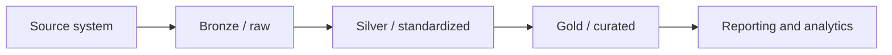
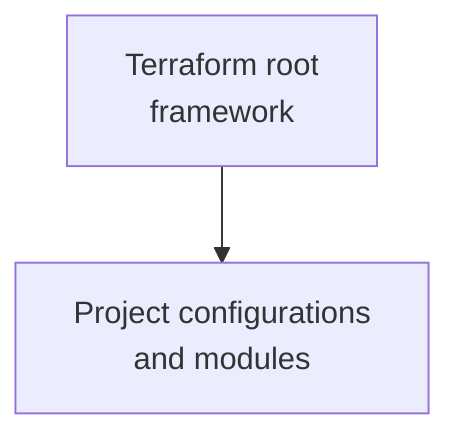
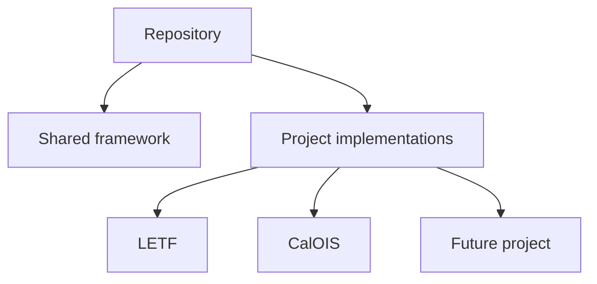
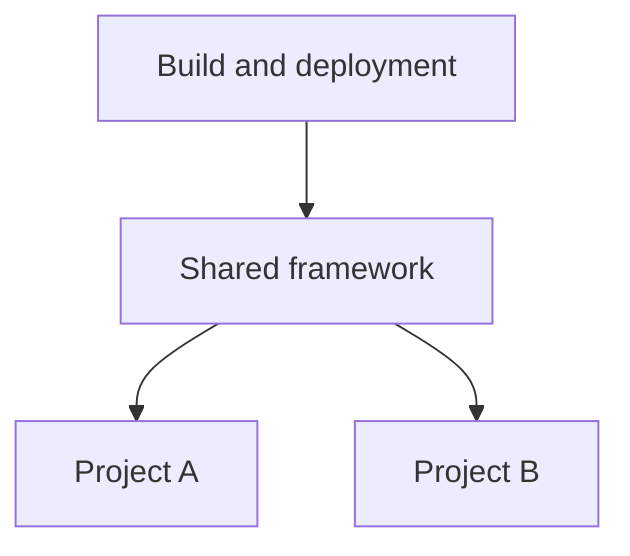

# Document control

| Field | Value |
|---|---|
| Document owner | DIR Data Platform management |
| Intended audience | Developers, engineers, analysts, contractors, and project staff who maintain source repositories |
| Version | 1.0 |
| Effective date | July 26, 2026 |
| Review frequency | At least annually and whenever the repository documentation model changes |
| Applies to | Data ingestion, data warehouse, infrastructure, and future multi-project repositories |

> **Purpose of this procedure:** Provide a consistent, beginner-friendly method for keeping repository README.md files accurate, useful, and maintainable. The procedure is limited to the Markdown features and documentation patterns used in the current DIR Data Platform READMEs.

# Contents

1. Purpose and expected outcome
2. Documentation model
3. Roles and responsibilities
4. Markdown basics
5. Formatting standards
6. Root framework README standard
7. Project README standard
8. Mermaid flowcharts
9. Step-by-step maintenance procedure
10. Validation and peer review
11. Common maintenance scenarios
12. Common mistakes
13. Copy-ready templates
14. Quick reference and checklists

# 1. Purpose and expected outcome

A `README.md` file is a plain-text document that explains what a repository or folder contains, how it works, and how staff should maintain it. The `.md` extension means the file uses **Markdown**, a simple formatting language that GitHub and common development tools render as a formatted web page.

This procedure ensures that:

- the root README remains generic and applies to every project managed in the repository;
- each project README contains only project-specific configuration, resources, business rules, schedules, and operating procedures;
- architecture diagrams and inventories remain aligned with the source code;
- staff can update documentation without advanced Markdown knowledge;
- README changes are reviewed and merged with the related code or configuration change.

## 1.1 What this procedure covers

The current READMEs use only the following Markdown features:

- headings;
- paragraphs and blank lines;
- bold text;
- inline code;
- bulleted and numbered lists;
- task checkboxes;
- tables;
- relative links;
- blockquotes for important notes;
- fenced code blocks;
- directory trees shown as text;
- Mermaid `flowchart` diagrams.

This procedure intentionally does **not** introduce badges, embedded HTML, footnotes, advanced Mermaid styling, custom themes, or other specialized Markdown features.

# 2. Documentation model

Multi-project repositories must separate shared framework information from project-specific information.


## 2.1 Root framework README

The root `README.md` answers questions that apply to the whole repository:

- What is the repository for?
- What shared capabilities does it provide?
- How is the repository organized?
- What are the common environment, naming, deployment, security, and maintenance conventions?
- How is a new project added?
- What limitations affect the framework as a whole?
- Where is each project README located?

The root README must **not** become a detailed inventory of one project's tables, buckets, pipelines, schedules, IAM groups, or business rules.

## 2.2 Project README

Each project folder must contain its own `README.md`. It answers questions unique to that project:

- What is the project's purpose and scope?
- Where is its implementation located?
- What source systems, datasets, tables, views, buckets, pipelines, and schedules does it use?
- What project-specific service accounts, IAM groups, PII controls, and governance rules apply?
- What is the project's execution order?
- How should staff troubleshoot, backfill, recover, and validate it?
- What known risks or limitations apply only to that project?

LETF may be used as a reference implementation, but staff must replace its names, inventories, business rules, and access groups rather than copying them unchanged.

## 2.3 Optional intermediate README

A major framework folder may also contain a README when it has its own shared contract. Examples include:

- `terraform/README.md` for shared Terraform behavior;
- `definitions/README.md` for the standard structure of Dataform project folders.

Use an intermediate README only when the folder contains shared rules that apply to multiple projects. Do not add extra README files that repeat the same information.

## 2.4 Required naming

Use the exact filename:

```text
README.md
```

Use uppercase `README` and lowercase `.md`. File systems and links may be case-sensitive, so `Readme.md`, `README.MD`, and `readme.md` can behave differently.

# 3. Roles and responsibilities

| Role | Responsibilities |
|---|---|
| Change author | Updates the correct README in the same branch or pull request as the code/configuration change; verifies technical details against the repository. |
| Technical reviewer | Confirms paths, resource names, commands, dependencies, Mermaid diagrams, and procedures are technically accurate. |
| Project owner or lead | Confirms project scope, business terminology, schedules, ownership, and operational guidance. |
| Repository maintainer | Protects the shared documentation structure, prevents duplication, and ensures new projects have project READMEs. |

Documentation is part of the deliverable. A code change is not complete when it leaves the README inaccurate.

# 4. Markdown basics

Markdown is edited as plain text. The characters shown below create the formatting after GitHub or an editor renders the file.

## 4.1 Headings

Use `#` characters followed by one space.

```markdown
# Repository title

## Major section

### Subsection
```

Rules:

- Use exactly one level-1 heading (`#`) in each README.
- Use level-2 headings (`##`) for major sections.
- Use level-3 headings (`###`) only within a level-2 section.
- Do not skip levels, such as going from `##` directly to `####`.
- Use sentence case: `## Deployment process`, not `## Deployment Process` unless a proper name requires capitals.
- Keep headings short because GitHub uses them to create link anchors.

## 4.2 Paragraphs and blank lines

Write normal sentences as plain text. Add one blank line between paragraphs, lists, tables, headings, and code blocks.

```markdown
This repository manages shared data-platform infrastructure.

Project-specific resource inventories are documented in each project folder.
```

Do not create visual spacing by adding many blank lines.

## 4.3 Bold text

Use two asterisks around a short phrase that requires emphasis.

```markdown
**Important:** Run the create actions before the first upsert.
```

Use bold sparingly. Do not bold entire paragraphs.

## 4.4 Inline code

Use one backtick on each side of a file name, command, resource name, variable, tag, or short code value.

```markdown
Update `terraform/envs/dev/dev.tfvars`.

The short environment value is `d`.
```

Inline code helps readers distinguish literal technical values from explanatory text.

## 4.5 Bulleted lists

Use a hyphen and one space for items that do not need a sequence.

```markdown
- BigQuery datasets;
- Cloud Storage buckets;
- Dataform schedules;
- Dataplex scans.
```

Keep items parallel. Start each item with the same type of word when possible.

## 4.6 Numbered lists

Use numbered lists for procedures and sequences.

```markdown
1. Update the configuration.
2. Preview the README.
3. Request peer review.
4. Merge the change.
```

Use numbered steps only when order matters.

## 4.7 Task checkboxes

Use task checkboxes for release and review checklists.

```markdown
- [ ] All relative links open correctly.
- [ ] Mermaid diagrams render.
- [ ] Project-specific details are not in the root README.
- [ ] The README was updated in the same pull request.
```

Check a completed item by replacing the space with `x`:

```markdown
- [x] Technical review completed.
```

## 4.8 Tables

Use tables for inventories, comparisons, mappings, responsibilities, and configuration summaries.

```markdown
| Environment | Short code | Branch |
|---|---:|---|
| Development | `d` | `dev` |
| Test | `t` | `test` |
| Production | `p` | `main` |
```

Table rules:

- Put a header row first.
- Put a separator row second using hyphens.
- Use `---:` to right-align numeric or short-code columns only when helpful.
- Keep tables narrow enough to read on a normal screen.
- Prefer several small tables over one table with many columns.
- Do not put long paragraphs or large code examples inside table cells.
- Update stated counts whenever rows are added or removed.

## 4.9 Links

Use descriptive link text followed by a relative path in parentheses.

```markdown
See the [LETF project README](terraform/letf/README.md).
```

From a file in a child folder, use `../` to move up one folder:

```markdown
See the [shared Terraform framework](../README.md).
```

Rules:

- Prefer relative links for files inside the same repository.
- Do not use a computer-specific path such as `C:\Users\...`.
- Verify capitalization and folder names exactly.
- Use meaningful link text; do not write only “click here.”

## 4.10 Blockquotes for important notes

Use `>` at the start of a paragraph for a prominent note, warning, or source-of-truth statement.

```markdown
> **Source-of-truth note:** The active Dockerfile runs `pipeline.py`. Other copies are historical until proven otherwise.
```

Use blockquotes for information that changes how staff interpret the repository. Do not overuse them.

## 4.11 Fenced code blocks

Use three backticks before and after commands, configuration, SQL, JSON, directory trees, and Mermaid diagrams.

````markdown
```bash
terraform init
terraform validate
terraform plan -var-file=dev.tfvars
```
````

Add a language after the opening backticks when known:

| Language label | Use for |
|---|---|
| `bash` | Shell and command-line examples |
| `hcl` | Terraform configuration |
| `sql` | BigQuery or other SQL |
| `json` | JSON configuration and schemas |
| `text` | Directory trees and plain output |
| `mermaid` | Mermaid diagrams |

Do not include passwords, tokens, private keys, production secrets, or confidential data in code blocks.

## 4.12 Directory trees

Show repository layout in a `text` code block.

```text
.
├── README.md
├── terraform/
│   ├── README.md
│   ├── letf/
│   │   └── README.md
│   └── calois/
│       └── README.md
└── cb-files/
```

Only include the folders and files that help readers understand the framework. Do not paste the entire repository when it adds no value.

# 5. Formatting standards

## 5.1 General writing style

- Write for a staff member who is new to the repository.
- Use complete sentences and direct language.
- Explain acronyms the first time they appear.
- Use the exact names found in source code and configuration.
- Distinguish current implementation from recommended future changes.
- State assumptions and limitations explicitly.
- Use present tense for current behavior: “The module creates...”
- Use imperative language for procedures: “Update...”, “Run...”, “Verify...”
- Avoid marketing language and unsupported claims.

## 5.2 Technical formatting

Use inline code for:

- file and folder names;
- Terraform variables and module names;
- Dataform actions and tags;
- BigQuery datasets and tables;
- bucket names;
- commands;
- short environment codes;
- configuration values.

Use normal text for product names such as Google Cloud, BigQuery, Terraform, Dataform, Dataplex, and Cloud Build.

## 5.3 Section organization

A reader should be able to scan the README in this order:

1. what the repository or project does;
2. how it is organized;
3. how data or infrastructure flows;
4. what components exist;
5. how to configure and deploy them;
6. how to add or change components;
7. how to test and operate them;
8. what risks or limitations remain.

## 5.4 Current state versus future state

Document the source code as it exists today. Put recommendations in a clearly labeled section such as:

```markdown
## Current structural limitations
```

or:

```markdown
## Known issues and recommended improvements
```

Do not describe a proposed refactor as if it has already been implemented.

## 5.5 Security and privacy

Never place the following in a README:

- passwords;
- access tokens;
- private keys;
- service-account key contents;
- database credentials;
- confidential records;
- personal information used only for testing;
- secrets copied from `.tfvars`, environment files, or local credentials.

It is acceptable to document the name of a service account, Secret Manager secret, IAM group, or configuration variable when that information is already part of the approved repository configuration.

# 6. Root framework README standard

The root README must remain generic enough to apply to current and future projects.

## 6.1 Required root sections

Use the following sections when applicable:

1. **Title and introduction** — repository purpose and multi-project intent.
2. **Documentation model** — links to shared and project-specific READMEs.
3. **Framework responsibilities** — common capabilities managed for all projects.
4. **High-level architecture** — generic Mermaid flowchart.
5. **Repository structure** — major shared and project folders.
6. **Environment and branch mapping** — common environment conventions.
7. **Deployment** — shared plan/apply or compile process.
8. **Adding another project** — framework onboarding requirements.
9. **Maintenance principles** — rules that apply to all projects.
10. **Current structural limitations** — repository-wide constraints and refactoring status.

## 6.2 Information that belongs in the root README

Examples:

- shared Terraform or Dataform architecture;
- standard branch-to-environment mapping;
- shared resource factories;
- common deployment files;
- repository-wide security and maintenance rules;
- project onboarding requirements;
- links to project READMEs.

## 6.3 Information that does not belong in the root README

Move these details to the applicable project README:

- one project's table or view inventory;
- project-specific bucket names;
- project-specific IAM groups;
- project-specific pipeline schedules;
- business rules and penalty calculations;
- project-specific source systems;
- a project's backfill instructions;
- one project's known data-quality issues.

# 7. Project README standard

Every project folder must have a README that stands on its own while linking back to the shared framework.

## 7.1 Required project sections

Use the sections that apply to the project:

1. **Project title and purpose**
2. **Reference to shared framework documentation**
3. **Current implementation layout**
4. **Project architecture or data flow**
5. **Environment configuration**
6. **Project dependencies**
7. **Resource or module inventory**
8. **Schemas, views, pipelines, and schedules**
9. **IAM, security, PII, and governance**
10. **Execution order or deployment procedure**
11. **How to add or change project components**
12. **Testing and validation**
13. **Operational runbook and recovery**
14. **Known issues and project-specific improvements**
15. **Release checklist and ownership**

## 7.2 Project inventory tables

Use tables to document items such as:

- source objects;
- datasets;
- BigQuery tables and views;
- Cloud Storage buckets;
- Terraform modules;
- Dataform actions and tags;
- schedules;
- service accounts;
- policy tags;
- dependencies;
- partition fields;
- merge keys;
- schema file paths.

Only include columns that help maintain the project. Verify each row against the code before publishing.

## 7.3 Project reference implementation statement

When a project serves as a reference, include a caution similar to:

```markdown
LETF may be used as a reference implementation, but its resource names, IAM groups, schedules, policy tags, schemas, and business rules must not be copied into another project without review.
```

# 8. Mermaid flowcharts

Mermaid lets GitHub render a diagram from text stored directly in the README. The generated READMEs use only simple `flowchart` diagrams.

## 8.1 When to use a flowchart

Use a Mermaid flowchart when it clarifies:

- data movement;
- infrastructure composition;
- framework-to-project relationships;
- deployment or execution order;
- dependencies between major components.

Do not use a flowchart for a simple list that is easier to read as bullets or a table.

## 8.2 Direction

Use one of these directions:

| Syntax | Direction | Best use |
|---|---|---|
| `flowchart LR` | Left to right | Pipelines and data movement |
| `flowchart TB` | Top to bottom | Hierarchies and framework composition |

## 8.3 Basic node and arrow syntax

````markdown

````


Explanation:

- `Source` is a short internal node ID.
- `[Source system]` is the label readers see.
- `-->` creates a directional arrow.
- Each node ID must be unique within the diagram.

## 8.4 Line breaks in node labels

Keep labels short. When a label needs two lines, use `<br/>`:



## 8.5 Framework diagram example



## 8.6 Mermaid best practices

- Keep the diagram focused on major components.
- Use 5 to 15 nodes when possible.
- Use short, stable node IDs without spaces.
- Use readable labels instead of raw resource IDs.
- Keep the direction consistent.
- Avoid crossing arrows when a simpler layout is possible.
- Do not add unsupported colors, icons, scripts, or HTML.
- Put the Mermaid block near the section it explains.
- Update the diagram whenever components or flow directions change.
- Preview the README in GitHub or an editor that supports Mermaid.

## 8.7 Mermaid troubleshooting

If the diagram does not render:

1. Confirm the block starts with three backticks followed by `mermaid`.
2. Confirm the first line inside the block is `flowchart LR` or `flowchart TB`.
3. Confirm every opening `[` has a closing `]`.
4. Confirm node IDs do not contain spaces.
5. Remove punctuation from node IDs; keep punctuation inside labels.
6. Check that the closing three backticks are present.
7. Simplify the diagram until it renders, then add nodes back gradually.

# 9. Step-by-step maintenance procedure


## Step 1 — Identify the change

Review the code, configuration, folder, schema, pipeline, or resource change before editing documentation.

Determine whether the change affects:

- the entire repository or shared framework;
- one project only;
- both the shared framework and one or more projects.

## Step 2 — Select the correct README

| Change type | README to update |
|---|---|
| Shared deployment process, common module, naming rule, repository structure, or onboarding contract | Root and/or shared framework README |
| Project dataset, table, view, bucket, pipeline, schedule, service account, IAM group, schema, or business rule | Project README |
| New project folder | Root documentation links, shared onboarding documentation, and new project README |
| Shared change that alters project procedures | Shared README and each affected project README |

Do not place project details in the root README only because the change was made in a root Terraform or configuration file. Document according to functional ownership, not merely file location.

## Step 3 — Verify source-of-truth information

Use the repository itself as the source of truth. Check:

- file and folder names;
- active entrypoints;
- module calls and variables;
- environment tfvars;
- schema files;
- SQL or view definitions;
- Cloud Build files;
- workflow tags and schedules;
- service accounts and IAM assignments;
- actual dependencies and execution order.

Do not rely only on memory, meeting notes, or an older README.

## Step 4 — Update the introduction and structure when needed

When the repository or project purpose changes, update the opening paragraphs first. When folders are added, removed, or renamed, update the directory tree and links.

Keep the introduction short enough that a new staff member can understand the purpose before reading technical details.

## Step 5 — Update architecture and flowcharts

Change the Mermaid diagram when any major component, dependency, or data flow changes.

Examples that require a diagram update:

- adding a new transformation layer;
- adding a project module;
- replacing Cloud Data Fusion with another ingestion service;
- changing where audit or reconciliation occurs;
- introducing a new shared service.

## Step 6 — Update inventories and configuration tables

Add, remove, or modify rows for affected resources. Recalculate stated counts instead of leaving phrases such as “20 active tables” unchanged.

Verify:

- spelling and capitalization;
- project and dataset suffixes;
- schema paths;
- partition fields;
- merge keys;
- schedule times and time zones;
- enabled/disabled environment flags;
- owners and service accounts.

## Step 7 — Update procedures and maintenance guidance

When behavior changes, update:

- deployment commands;
- bootstrap order;
- normal execution order;
- schema-change steps;
- backfill and reprocessing steps;
- failure recovery;
- testing scenarios;
- release checklists.

Do not update only the architecture description while leaving old operating instructions in place.

## Step 8 — Update known issues and limitations

Remove an issue only after the code has actually resolved it. Add new limitations discovered during implementation or review.

Use factual wording:

```markdown
The Cloud Build file compiles the Dataform project but does not execute workflow actions.
```

Avoid unsupported conclusions:

```markdown
The deployment is fully automated and production ready.
```

## Step 9 — Preview the Markdown

Preview the README using one of these methods:

- GitHub pull-request preview;
- Visual Studio Code Markdown preview;
- another approved editor that supports GitHub-style Markdown and Mermaid.

Check the rendered page, not only the raw text.

## Step 10 — Perform the validation checklist

Use the checklist in Section 14. Confirm all links, tables, code blocks, and diagrams render correctly.

## Step 11 — Request peer review

The reviewer must compare the README to the changed source files. Documentation review is not only proofreading.

## Step 12 — Merge documentation with the change

Commit the README update in the same pull request as the code or configuration change. This keeps documentation and implementation synchronized.

# 10. Validation and peer review

## 10.1 Author validation

Before requesting review, confirm:

- every heading renders at the intended level;
- every table has a header and separator row;
- all fenced code blocks close correctly;
- Mermaid diagrams render without errors;
- relative links open the intended files;
- file names and paths match repository capitalization;
- commands use the correct working directory;
- project-specific information is in the project README;
- the root README remains reusable for future projects;
- no secrets or confidential data are present;
- stated counts match current files/configuration;
- current behavior and recommendations are clearly separated.

## 10.2 Technical reviewer checklist

The reviewer should verify at least one representative item from every changed inventory, such as:

- a table against its Terraform map or Dataform action;
- a pipeline against its actual entrypoint;
- a schedule against environment tfvars;
- a service account against module configuration;
- a diagram arrow against the real dependency;
- a command against the current folder layout.

## 10.3 Link review

Relative links are interpreted from the location of the README containing the link.

Example:

```text
terraform/README.md
terraform/letf/README.md
```

From `terraform/README.md`, the LETF link is:

```markdown
[LETF README](letf/README.md)
```

From `terraform/letf/README.md`, the shared Terraform link is:

```markdown
[Shared Terraform README](../README.md)
```

## 10.4 Code-example review

Code examples must be:

- syntactically plausible;
- limited to the part staff need;
- free of secrets;
- aligned with current filenames and variables;
- clearly identified as examples when placeholders are used.

Use angle brackets for values staff must replace:

```bash
terraform plan -var-file=<environment>.tfvars
```

Do not use real secret values as examples.

# 11. Common maintenance scenarios

## 11.1 Adding a new project

Update:

1. the root README documentation table;
2. the root repository tree;
3. the shared onboarding section if the project introduces a new reusable pattern;
4. the applicable intermediate README;
5. the new project's `README.md` with its own inventory and operating guidance.

Minimum project README content:

- purpose;
- folder layout;
- environments;
- dependencies;
- resources/modules;
- deployment/execution order;
- security and IAM;
- testing;
- runbook;
- known limitations;
- owner.

## 11.2 Adding a table or view

Update the project README inventory with:

- action/resource name;
- target dataset and object;
- source/dependencies;
- schema file or SQL definition path;
- partitioning or key information;
- purpose;
- affected workflow/tag.

Update stated object counts and any Mermaid diagram only when the new object changes the major data flow.

## 11.3 Changing an environment or branch mapping

Update every shared and project section that documents:

- branch names;
- short environment codes;
- suffix rules;
- backend/state paths;
- schedules;
- release configurations;
- examples and commands.

Because environment naming is shared behavior, this usually requires root/shared README updates plus project verification.

## 11.4 Changing a schedule

Update the project README schedule table and operating runbook. Include:

- environment;
- time;
- time zone;
- workflow/tag;
- dependency timing;
- downstream impact.

Do not document only “daily”; provide the configured time and time zone when available.

## 11.5 Renaming a file or folder

Update:

- repository trees;
- relative links;
- commands;
- schema paths;
- module paths;
- source-of-truth statements;
- project implementation-layout tables.

Search the repository for the old name before merging.

## 11.6 Resolving a known issue

When code resolves a documented issue:

1. remove or revise the issue statement;
2. update the current behavior section;
3. update procedures and recovery guidance;
4. add any new configuration or operational requirement;
5. retain important historical rationale in the pull request or design record rather than leaving inaccurate warnings in the README.

# 12. Common mistakes

## 12.1 Copying a reference project unchanged

A reference README is a structural example, not a configuration template. Replace names, schedules, schemas, groups, ownership, and business rules.

## 12.2 Mixing shared and project information

A long root README containing every LETF or CalOIS object becomes hard to maintain and cannot support new projects cleanly.

## 12.3 Documenting intended behavior instead of actual behavior

Always state what the code currently does. Put desired improvements in a separate limitations or recommendations section.

## 12.4 Stale counts and inventories

Counts such as “102 actions” or “20 tables” must be updated when the inventory changes. When maintaining counts is not useful, omit the number and link to the authoritative inventory instead.

## 12.5 Broken code fences

One missing set of closing backticks can cause the rest of the README to render as code. Preview the entire page after editing code blocks.

## 12.6 Broken relative links

A relative path that works from the repository root may fail from a child README. Calculate the path from the README's folder.

## 12.7 Overly complex diagrams

A Mermaid diagram with many low-level resources becomes unreadable and is difficult to maintain. Show major components and use tables for detailed inventories.

## 12.8 Secrets in examples

Never paste credentials or copied environment values without checking whether they are sensitive. Use placeholders for secret values.

## 12.9 README update separated from code change

A later documentation-only task is often forgotten. Update the README in the same pull request.

# 13. Copy-ready templates

## 13.1 Root framework README template

Copy the following structure and replace bracketed placeholders.

````markdown
# [Repository/framework name]

This repository manages [shared purpose] for multiple projects.

## Documentation model

| Documentation | Scope |
|---|---|
| [`shared-folder/README.md`](shared-folder/README.md) | Shared framework behavior and onboarding. |
| [`projects/project-a/README.md`](projects/project-a/README.md) | Project A-specific implementation. |

## Framework responsibilities

- [Shared capability 1]
- [Shared capability 2]
- [Shared capability 3]

## High-level architecture



## Repository structure

```text
.
├── README.md
├── shared-folder/
│   └── README.md
└── projects/
    ├── project-a/
    │   └── README.md
    └── project-b/
        └── README.md
```

## Environment and branch mapping

| Environment | Short code | Branch |
|---|---:|---|
| Development | `d` | `dev` |
| Test | `t` | `test` |
| Production | `p` | `main` |

## Deployment

[Shared deployment process and commands.]

## Adding another project

[Project onboarding requirements.]

## Maintenance principles

- Keep shared logic generic.
- Keep project inventories in project folders.
- Update README files in the same pull request as implementation changes.

## Current structural limitations

- [Current repository-wide limitation.]
````

## 13.2 Project README template

````markdown
# [Project name] [implementation type]

This directory contains [project-specific purpose].

Shared management conventions are documented in the [framework README](../README.md).

## Current implementation layout

| Location | Responsibility |
|---|---|
| `[path]` | [Project-specific responsibility] |

## Purpose and platform role

[Brief project purpose and how it uses the shared framework.]


## Environments

| Environment | Short code | Schedule or branch |
|---|---:|---|
| Development | `d` | [Value] |
| Test | `t` | [Value] |
| Production | `p` | [Value] |

## Project dependencies

| Dependency | Purpose |
|---|---|
| `[dependency]` | [Purpose] |

## Resource or module inventory

| Resource/module | Purpose | Source/configuration |
|---|---|---|
| `[name]` | [Purpose] | `[path]` |

## Security, IAM, and governance

[Project-specific access groups, service accounts, policy tags, and sensitive-data controls.]

## Execution or deployment order

1. [Step 1]
2. [Step 2]
3. [Step 3]

## Maintenance procedures

[How to add or change project-specific objects.]

## Testing and validation

- [ ] [Test item]
- [ ] [Test item]

## Operational runbook

[Monitoring, troubleshooting, backfill, and recovery.]

## Known issues and recommended improvements

- [Current project-specific issue.]

## Ownership

[Owner, support team, and escalation information.]
````

## 13.3 Pull request documentation summary

Use a short statement in the pull request:

```markdown
### Documentation updates

- Updated the shared framework README for [shared change].
- Updated the [project] README for [project-specific change].
- Verified relative links, inventories, commands, and Mermaid diagrams.
```

# 14. Quick reference and checklists

## 14.1 Markdown quick reference

| Result | Markdown |
|---|---|
| Main title | `# Title` |
| Major section | `## Section` |
| Subsection | `### Subsection` |
| Bold | `**Important**` |
| Inline code | `` `terraform.tfvars` `` |
| Bullet | `- Item` |
| Numbered step | `1. Step` |
| Unchecked task | `- [ ] Task` |
| Checked task | `- [x] Task` |
| Link | `[Link text](relative/path.md)` |
| Important note | `> **Note:** Text` |
| Code block | Three backticks before and after the code |
| Mermaid | Code block with language `mermaid` |

## 14.2 Author checklist

- [ ] I identified whether the change is shared or project-specific.
- [ ] I updated the correct README file or files.
- [ ] The root README remains generic and reusable.
- [ ] Project inventories are in the project README.
- [ ] I verified names, paths, resources, schedules, and dependencies against source code.
- [ ] I updated directory trees and relative links.
- [ ] I updated Mermaid diagrams when the architecture changed.
- [ ] I updated stated counts.
- [ ] I updated deployment, maintenance, testing, and recovery instructions when behavior changed.
- [ ] I separated current behavior from recommendations.
- [ ] I confirmed no secrets or confidential data are present.
- [ ] I previewed the rendered Markdown and Mermaid diagrams.
- [ ] I included the README change in the same pull request.

## 14.3 Reviewer checklist

- [ ] The documentation matches the actual implementation.
- [ ] Shared and project-specific information are separated correctly.
- [ ] The README is understandable to a new staff member.
- [ ] All relative links and code examples are valid.
- [ ] Tables are accurate and readable.
- [ ] Mermaid diagrams render and match actual dependencies.
- [ ] Security, IAM, and sensitive-data statements are appropriate.
- [ ] Known issues are factual and current.
- [ ] Ownership and operational procedures are sufficient.

## 14.4 Final approval criteria

The README update is complete when a new staff member can determine:

- what the repository or project does;
- where its major components are located;
- how those components relate;
- how to configure, deploy, test, and maintain them;
- who owns them;
- what current limitations or risks must be considered.

# Appendix A — Glossary

| Term | Meaning |
|---|---|
| Markdown | Plain-text formatting syntax used by `.md` files. |
| README | The primary documentation file for a repository or folder. |
| Repository | A version-controlled collection of source code, configuration, and documentation. |
| Relative link | A link based on the current file's repository location rather than a full web address. |
| Mermaid | Text syntax that GitHub renders as diagrams. |
| Code block | A fenced section that preserves commands, code, SQL, JSON, or text formatting. |
| Root README | The README at the top of the repository. |
| Project README | A README inside a project folder containing project-specific information. |
| Pull request | A reviewed proposal to merge source changes into a branch. |
| Source of truth | The authoritative code or configuration that documentation must match. |

# Appendix B — Recommended review cadence

Review README files:

- with every related code or configuration pull request;
- when a project is onboarded or decommissioned;
- after a major architecture or deployment change;
- after an incident reveals missing or incorrect runbook steps;
- at least annually for ownership, links, schedules, inventories, and known limitations.
