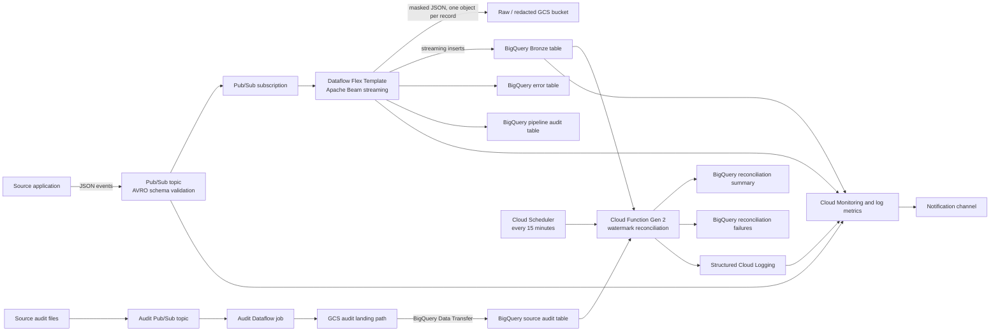

# CA DIR DLO Data Ingestion

This repository provisions and deploys a Google Cloud streaming ingestion framework for California DIR data workloads. The implemented pattern receives schema-validated JSON events from Pub/Sub, enriches and masks each record in Apache Beam/Dataflow, writes data to a raw GCS landing area and BigQuery Bronze tables, records operational audit and error information, and periodically reconciles source audit files against Bronze data.

The repository is organized into three main layers:

1. **Dataflow Flex Template** — the Python streaming pipeline and its container/template build files.
2. **Terraform** — reusable infrastructure modules, LETF pipeline instances, reconciliation resources, schemas, and monitoring policies.
3. **Cloud Build** — template build and Terraform plan/apply workflows.

> **Important source-of-truth note**
>
> The current Docker build copies and runs `dataflow-flex-template/dir-ingestion-pipeline.py`. Files whose names contain `v16`, `v21`, `working_template`, `cleanup-bkp`, and `dir-data-ingestion-processing.py` are not referenced by the active Dockerfile or Terraform deployment path. Treat them as historical or experimental until the team formally identifies otherwise.

---

## Table of contents

- [Architecture](#architecture)
- [Runtime data flow](#runtime-data-flow)
- [Repository structure](#repository-structure)
- [Dataflow Flex Template](#dataflow-flex-template)
- [Terraform](#terraform)
- [Reconciliation Cloud Function](#reconciliation-cloud-function)
- [Monitoring and alerting](#monitoring-and-alerting)
- [Cloud Build deployment](#cloud-build-deployment)
- [Environment configuration](#environment-configuration)
- [Schema management](#schema-management)
- [How to add a new ingestion pipeline](#how-to-add-a-new-ingestion-pipeline)
- [How to maintain the Dataflow code](#how-to-maintain-the-dataflow-code)
- [How to maintain reconciliation](#how-to-maintain-reconciliation)
- [Testing and validation](#testing-and-validation)
- [Operational runbook](#operational-runbook)
- [Known issues and recommended improvements](#known-issues-and-recommended-improvements)
- [Release checklist](#release-checklist)

---

## Architecture



### Google Cloud project boundaries

The Terraform configuration separates responsibilities across project variables rather than assuming all resources live in one project:

- `dir-cicd-project_id` — Cloud Build, Scheduler, function source artifacts, and deployment control-plane resources.
- `dir-service-project_id` — Pub/Sub, Dataflow jobs, Cloud Functions, and staging resources.
- `dir-ingestion-project_id` — retained for ingestion resources; current usage is limited.
- `dir-data-warehouse-project_id` — BigQuery Bronze, audit, error, and reconciliation tables.
- `dir-data-monitoring-project_id` — monitoring policies, log metrics, and notifications.

Maintain these boundaries deliberately. A change to one project ID usually requires corresponding IAM changes in the other projects.

---

## Runtime data flow

### Standard object ingestion

1. A publisher sends a JSON message to an object-specific Pub/Sub topic.
2. Pub/Sub validates the JSON representation against the attached AVRO schema.
3. An object-specific subscription feeds the shared Dataflow Flex Template.
4. The pipeline parses the JSON payload.
5. The pipeline adds:
   - `audit_load_timestamp`
   - `audit_processed_id`
6. Configured top-level string fields are masked using the configured mask character.
7. Each transformed record is written as an individual JSON object in GCS under:

   ```text
   <job-name>/YYYY/MM/DD/<audit_processed_id>.json
   ```

8. Unless the job name is in `BASE_JOBS_TO_SKIP_BQ`, the transformed record is streamed to its pre-created BigQuery Bronze table.
9. GCS write results and BigQuery write attempts/failures are written to the audit table.
10. BigQuery failures are also written to the error table.

### Audit-file ingestion and reconciliation

The `letf-snow-audit-file-processing` job is a special case:

1. It receives source audit messages through Pub/Sub.
2. The shared Dataflow pipeline adds standard audit columns and writes the records to GCS.
3. Direct Dataflow-to-BigQuery Bronze writing is skipped because the job name starts with a value in `BASE_JOBS_TO_SKIP_BQ`.
4. A BigQuery Data Transfer Service configuration loads JSON files from the audit GCS path into the audit reconciliation table every 15 minutes.
5. Cloud Scheduler invokes the reconciliation Cloud Function every 15 minutes.
6. The function selects audit files newer than its watermark, groups payload rows by source table, locates the matching Bronze table, and compares source IDs and timestamps.
7. It writes one reconciliation summary per source table and writes detailed result rows only for failures.
8. Structured logs drive reconciliation alerting.

---

## Repository structure

```text
.
├── README.md
├── cb-files/
│   ├── cloudbuild_df_flex_template_versioned.yaml
│   ├── cloudbuild_pipeline_plan.yaml
│   └── cloudbuild_pipeline_apply.yaml
├── dataflow-flex-template/
│   ├── Dockerfile
│   ├── metadata.json
│   ├── requirements.txt
│   ├── dir-ingestion-pipeline.py
│   ├── dir-ingestion-pipeline-cleanup-bkp.py
│   ├── dir-ingestion-pipeline_v16_current.py
│   ├── dir-ingestion-pipeline_v16_working_template.py
│   ├── dir-ingestion-pipeline_v21_working_template.py
│   ├── dir-data-ingestion-processing.py
│   ├── dir-pubsub-avro-to-bq-with-fault-tolerance-template.json
│   └── schemas/
└── terraform/
    ├── provider.tf
    ├── variable.tf
    ├── bootstrap.tf
    ├── monitoring_alerting.tf
    ├── letf_*.tf
    ├── ingestion_module/
    ├── bootstrap_module/
    ├── monitoring_alerting_module/
    ├── env/{dev,test,prod}/
    ├── schemas/
    └── notebook_cfcode/
```

---

# Dataflow Flex Template

## Active deployment files

### `dataflow-flex-template/Dockerfile`

Builds the Dataflow Flex Template container using Google's Python Flex Template launcher base image.

The active Dockerfile:

- copies `dir-ingestion-pipeline.py` into `/dataflow/template`;
- copies and installs `requirements.txt`;
- sets `FLEX_TEMPLATE_PYTHON_PY_FILE` to the active pipeline;
- sets `FLEX_TEMPLATE_PYTHON_REQUIREMENTS_FILE`;
- starts `/opt/google/dataflow/python_template_launcher`.

**Maintenance guidance**

- Keep the Beam SDK version in `requirements.txt` compatible with the launcher base image and Dataflow runtime.
- Pin all direct Python dependencies; do not rely on transitive versions for production releases.
- Test a container build before tagging a release.
- Change the active entrypoint only in a reviewed change that also updates this README, the template metadata, and release tests.
- Remove the large commented-out obsolete Dockerfile block after the team confirms it is no longer needed.

### `dataflow-flex-template/requirements.txt`

Current direct dependency:

```text
apache-beam[gcp]==2.65.0
```

**Maintenance guidance**

- Keep one dependency per line and end the file with a newline.
- Use exact pins for the Beam SDK and other runtime-critical libraries.
- Before upgrading Beam, run unit tests, build the image, run a DirectRunner test, and deploy a test-environment Dataflow job.
- Verify APIs used by `WriteToBigQuery`, `failed_rows_with_errors`, Pub/Sub message handling, and Flex Template launch options after every Beam upgrade.

### `dataflow-flex-template/metadata.json`

Defines the Flex Template user-facing parameters and validation expressions.

Parameters include:

| Parameter | Purpose |
|---|---|
| `input_subscription` | Full Pub/Sub subscription resource name. |
| `gcs_bucket_name` | Nominal raw GCS bucket parameter. The active Python pipeline does not currently use it. |
| `redacted_gcs_output_bucket` | Bucket used by `WriteToGCSAndSignal`. The active code expects a bucket name, not a `gs://` URI. |
| `output_table` | Destination BigQuery table in `project:dataset.table` form. |
| `bq_error_table` | BigQuery table for parse/write errors. |
| `bq_audit_table` | BigQuery table for operational audit records. |
| `pii_fields` | Comma-separated top-level JSON field names to mask. |
| `dataflow_job_name` | Logical job name used in GCS paths and audit records. |
| `mask_char` | Character used to replace each character of a masked value. |
| `staging_location` | Standard Beam/Dataflow staging path. |
| `temp_location` | Standard Beam/Dataflow temporary path. |

**Maintenance guidance**

- Keep this parameter list synchronized with:
  - `CustomPipelineOptions` in `dir-ingestion-pipeline.py`;
  - standard Beam options passed by Terraform;
  - `parameters` in `terraform/ingestion_module/main.tf`.
- Use a single metadata convention. The file currently mixes `isOptional` and `is_required`; normalize this before relying on metadata validation.
- Correct bucket validation before the next release. The active GCS writer uses `storage.Client().bucket()` and therefore expects a bare bucket name, while the metadata currently describes and validates `gs://...` paths.
- Remove `gcs_bucket_name` or implement its intended raw-output behavior so operators are not given an unused parameter.

### `dataflow-flex-template/dir-ingestion-pipeline.py`

This is the current runtime entrypoint selected by the Dockerfile.

## Python modules and classes

### `CustomPipelineOptions`

Declares application-specific runtime options:

- Pub/Sub subscription;
- raw and redacted GCS bucket names;
- output, error, and audit BigQuery tables;
- logical Dataflow job name;
- PII field list and mask character.

`staging_location` and `temp_location` are standard Beam options and are therefore passed by Terraform without being declared in this custom class.

**Maintenance guidance**

- Add every new custom parameter here and in `metadata.json` and Terraform.
- Prefer consistent snake_case names across Python, metadata, Cloud Build, and Terraform.
- Add validation for incompatible combinations, empty required strings, and malformed BigQuery identifiers.

### `AddAuditColumns`

Adds two fields to each parsed payload:

- `audit_load_timestamp` — worker processing time as an ISO string;
- `audit_processed_id` — a random UUID.

It also removes `__pubsub_topic__` and `__event_timestamp__` when present.

**Maintenance guidance**

- Use timezone-aware UTC timestamps rather than naive local timestamps.
- Treat audit field names as part of the BigQuery contract; update every BigQuery schema before changing them.
- Decide whether `audit_processed_id` must be deterministic for replay/idempotency. A random UUID creates a new identity on every replay.

### `MergeDictsFn`

A custom Beam `CombineFn` intended to merge keyed dictionary fragments while ignoring `None` values.

**Current status:** it is not used by the active pipeline.

**Maintenance guidance**

- Remove it if no planned transform requires it.
- If retained, add unit tests for its expected nested tuple input structure; its current `input_dict[1][1][0]` indexing is tightly coupled and not self-documenting.

### `RedactPII`

Masks configured fields by replacing every character in a top-level string value with `mask_char`.

Example:

```text
"tax_id": "12345"  ->  "tax_id": "*****"
```

**Limitations**

- Only top-level keys are checked.
- Only string values are masked.
- Nested objects, arrays, numeric identifiers, and partial masking are not supported.
- The original and masked records are not separately retained by this code.

**Maintenance guidance**

- Keep PII fields in environment-specific configuration or a governed data contract.
- Add recursive or JSONPath-based handling if nested PII is possible.
- Add tests proving sensitive values never appear in GCS, BigQuery, error logs, or audit payloads.
- Do not log full payloads while validating PII behavior in shared environments.

### `AuditLogEntry`

Converts a pipeline event into the shared audit-table shape. It records:

- pipeline and job identifiers;
- processed and event timestamps;
- derived source topic;
- target BigQuery table and GCS path;
- status;
- error destination and details when applicable;
- an additional audit load timestamp.

**Maintenance guidance**

- Keep this dictionary aligned with `terraform/schemas/bigquery_audit_table_schema.json` and the environment's configured audit table.
- Do not derive the source topic by replacing the word `subscription` with `topic`; pass an authoritative topic or source identifier when lineage accuracy matters.
- Standardize status values through constants or an enum. Current values mix uppercase, lowercase, colons, and labels such as `ATTEMPTED`.
- Avoid storing raw sensitive rows in `error_row_data` unless governance explicitly permits it.

### `AssignDynamicDestination`

Builds a date-based GCS destination prefix for a Beam `WriteToFiles` implementation.

**Current status:** not used by the active pipeline.

### `RecordTupleSink`

Custom `fileio.TextSink` that writes the record portion of a `(destination, record)` tuple.

**Current status:** not used by the active pipeline.

### `WriteToGCSAndSignal`

Uses the Google Cloud Storage Python client directly from a Beam `DoFn` to write one JSON object per element.

Success output:

- returns the original transformed element;
- adds `target_gcs_path`.

Failure side output:

- `audit_processed_id`;
- `audit_status`;
- exception details;
- serialized original element.

**Maintenance guidance**

- This implementation performs one remote GCS upload per record. It can become a throughput, cost, and small-file-management problem at scale.
- Prefer Beam-native batched file output for high-volume workloads.
- Define retry and idempotency behavior. The path is UUID-based, so reprocessing creates an additional object.
- Ensure the worker service account has only the required object permissions on the target bucket.
- Add metrics for GCS successes, failures, latency, and object counts.

### `DetermineBqStatus`

Combines attempted writes and failed writes by `audit_processed_id` to determine final success or failure.

**Current status:** the transform that uses this class is commented out. The active pipeline records `BQ Write :ATTEMPTED` for records sent to BigQuery and separately records failures.

**Maintenance guidance**

- Re-enable a tested correlation mechanism if final per-record success is required.
- Until then, treat `ATTEMPTED` as an attempt, not proof that BigQuery accepted the row.

### `run()`

Builds the streaming Beam graph.

#### Stage 1: Read and parse

- Reads `PubsubMessage` objects from the configured subscription.
- Attempts to decode `msg.data` as UTF-8 JSON.
- Reads expected Pub/Sub metadata from custom attributes.
- Extracts the payload dictionary from the wrapper.

#### Stage 2: Format parse errors

The code defines a parse-error branch and error-table writer.

**Important:** the current decode uses a `beam.Map` lambda that does not catch exceptions or emit a tagged `errors` output. A malformed message is therefore not reliably routed through the intended parse-error branch and may fail/retry the bundle instead.

#### Stage 3: Add audit fields and redact PII

Applies `AddAuditColumns` and `RedactPII` to valid payloads.

#### Stage 4: Write to GCS

Writes each transformed element using `WriteToGCSAndSignal`; writes GCS success/failure audit rows to BigQuery.

#### Stage 5: Filter special jobs

Skips direct BigQuery output for job-name prefixes in:

```python
BASE_JOBS_TO_SKIP_BQ = {
    "letf-snow-audit-file-processing"
}
```

#### Stage 6: Write to BigQuery

Uses streaming inserts with:

- `WRITE_APPEND`;
- `CREATE_NEVER`;
- transient-error retry;
- unknown-column ignoring.

The target Bronze table must already exist.

#### Stage 7: Write BigQuery failures

Maps `failed_rows_with_errors` into the shared error-table format.

#### Stage 8: Write BigQuery audit records

Writes one `ATTEMPTED` audit row for each submitted record and an additional failure audit row for rejected records.

**Maintenance guidance for `run()`**

- Keep transformations small and independently testable.
- Replace inline lambdas that contain business rules with named functions.
- Add Beam metrics for each stage.
- Make event time and Pub/Sub message metadata explicit.
- Do not assume branches are sequential. Beam executes the GCS and BigQuery branches independently unless an explicit dependency is modeled.
- Confirm whether the required delivery semantic is at-least-once, effectively-once, or exactly-once and design identifiers/deduplication accordingly.

## Historical and experimental pipeline files

| File | Observed role | Maintenance recommendation |
|---|---|---|
| `dir-ingestion-pipeline-cleanup-bkp.py` | Near-copy of the active pipeline with additional diagnostic logging. | Move to version control history or an `archive/` folder; do not patch it in parallel. |
| `dir-ingestion-pipeline_v21_working_template.py` | Earlier variant similar to the active one; includes verbose logging and does not contain the active audit-job BigQuery skip. | Archive after confirming no deployment references it. |
| `dir-ingestion-pipeline_v16_current.py` | Older implementation that uses Beam `WriteToFiles` with fixed windows rather than one GCS object per record. | Preserve only if it is an intentional reference implementation; otherwise remove. |
| `dir-ingestion-pipeline_v16_working_template.py` | Another v16 working copy. | Archive or delete after review. |
| `dir-data-ingestion-processing.py` | Conceptual ServiceNow/DLP pipeline outline. It uses a different parameter contract and contains incomplete/error-prone code paths. | Move to design documentation or a separate prototype repository; do not treat as deployable. |
| `dir-pubsub-avro-to-bq-with-fault-tolerance-template.json` | Standalone template specification for a different schema-aware/DLQ interface. It is not referenced by the active Cloud Build file. | Reconcile with the active template or remove it to avoid operator confusion. |
| `schemas/test_schema.json` | Small local/example schema. | Keep under a test fixture directory and document its test case. |

---

# Terraform

Terraform is executed from the `terraform/` root. Environment-specific backend and variable files are copied into that directory by Cloud Build before `init`, `plan`, and `apply`.

## Root files

### `terraform/provider.tf`

Configures:

- the default Google provider using the CI/CD project and region;
- an aliased `google.monitoring` provider.

**Maintenance guidance**

- Add explicit `required_version` and `required_providers` constraints.
- Pin provider versions in a root `versions.tf` and commit `.terraform.lock.hcl` when policy allows.
- The ingestion module references `google-beta`; configure and version that provider explicitly rather than relying on implicit provider behavior.

### `terraform/variable.tf`

Declares shared project, environment, network, Dataflow, BigQuery, reconciliation, and monitoring variables.

**Maintenance guidance**

- Avoid real environment-specific defaults for networks, service accounts, project IDs, or notification channels. Put those values in `env/*/*.tfvars`.
- Add descriptions and validations to every operator-facing variable.
- Mark credentials or tokens as `sensitive = true` if any are introduced. Prefer Secret Manager rather than tfvars.
- Remove variables that are no longer consumed.

### `terraform/bootstrap.tf`

Instantiates `bootstrap_module` and exposes the enabled-team map through a local value.

The bootstrap module is responsible for shared reconciliation resources rather than individual object pipelines.

### `terraform/monitoring_alerting.tf`

Instantiates the monitoring module and passes subscription, job, bucket, logging, network, and project configuration.

**Important:** the notification channel is currently hard-coded in the module call even though channel-related variables exist. Parameterize this before promoting configuration across environments.

## Reusable ingestion module

### `terraform/ingestion_module/main.tf`

Creates one object-specific streaming ingestion stack.

Resources:

1. `google_pubsub_schema.main_schema`
   - Reads `schemas/<schema_file_name>.avsc`.
   - Uses AVRO as the schema type.

2. `google_pubsub_topic.input_topic`
   - Attaches the AVRO schema.
   - Uses JSON encoding so publishers send JSON validated against AVRO.

3. `google_pubsub_subscription.input_subscription`
   - Seven-day retention.
   - Ten-second acknowledgement deadline.

4. `google_pubsub_topic.recon_dlq_topic`
   - Topic reserved for reconciliation failures or unprocessable messages.

5. `google_pubsub_subscription.recon_dlq_subscription`
   - Subscription for the reconciliation DLQ topic.

6. `google_bigquery_table.output_table`
   - Creates the object-specific Bronze table.
   - Loads a BigQuery JSON schema through `templatefile`.
   - Injects a policy-tag resource into schema templates that use `high_tag`.
   - Adds time partitioning and environment labels.

7. `google_dataflow_flex_template_job.pubsub_to_bigquery_flex_job`
   - Starts an object-specific streaming Dataflow job from a shared Flex Template specification.
   - Uses private worker IP configuration and the configured Shared VPC/subnetwork.
   - Passes object-specific Pub/Sub, BigQuery, GCS, audit, error, PII, staging, and temporary parameters.

**Maintenance guidance**

- The module starts a long-running Dataflow job as a Terraform resource. Carefully review replacement behavior before changing a job name, template path, network, or immutable job property.
- Configure the Dataflow worker service account explicitly; the relevant line is currently commented out.
- Avoid `ignore_unknown_columns=True` as a substitute for schema governance. Schema evolution should be explicit.
- Add a real Pub/Sub dead-letter policy if message-delivery DLQ behavior is required; creating a separate topic/subscription alone does not attach it to the input subscription.
- Verify `ack_deadline_seconds` against pipeline startup and processing behavior.
- Use consistent bucket-name conventions. Terraform currently passes bare bucket names to application parameters and `gs://` URIs to standard Beam staging/temp options.

### `terraform/ingestion_module/variable.tf`

Defines the input contract for one ingestion instance.

**Maintenance guidance**

- Add validation for resource-name formats, partition types, positive worker counts, and supported regions.
- Remove unused variables after confirming no downstream module consumes them.
- Replace duplicate defaults in root and child modules with required inputs where ambiguity could deploy resources to the wrong location.

## LETF ingestion instances

Each root `letf_*.tf` file instantiates the shared ingestion module with source-specific names, schema files, partition fields, and PII configuration.

| Terraform file | Dataflow job | BigQuery table | Schema base name | PII fields | Partition field |
|---|---|---|---|---|---|
| `letf_business_profile.tf` | `letf-business-profile` | `sn_gsm_business_profile` | `letf_business_profile_bq_schema` | none configured | `sys_updated_on` |
| `letf_classifications.tf` | `letf-classifications` | `x_cdoi2_letf_core_classification` | `letf_classifications_bq_schema` | none configured | `sys_updated_on` |
| `letf_crafts.tf` | `letf-crafts` | `x_cdoi2_letf_core_craft` | `letf_crafts_bq_schema` | none configured | `sys_updated_on` |
| `letf_customer_account.tf` | `letf-customer-account` | `customer_account` | `letf_customer_account_bq_schema` | `tax_id` | `sys_updated_on` |
| `letf_customer_account_lookup.tf` | `letf-customer-account-lookup` | `x_cdoi2_csm_portal_customer_account_lookup` | `letf_customer_account_lookup_bq_schema` | none configured | `sys_updated_on` |
| `letf_customer_contact.tf` | `letf-customer-contact` | `customer_contact` | `letf_customer_contact_bq_schema` | none configured | `sys_updated_on` |
| `letf_ecpr_payroll_entry.tf` | `letf-ecpr-payroll-entry` | `x_cdoi2_letf_ecpr_payroll_entry_raw` | `letf_ecpr_payroll_entry_bq_schema` | none configured | `sys_updated_on` |
| `letf_ecpr_payroll_run.tf` | `letf-ecpr-payroll-run` | `x_cdoi2_letf_ecpr_payroll_run` | `letf_ecpr_payroll_run_bq_schema` | none configured | `sys_updated_on` |
| `letf_local_debarment_registry.tf` | `letf-local-debarment-registry` | `x_cdoi2_ldm_registry` | `letf_local_debarment_registry_bq_schema` | `sys_created_by` | `sys_updated_on` |
| `letf_project.tf` | `letf-project` | `x_cdoi2_csm_portal_project` | `letf_project_bq_schema` | none configured | `sys_updated_on` |
| `letf_registration_dates.tf` | `letf-registration-dates` | `x_cdoi2_csm_portal_his_reg_dates` | `letf_registration_dates_bq_schema` | none configured | `sys_updated_on` |
| `letf_transactions.tf` | `letf-transactions` | `x_cdoi2_csm_portal_transaction_record` | `letf_transactions_bq_schema` | none configured | `sys_updated_on` |
| `letf_snow_audit_file_processing_pipeline.tf` | `letf-snow-audit-file-processing` | `letf_audit_reconciliation` | `letf_audit_schema` | none configured | `audit_creation_timestamp` |

### `terraform/letf_snow_audit_file_processing_pipeline.tf`

In addition to the shared ingestion module, this file creates a BigQuery Data Transfer Service configuration that loads JSON audit files from GCS into the audit reconciliation table every 15 minutes.

**Maintenance guidance**

- Keep the GCS path template aligned with `WriteToGCSAndSignal` job-name/date path generation.
- Parameterize the service-account address and data path rather than embedding environment naming assumptions.
- Validate the transfer schedule against the reconciliation scheduler. Both currently run every 15 minutes, which can create race timing where reconciliation runs before the newest transfer completes.
- Consider an event-driven or dependency-aware trigger if consistent immediate reconciliation is required.

---

# Reconciliation Cloud Function

## `terraform/bootstrap_module/bootstrap_initial_setup.tf`

Creates shared reconciliation infrastructure for every enabled ingestion team.

### Resources

- Versioned GCS bucket for Cloud Function source code.
- Local archive build directory through `null_resource` and `local-exec`.
- ZIP archive generated with `archive_file`.
- Versioned function source object in GCS.
- One Gen 2 Cloud Function per enabled team.
- One Cloud Scheduler HTTP trigger per enabled team.
- Reconciliation result, summary, and error BigQuery tables.
- One Dataflow staging bucket per enabled team.

### Cloud Function runtime

- Runtime: Python 3.12.
- Entry point: `reconcile_data_ingestion`.
- Timeout: 3,600 seconds.
- CPU: 1 vCPU.
- Memory: 4 GiB.
- Environment variables define Bronze, audit, result, and summary locations and field mappings.

### Scheduler

- Cron: every 15 minutes.
- HTTP POST with OIDC authentication.
- Attempt deadline: 10 minutes.
- Configured retry behavior.

**Maintenance guidance**

- The function can run for up to 60 minutes while Scheduler considers an attempt failed after 10 minutes. Align these values to avoid overlapping retries and duplicate concurrent executions.
- The code is documented as lock-free and assumes a single scheduler. Prevent concurrent manual or retry invocations or add a distributed lock/concurrency control.
- Verify whether `America/Chicago` is the intended scheduling timezone. For a 15-minute cadence it does not change frequency, but it matters if the schedule later becomes time-of-day based.
- `force_destroy = true` is enabled on the staging bucket. Do not use this in production unless deletion of all objects during destroy is explicitly accepted.
- `local-exec` requires a Unix-like `mkdir`; keep CI runner assumptions documented.

## `terraform/bootstrap_module/variables.tf`

Defines per-team reconciliation configuration.

Each enabled team must provide:

- Bronze dataset ID;
- audit dataset, source audit table, result table, and summary table IDs;
- error dataset and table IDs;
- schema paths;
- staging/output bucket names;
- default and per-table reconciliation field maps.

The validation block requires all critical IDs and schema paths for enabled teams.

## `terraform/bootstrap_module/cloud_function/main.py`

Implements lock-free, watermark-driven reconciliation.

### Configuration constants

Required environment variables:

- `AUDIT_TBL`
- `RESULT_TBL`
- `SUMMARY_TBL`

Additional environment variables:

| Variable | Purpose | Default |
|---|---|---|
| `BQ_PROJECT` | BigQuery project containing Bronze data. | none |
| `BRONZE_DATASET` | Bronze dataset ID. | none |
| `CF_NAME` | Logical function/job name. | `reconciliation-function` |
| `LOG_LEVEL` | Python/Cloud Logging level. | `INFO` |
| `SOFT_DEADLINE_SEC` | Stops starting new table groups near deadline. | `840` |
| `TS_TOLERANCE_SECS` | Allowed Bronze/source timestamp difference. | `5` |
| `MAX_GROUP_ROWS` | Maximum rows processed for one table per invocation. | `10000` |
| `MAX_FILES_PER_RUN` | Maximum source audit files processed per invocation. | `8` |
| `ROW_BUDGET_PER_RUN` | Maximum audit payload rows processed per invocation. | `60000` |
| `RECON_DEFAULT` | JSON field mapping defaults. | internal defaults |
| `RECON_PER_TABLE` | JSON per-table field overrides. | empty |

### `reconcile_data_ingestion(request)`

Main HTTP entry point.

Processing sequence:

1. Creates a run ID and processing ID.
2. Loads default and per-table field mappings.
3. Verifies the result and summary tables exist.
4. Determines normal or reprocess mode from constants/request body.
5. Selects audit-file timestamps:
   - normal mode: newer than the maximum summary watermark;
   - reprocess mode: explicit timestamps and/or time range.
6. Retrieves and unnests audit payload rows.
7. Applies total row budget.
8. Groups rows by `source_table`.
9. For each table:
   - applies field mappings;
   - finds the Bronze table;
   - compares source IDs and timestamps;
   - creates one summary row;
   - creates one detailed result row only when reconciliation fails.
10. Deletes existing records for the same business keys.
11. Inserts rows with stable BigQuery insert IDs.
12. Emits structured per-table failure logs and a run summary log.

### `_select_reprocess_files(...)`

Selects source audit files by:

- a list of audit timestamps with tolerance;
- an inclusive start/end range;
- or both.

Request example:

```json
{
  "reprocess_mode": true,
  "audit_ts": ["2026-07-25T20:00:00Z"],
  "source_tables": ["customer_account"]
}
```

Range example:

```json
{
  "reprocess_mode": true,
  "reprocess_range": {
    "start": "2026-07-25T00:00:00Z",
    "end": "2026-07-26T00:00:00Z"
  },
  "source_tables": ["customer_account", "customer_contact"]
}
```

### `_select_next_files_after_watermark(...)`

Reads the maximum `audit_load_timestamp` from the summary table, then selects later audit files in timestamp order.

**Maintenance consideration:** one global maximum summary timestamp acts as the watermark for all tables. If processing is partial or table groups are skipped after later timestamps are written, earlier unprocessed data could be hidden by the advanced watermark. Test this carefully when changing row budgets, table batching, or soft-deadline behavior.

### `_reconcile_batch(...)`

Performs one BigQuery SQL reconciliation for one source table.

It:

- constructs parallel arrays of source IDs and audit timestamps;
- joins source IDs to the Bronze table case-insensitively;
- finds the nearest Bronze timestamp;
- considers a record matched when the difference is within `TS_TOLERANCE_SECS`;
- returns matched count, examples of missing IDs, examples of timestamp mismatches, and full non-match details.

### `_find_bronze_table(...)`

Looks for either:

- an exact Bronze table name equal to `source_table`; or
- `<source_table>_stg`.

It also contains an in-memory `BRONZE_TABLE_MAP`, but the code no longer loads the `bronze_table_map` Terraform value into that map.

**Maintenance guidance**

- Restore an environment-driven mapping if audit source table names do not match Bronze names.
- Avoid listing every table repeatedly for high table counts; cache table discovery within an invocation.
- Validate dynamic column names before interpolating them into SQL. Field maps are configuration-controlled but still become SQL identifiers.

### Duplicate handling helpers

`_delete_existing_summaries` and `_delete_existing_results` pre-delete rows for the same table/timestamp key before inserting. `_safe_predelete` tolerates BigQuery streaming-buffer delete restrictions and relies on insert IDs for the current run when deletion cannot occur.

**Maintenance guidance**

- BigQuery streaming insert IDs provide best-effort deduplication rather than a permanent uniqueness constraint.
- Consider `MERGE` or batch load semantics for stronger deterministic idempotency.
- Keep the delete keys and insert ID keys synchronized with the actual table business key.

### Cloud Function dependencies

`terraform/bootstrap_module/cloud_function/requirements.txt` includes:

- `google-cloud-bigquery`
- `google-cloud-logging`
- `flask`

Pin tested versions before production releases to reduce surprise upgrades.

---

# Monitoring and alerting

## `terraform/monitoring_alerting_module/`

### `versions.tf`

Declares module-level Terraform/provider requirements. Keep these compatible with the root module and lock file.

### `variables.tf`

Accepts project IDs, region/environment values, notification channel, log bucket references, Pub/Sub subscriptions, Dataflow job names, GCS buckets, and network allowlists.

### `outputs.tf`

Exports alert policy IDs.

### `alerts.tf`

Defines monitoring policies and log-based metrics covering:

#### Pub/Sub

- oldest unacknowledged message age;
- undelivered messages;
- schema mismatch publish errors.

#### Dataflow

- step lag;
- step bottlenecks;
- failed jobs;
- estimated byte-count drop;
- records written to the BigQuery dead-letter/error path;
- high and low BigQuery write record counts.

#### BigQuery

- pending jobs.

#### Storage and Dataplex

- storage errors;
- Dataplex resources requiring action.

#### Network and security

- non-allowlisted egress;
- VPC Service Controls changes/violations;
- firewall creation or modification.

#### Dataform and reconciliation

Log-based metrics and alerts for:

- Dataform assertion failures;
- Dataform pipeline failures;
- Dataform repository errors;
- ingestion audit failures;
- reconciliation summary failures.

**Maintenance guidance**

- Every alert should have a documented owner, severity, threshold rationale, notification target, and runbook.
- Keep resource-name maps in each environment tfvars synchronized with actual subscriptions, Dataflow jobs, and buckets.
- Parameterize the notification channel per environment.
- Review thresholds after major volume changes; static high/low thresholds can create false positives.
- Test log-based metrics whenever structured log field names change in Python.
- Use `for_each` consistently for environment and pipeline scale; avoid duplicating near-identical alert resources manually.

---

# Cloud Build deployment

## `cb-files/cloudbuild_df_flex_template_versioned.yaml`

Builds and publishes a versioned Dataflow Flex Template.

Steps:

1. Build Docker image:

   ```text
   gcr.io/${PROJECT_ID}/dataflow/dir-ingestion-flex-template:${TAG_NAME}
   ```

2. Push the image.
3. Build a Flex Template specification in:

   ```text
   gs://${_BUCKET_NAME}-${_ENV}/templates/dir_ingestion_flex_template_${TAG_NAME}.json
   ```

The Terraform object modules reference template base names such as `dir_ingestion_flex_template_v1.0.1`; therefore the Git tag and Terraform `container_spec_gcs_path` must match.

**Maintenance guidance**

- Use tagged builds for immutable releases. `TAG_NAME` may be empty for branch-only triggers.
- `_ENV` is used but not declared in the file's substitutions; ensure the trigger supplies it or declare a default.
- `_TAG` is declared but not used; remove it or use one consistent tag variable.
- The Cloud Build service account is hard-coded to a development project. Parameterize it or use separate trigger configuration per environment.
- Migrate from legacy Container Registry naming to the organization's approved Artifact Registry pattern when applicable.
- Add image vulnerability scanning and provenance/signing controls.

## `cb-files/cloudbuild_pipeline_plan.yaml`

Runs Terraform `init` and `plan` against the pull request's `_BASE_BRANCH`.

Environment mapping:

- `_BASE_BRANCH=dev` -> `terraform/env/dev/`
- `_BASE_BRANCH=test` -> `terraform/env/test/`
- `_BASE_BRANCH=main` -> `terraform/env/prod/`

**Maintenance guidance**

- Pin the Terraform container version rather than using `latest`.
- Add `terraform fmt -check`, `terraform validate`, linting, policy checks, and a saved plan artifact.
- Fail explicitly for unsupported branches. The current script logs “Skipping” and can allow a successful build that performed no validation.
- Use isolated build workspaces so copied backend/tfvars files cannot leak between steps or builds.

## `cb-files/cloudbuild_pipeline_apply.yaml`

Runs Terraform `init`, `plan`, and `apply -auto-approve` based on `$BRANCH_NAME`.

Environment mapping:

- `dev` branch -> development configuration;
- `test` branch -> test configuration;
- `main` branch -> production configuration.

**Maintenance guidance**

- Protect the apply trigger with branch protection, approvals, and least-privilege service accounts.
- Prefer applying a reviewed saved plan instead of running a new plan immediately before auto-approve.
- Add concurrency controls/state locking safeguards so two applies cannot target the same environment simultaneously.
- Pin the Terraform version.
- Make unsupported branches fail rather than silently skip.

---

# Environment configuration

Environment files:

```text
terraform/env/dev/backend.tf
terraform/env/dev/dev.tfvars
terraform/env/test/backend.tf
terraform/env/test/test.tfvars
terraform/env/prod/backend.tf
terraform/env/prod/prod.tfvars
```

Each tfvars file supplies:

- environment identifiers and project IDs;
- region and Shared VPC subnetwork;
- service accounts;
- Cloud Function source bucket;
- `ingestion_teams` reconciliation configuration;
- notification configuration;
- subscription/job/bucket maps for monitoring;
- VPC log projects and allowed Artifact Registry subnets.

### `ingestion_teams`

The bootstrap module filters this map to entries with `enabled = true`. Current environment files enable the LETF team configuration.

Each team configuration controls:

- Bronze dataset;
- source audit, result, summary, and error tables;
- schema files;
- staging/output buckets;
- reconciliation field mappings.

### Field mapping

Default reconciliation field meanings are:

| Logical field | Default physical field |
|---|---|
| `audit_id` | `snow_sysid` |
| `audit_ts` | `publish_time` |
| `bronze_id` | `sys_id` |
| `bronze_ts` | `publish_time` |

Use `recon_field_maps.per_table` when a specific source table uses different field names.

**Maintenance guidance**

- Keep dev, test, and prod structurally identical where practical.
- Never store passwords, private keys, access tokens, or client secrets in tfvars.
- Review service-account identities and cross-project roles for each environment.
- Validate every resource map after renaming a Dataflow job, subscription, or bucket; monitoring references will not update automatically unless the map changes.
- Add a documented promotion process: dev validation -> test validation -> production approval.

---

# Schema management

## Schema pairs

Most ingested objects have two schema files with the same base name:

```text
terraform/schemas/<object>_bq_schema.avsc
terraform/schemas/<object>_bq_schema.json
```

### AVRO schema (`.avsc`)

Used by `google_pubsub_schema` to validate publisher JSON.

### BigQuery JSON schema (`.json`)

Used by `google_bigquery_table` to create the destination table. It includes the source fields plus Dataflow-added audit columns such as:

- `audit_load_timestamp`
- `audit_processed_id`

Some tables include additional audit fields.

### Shared operational schemas

- `bigquery_audit_table_schema.json` — pipeline audit records.
- `bigquery_error_table_schema.json` — pipeline errors.
- `bigquery_recon_summary_table_schema.json` — reconciliation summary rows.
- `audit_schema.json`, `_audit_schema_clean.json`, and test schemas — older/supporting artifacts; confirm usage before editing.

### `terraform/schemas/latest-code.py`

This appears to be a historical reconciliation scratch file rather than deployed code. It currently contains an indentation syntax error and is not referenced by Terraform.

Move it to an archive or delete it after confirming it is not needed. The deployed reconciliation implementation is `terraform/bootstrap_module/cloud_function/main.py`.

## Schema change procedure

1. Identify the object and determine whether the change is additive, relaxing, breaking, or destructive.
2. Update the AVRO schema.
3. Update the matching BigQuery schema.
4. Ensure Dataflow-added audit columns remain in the BigQuery schema but not necessarily in the publisher AVRO schema.
5. Confirm the partition field still exists and has a compatible type.
6. Confirm policy tags and PII field configuration.
7. Validate both JSON files locally.
8. Test publishing a conforming and nonconforming message.
9. Run Terraform plan and inspect whether BigQuery proposes an in-place update or replacement/destructive change.
10. Deploy to dev, verify Dataflow, GCS, Bronze, audit, error, and reconciliation behavior, then promote.

### Compatibility rules

- Prefer additive nullable fields.
- Do not rename or remove a field without a migration plan.
- Keep publisher schema, source extraction contract, and BigQuery destination synchronized.
- Do not depend on `ignore_unknown_columns=True` to handle unmanaged schema drift.
- For policy-tagged fields, confirm taxonomy and policy tag IDs in every environment.

---

# How to add a new ingestion pipeline

The repository currently creates one root Terraform module block per object. To add another object:

## 1. Define the source contract

Document:

- source system and object/table name;
- event key and event timestamp;
- expected volume and burst rate;
- required fields and data types;
- PII/sensitivity classification;
- partition field;
- replay and deduplication expectations;
- whether the object participates in source audit reconciliation.

## 2. Add schema files

Create:

```text
terraform/schemas/<new_object>_bq_schema.avsc
terraform/schemas/<new_object>_bq_schema.json
```

The BigQuery schema must include the Dataflow-added audit columns.

## 3. Add a root object module

Copy the nearest existing `letf_*.tf` file to a new clearly named file and update all object-specific values:

```hcl
module "df-new-object" {
  source = "./ingestion_module"

  region                        = var.region
  env                           = var.env
  shortenv                      = var.shortenv
  dir-service-project_id        = var.dir-service-project_id
  dir-ingestion-project_id      = var.dir-ingestion-project_id
  dir-data-warehouse-project_id = var.dir-data-warehouse-project_id
  subnetwork                    = var.subnetwork
  service_account_email         = var.service_account_email

  max_num_workers               = 2
  pubsub_topic_name             = "ps-<domain>-<source>-in-topic-ingest-<object>"
  pubsub_subscription_name      = "ps-<domain>-<source>-in-subscription-ingest-<object>"
  pubsub_recon_topic_name       = "ps-<domain>-<source>-in-topic-recon-<object>"
  pubsub_recon_dlq_subscription = "ps-<domain>-<source>-in-subscription-recon-<object>"

  gcs_bucket_name         = "<raw-output-bucket-base>"
  gcs_staging_bucket_name = "<staging-bucket-base>"

  bigquery_dataset_id      = "<bronze-dataset-base>"
  bigquery_table_id        = "<table>"
  dataflow_job_name        = "<job-name>"
  schema_file_name         = "<new_object>_bq_schema"
  time_partitioning_field  = "<timestamp-field>"
  time_partitioning_type   = "DAY"
  container_spec_gcs_path  = "dir_ingestion_flex_template_<release-tag>"

  audit_results_dataset_id = "<audit-dataset-base>"
  audit_result_table_id    = "<audit-table>"
  missing_files_dataset_id = "<error-dataset-base>"
  missing_files_table      = "<error-table>"

  pii_fields = "field1,field2"
  taxonomy_id = "<taxonomy-id>"
  pii_high_tag = "<policy-tag-id>"
}
```

## 4. Update monitoring maps

Add the new subscription and Dataflow job name to dev/test/prod tfvars monitoring maps.

## 5. Update reconciliation configuration when applicable

If the source audit payload includes the new object:

- ensure `source_table` matches the Bronze table name or `<name>_stg`;
- otherwise implement and configure Bronze table mapping;
- add per-table field mappings when IDs or timestamps differ.

## 6. Validate and deploy

- format and validate Terraform;
- review the plan for all environments;
- deploy to dev;
- publish a sample event;
- verify Pub/Sub schema acceptance;
- verify GCS file creation;
- verify masked fields;
- verify Bronze row and partitioning;
- verify audit and error records;
- verify reconciliation.

---

# How to maintain the Dataflow code

## Source-control rule

Maintain exactly one production entrypoint. Historical working copies should be preserved through Git history, tags, and releases—not by keeping several editable copies beside production code.

Recommended cleanup:

```text
dataflow-flex-template/
├── pipeline/
│   ├── main.py
│   ├── options.py
│   ├── transforms.py
│   ├── sinks.py
│   └── audit.py
├── tests/
├── Dockerfile
├── metadata.json
└── requirements.txt
```

## Recommended module split

- `options.py` — pipeline option definitions and validation.
- `parse.py` — Pub/Sub decoding and error side output.
- `audit.py` — audit field enrichment and audit record creation.
- `pii.py` — masking rules.
- `gcs.py` — GCS output implementation.
- `bigquery.py` — BigQuery mapping and failed-row handling.
- `main.py` — graph composition only.

## Coding standards

- Use timezone-aware UTC timestamps.
- Use structured logging without sensitive payloads.
- Use named functions instead of complex lambdas.
- Add type hints and docstrings to production functions.
- Use constants for field names and status values.
- Do not mutate shared input dictionaries in place unless explicitly tested.
- Add counters/distributions with `apache_beam.metrics`.
- Catch only expected exceptions and route invalid records to an explicit DLQ/error path.

## Dependency upgrades

For each Beam or Google library upgrade:

1. Review release notes for Pub/Sub, BigQuery, GCS, and Flex Template changes.
2. Update the pin.
3. Run unit tests.
4. Run syntax/static checks.
5. Build the image.
6. Run DirectRunner tests.
7. deploy a new immutable template tag to dev;
8. observe a representative volume and failure case;
9. promote the exact same image digest/template release.

---

# How to maintain reconciliation

## Normal operations

The function advances based on the maximum `audit_load_timestamp` already written to the summary table. Operators should monitor:

- newest source audit-file timestamp;
- newest summary watermark;
- number of selected and processed files per run;
- row-budget truncation;
- soft-deadline exits;
- missing Bronze tables;
- missing IDs and timestamp mismatches;
- concurrent/retried invocations.

## Field-map change

When a source table changes ID or timestamp column names:

1. Update `recon_field_maps.per_table` in each environment tfvars.
2. Confirm the audit payload physical names.
3. Confirm the Bronze physical names.
4. Plan and apply the function environment update.
5. Reprocess a bounded audit timestamp/range.
6. Validate summary and failure details.

## Reprocessing

Use an authenticated HTTP invocation and a narrowly scoped request. Always specify source tables when practical.

Do not set the hard-coded `REPROCESS_MODE` in source for routine operations. Prefer request-based reprocessing so a deployment is not required and the mode cannot accidentally remain enabled.

## Scale tuning

Tune together:

- `MAX_FILES_PER_RUN`;
- `ROW_BUDGET_PER_RUN`;
- `MAX_GROUP_ROWS`;
- `SOFT_DEADLINE_SEC`;
- Cloud Function timeout;
- Scheduler attempt deadline and retry behavior;
- Scheduler frequency.

Increasing only one value can create partial processing, overlapping runs, or excessive BigQuery query cost.

---

# Testing and validation

The repository currently has no automated unit-test suite. Add tests before major functional changes.

## Minimum local checks

### Python syntax

```bash
python -m compileall \
  dataflow-flex-template \
  terraform/bootstrap_module/cloud_function
```

Exclude or remove `terraform/schemas/latest-code.py` until its syntax is fixed.

### JSON and AVRO syntax

```bash
python - <<'PY'
from pathlib import Path
import json

for path in list(Path('.').rglob('*.json')) + list(Path('.').rglob('*.avsc')):
    json.loads(path.read_text())
    print(f'OK {path}')
PY
```

### YAML syntax

```bash
python - <<'PY'
from pathlib import Path
import yaml

for path in Path('cb-files').glob('*.yaml'):
    yaml.safe_load(path.read_text())
    print(f'OK {path}')
PY
```

### Terraform

```bash
terraform -chdir=terraform fmt -check -recursive
terraform -chdir=terraform init -backend=false
terraform -chdir=terraform validate
```

Run `plan` with the target environment's tfvars in an isolated working directory.

### Container build

```bash
docker build \
  -t dir-ingestion-flex-template:local \
  dataflow-flex-template
```

## Recommended unit tests

### Dataflow transforms

- valid JSON parsing;
- malformed JSON routing;
- missing/invalid UTF-8;
- audit columns added;
- top-level PII masking;
- nested PII behavior explicitly accepted or rejected;
- GCS success and failure outputs;
- BigQuery failed-row formatting;
- audit status construction;
- audit-job BigQuery skip.

Use Beam `TestPipeline`, `assert_that`, and mocked external clients.

### Reconciliation

- normal watermark selection;
- explicit timestamp reprocessing;
- range reprocessing;
- source-table filter;
- missing Bronze table;
- exact timestamp match;
- within-tolerance match;
- outside-tolerance mismatch;
- duplicate source IDs;
- null IDs/timestamps;
- row-budget truncation;
- pre-delete streaming-buffer behavior;
- stable insert ID generation;
- concurrent invocation behavior.

## Integration tests in dev

1. Publish one valid message.
2. Publish one schema-invalid message and confirm Pub/Sub rejects it.
3. Publish one JSON-valid but processing-invalid message and confirm the application error path.
4. Confirm GCS object naming and contents.
5. Confirm PII masking.
6. Confirm Bronze row and partition.
7. Confirm error/audit tables.
8. Send an audit payload and confirm the GCS-to-BigQuery transfer.
9. Run reconciliation for a match.
10. Run reconciliation for a deliberate mismatch and confirm monitoring notification.

---

# Operational runbook

## Dataflow job is failed

1. Open Dataflow job details and identify the first failing transform.
2. Check worker logs for parse, permission, schema, GCS, or BigQuery errors.
3. Confirm the input subscription, network, subnetwork, and worker service account.
4. Confirm the Flex Template specification points to the expected image tag/digest.
5. Confirm Bronze, audit, and error tables exist.
6. Confirm the GCS output and staging buckets exist and are reachable through VPC controls.
7. Fix and deploy an immutable new template version; avoid overwriting a known release tag.

## Pub/Sub backlog is increasing

1. Confirm Dataflow job state and worker health.
2. Check oldest-unacked-message age and throughput.
3. Verify autoscaling/max workers.
4. Check repeated poison messages or bundle retries.
5. Check VPC, API quota, BigQuery, and GCS latency.
6. Increase capacity only after identifying the bottleneck.

## Records are in GCS but not BigQuery

1. Determine whether the job is the audit-file processing job, which intentionally skips direct BQ writes.
2. Check `failed_rows_with_errors` output in Dataflow logs/error table.
3. Confirm the Bronze table exists (`CREATE_NEVER`).
4. Compare payload fields and types to the BigQuery schema.
5. Confirm the partition field is present and valid.
6. Confirm the Dataflow worker has BigQuery write permissions.

## Audit file is not reconciled

1. Confirm Dataflow created the audit GCS object.
2. Confirm the BigQuery Data Transfer run loaded it into the audit table.
3. Compare the audit-file timestamp to the summary watermark.
4. Check Cloud Scheduler execution status and OIDC authentication.
5. Check Cloud Function logs for row-budget, soft-deadline, missing-table, or field-map messages.
6. Reprocess a narrowly bounded timestamp or range after resolving the cause.

## Reconciliation false mismatches

1. Verify `source_table` to Bronze table naming.
2. Verify source and Bronze ID fields.
3. Verify source and Bronze timestamp fields.
4. Verify timestamp timezone and precision.
5. Review `TS_TOLERANCE_SECS`.
6. Check duplicate IDs and multiple Bronze versions.
7. Reprocess the affected audit file after configuration changes.

## PII appears unmasked

1. Stop or isolate affected ingestion when required by incident policy.
2. Confirm the field is listed in the object's `pii_fields` value.
3. Confirm the field is top-level and a string; current code does not mask nested or non-string values.
4. Check GCS, Bronze, error, audit, and logs for exposure.
5. Follow the organization's security/privacy incident process.
6. Correct masking logic and replay/remediate affected data under approved procedures.

---

# Known issues and recommended improvements

The following items were identified from static source review. Address the high-priority items before treating the framework as a general reusable enterprise template.

## High priority

### 1. Malformed JSON is not reliably routed to the parse-error branch

The current `beam.Map` JSON lambda does not catch exceptions and does not emit a tagged side output. The declared `errors` branch therefore does not implement the intended fault-tolerant behavior.

**Recommendation:** replace the lambda with a `DoFn` that catches decode/JSON exceptions and emits `TaggedOutput('errors', ...)`.

### 2. BigQuery audit status is not final success

Every submitted record is audited as `BQ Write :ATTEMPTED`, while failures receive another failure row. `DetermineBqStatus` exists but is not used.

**Recommendation:** either correlate attempts with failures and emit one final status or explicitly document/rename the audit event as an attempt metric.

### 3. One GCS object is written per record through the client library

This can produce very large numbers of small files and many API calls, and it bypasses Beam file-sink batching.

**Recommendation:** use windowed Beam `WriteToFiles` or another batched sink with a documented file-size/shard strategy.

### 4. GCS parameter contract is inconsistent

Metadata describes `gs://` paths while the active storage client expects bare bucket names. `gcs_bucket_name` is required but unused.

**Recommendation:** define separate, unambiguous parameter types such as `raw_bucket_name`, `redacted_bucket_name`, `staging_location`, and `temp_location`.

### 5. Reconciliation concurrency and timeout settings can overlap

The function timeout is 60 minutes; Scheduler attempt deadline and retry window are 10 minutes; the code assumes one lock-free scheduler.

**Recommendation:** align deadlines and set function/service concurrency or introduce a lock/idempotent work-claim mechanism.

### 6. Global reconciliation watermark can hide partial work

The normal selector uses the maximum timestamp in the summary table. The function can truncate by total row budget, per-table row limit, or soft deadline while still writing later timestamps.

**Recommendation:** track processing state per audit file and source table, or use a work queue/status table with explicit `pending`, `processing`, `complete`, and `failed` states.

### 7. Production service accounts and notification channels are partly hard-coded or implicit

The Dataflow worker service account is not explicitly set, the audit transfer service account is embedded, the Flex Template Cloud Build service account is development-specific, and monitoring notification channel is hard-coded.

**Recommendation:** parameterize all identities/channels per environment and document required IAM.

## Medium priority

### 8. Multiple editable pipeline versions create ambiguity

Five similar pipeline files and one conceptual alternate exist next to the active entrypoint.

**Recommendation:** keep one source tree and use Git tags/releases for versions.

### 9. No automated tests

There are no unit, integration, or contract tests in the repository.

**Recommendation:** add Beam transform tests, reconciliation tests, schema compatibility checks, and Terraform CI gates.

### 10. Terraform and provider versions are not consistently pinned

Cloud Build uses `hashicorp/terraform:latest`; root provider constraints are absent.

**Recommendation:** pin Terraform and providers and commit a reviewed lock file.

### 11. BigQuery unknown columns are ignored

`ignore_unknown_columns=True` may silently discard source fields.

**Recommendation:** fail or quarantine schema drift unless an approved compatibility policy explicitly allows dropping unknown fields.

### 12. Pub/Sub metadata assumptions are fragile

The pipeline expects attributes named `gcp-pubsub-topic`, `gcp-pubsub-message-id`, and `gcp-pubsub-publish-time`. These are only available if the publisher or upstream integration sets them as attributes in the expected format.

**Recommendation:** define required message attributes in the data contract or use Beam-supported message metadata fields where available.

### 13. Status vocabulary is inconsistent

Statuses include `SUCCESS`, `failure`, `GCS Write :SUCCESS`, `BQ Write :FAILED`, and `BQ Write :ATTEMPTED`.

**Recommendation:** define a controlled status model with stage, outcome, error class, and retryability as separate fields.

### 14. Source topic lineage is derived from subscription text

Replacing `subscription` with `topic` does not guarantee the true topic name.

**Recommendation:** provision/pass the authoritative topic ID.

### 15. Bronze table map configuration is disconnected

Terraform accepts `bronze_table_map`, but the Cloud Function no longer loads it.

**Recommendation:** restore a validated JSON environment variable or remove the unused configuration.

## Lower priority / cleanup

- Remove duplicate imports and obsolete commented code.
- Move test fixtures and scratch scripts out of production schema directories.
- Fix or remove `terraform/schemas/latest-code.py`.
- Add newline/style consistency to small text files.
- Replace hard-coded release template names in every object module with a shared variable.
- Reduce repeated object-module configuration by using a map and `for_each` where governance permits.
- Review whether the unused reconciliation DLQ topic/subscription should be attached to an actual flow.
- Review `force_destroy` on production buckets.
- Add lifecycle/retention policies for GCS raw, staging, audit, and function-source buckets.
- Define BigQuery table deletion protection and retention requirements.

---

# Release checklist

## Dataflow template release

- [ ] Production entrypoint is `dir-ingestion-pipeline.py` or the intentional replacement.
- [ ] Unit and integration tests pass.
- [ ] Python syntax/static checks pass.
- [ ] Dependencies are pinned and scanned.
- [ ] Container builds successfully.
- [ ] `metadata.json` matches Python and Terraform parameters.
- [ ] Image is tagged immutably.
- [ ] Flex Template JSON path matches Terraform `container_spec_gcs_path`.
- [ ] Dev job processes valid and invalid test messages correctly.
- [ ] GCS, BigQuery, error, audit, and PII behavior are verified.

## Terraform release

- [ ] `terraform fmt -check -recursive` passes.
- [ ] `terraform validate` passes.
- [ ] Environment-specific plan is reviewed.
- [ ] No unintended resource replacement or deletion.
- [ ] Service accounts and cross-project IAM are approved.
- [ ] Provider and Terraform versions are pinned.
- [ ] Monitoring resource maps include all new/renamed resources.
- [ ] Notification channel is correct for the environment.
- [ ] Production apply uses an approved reviewed plan.

## Schema release

- [ ] AVRO and BigQuery JSON schemas parse.
- [ ] Publisher and consumer contracts are compatible.
- [ ] BigQuery audit columns remain present.
- [ ] Partition field/type remains valid.
- [ ] PII classification, policy tags, and masking fields are reviewed.
- [ ] Additive/breaking classification is documented.
- [ ] Reconciliation field mappings are updated if needed.

## Reconciliation release

- [ ] Function source tests pass.
- [ ] Function and Scheduler deadlines/retries are aligned.
- [ ] No overlapping invocation risk.
- [ ] Normal watermark behavior is tested.
- [ ] Reprocess request is tested with a bounded range.
- [ ] Failure logs still match log-based metrics.
- [ ] Result/summary schemas match emitted dictionaries.
- [ ] Dev mismatch alert reaches the expected channel.

---

## Ownership and change records

For every production change, record at minimum:

- change owner;
- affected environment(s);
- source object(s) and pipeline(s);
- schema version/change classification;
- Dataflow template tag and image digest;
- Terraform plan/apply build reference;
- validation evidence;
- rollback steps;
- operational monitoring period and results.

This repository should be treated as infrastructure and data-contract code. Changes to a Python field name, schema, Terraform module argument, GCS path, table name, or structured log field can affect publishers, Dataflow, BigQuery, reconciliation, monitoring, and downstream consumers simultaneously.
