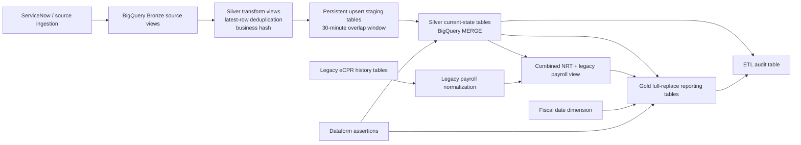

# CA DIR DLO Data Warehouse

This repository implements the California Department of Industrial Relations (DIR) LETF data warehouse transformation layer using **Google Cloud Dataform** and **BigQuery**. It converts source-system views in the raw/Bronze layer into current-state Silver tables, combines near-real-time and legacy eCPR payroll data, and builds Gold reporting tables for contractor registration, compliance, payroll submission, and user-account analytics.

The project currently contains **102 Dataform actions**:

| Action type | Count | Purpose |
|---|---:|---|
| Declarations | 10 | Register external Bronze source views with Dataform. |
| Views | 11 | Create Silver transform views and the combined payroll view. |
| Operations | 28 | Create tables, execute MERGE upserts, and perform Gold full replacements. |
| Assertions | 50 | Validate uniqueness, required values, column values, counts, and one relationship. |
| Incremental tables | 2 | Create the ETL audit table and load legacy eCPR payroll data. |
| Tables | 1 | Build the fiscal date dimension. |

> **Source-of-truth note**
>
> There are no obvious backup/version-copy files in this repository. All `.sqlx` files under `definitions/` are discoverable Dataform actions and should be treated as active unless disabled outside the repository by workflow configuration. The Cloud Build file only runs `dataform compile`; it does not execute the workflow in BigQuery.

---

## Table of contents

- [Architecture](#architecture)
- [Processing model](#processing-model)
- [Repository structure](#repository-structure)
- [Environment and dataset naming](#environment-and-dataset-naming)
- [Root configuration and deployment files](#root-configuration-and-deployment-files)
- [Reusable include modules](#reusable-include-modules)
- [Audit module](#audit-module)
- [Bronze declarations](#bronze-declarations)
- [Silver transformation modules](#silver-transformation-modules)
- [Legacy eCPR payroll module](#legacy-ecpr-payroll-module)
- [Gold curated modules](#gold-curated-modules)
- [Tags and execution order](#tags-and-execution-order)
- [How to run and compile](#how-to-run-and-compile)
- [How to add a new Silver entity](#how-to-add-a-new-silver-entity)
- [How to maintain an existing entity](#how-to-maintain-an-existing-entity)
- [Backfills and recovery](#backfills-and-recovery)
- [Testing and validation](#testing-and-validation)
- [Operational runbook](#operational-runbook)
- [Known issues and recommended improvements](#known-issues-and-recommended-improvements)
- [Release checklist](#release-checklist)

---

## Architecture



### Logical layers

| Layer | Repository location | BigQuery role |
|---|---|---|
| Bronze/raw | `definitions/letf/bronze/` | External declarations for source views. Dataform does not create these views. |
| Silver/staging | `definitions/letf/silver/` | Typed, deduplicated current-state tables populated with MERGE operations. |
| eCPR legacy | `definitions/letf/silver/ecpr_payroll_legacy/` | Normalizes legacy payroll history to the same shape as NRT payroll. |
| Gold/curated | `definitions/letf/gold/` | Reporting tables, the fiscal date dimension, and the combined payroll view. |
| Audit | `definitions/audit/` | ETL execution history used as a watermark and for row-count checks. |

---

## Processing model

### Standard Silver pipeline

Most Silver entities follow the same sequence:

1. A Bronze declaration registers an existing source view.
2. A `*_transform.sqlx` view:
   - selects the source fields;
   - computes a `business_hash` that excludes ingestion/system metadata;
   - ranks rows by `publish_time`, `sys_updated_on`, and `audit_load_timestamp`;
   - retains the latest row for each business key.
3. A `*_upsert.sqlx` operation:
   - reads the last successful execution timestamp from the audit table;
   - scans source rows from a 30-minute overlap before that timestamp through the current run time;
   - keeps only new rows or rows whose `business_hash` changed;
   - writes those rows to a persistent staging table;
   - checks for duplicate merge keys;
   - executes a BigQuery `MERGE` into the Silver target;
   - writes success or failure information to the audit table.
4. Assertions execute after the upsert action and validate selected conditions.

This is a **Type 1 current-state pattern**, not a history-preserving SCD Type 2 implementation. Existing rows are overwritten when business fields change.

### Business hash

Transform views calculate `business_hash` using `FARM_FINGERPRINT(TO_JSON_STRING(...))`. System and ingestion fields are replaced with `NULL` before hashing, including:

- `sys_id`
- `sys_created_on`, `sys_created_by`
- `sys_updated_on`, `sys_updated_by`
- `source_application`
- `business_object`
- `schema_version`
- `publish_time`
- `event_type`
- `audit_load_timestamp`
- `audit_processed_id`
- `sys_pub`

This lets the upsert ignore metadata-only changes. Any added business column is automatically included in the hash if it is present in the source row and not explicitly nulled.

### Deduplication

Most transform views retain one row per `sys_id`. `ecpr_payroll_run` uses the composite key `sys_id + employee_row_key` because one payroll run can contain multiple employee/day rows.

Freshness ordering is generally:

```sql
ORDER BY
  COALESCE(publish_time, TIMESTAMP '1970-01-01') DESC,
  COALESCE(sys_updated_on, TIMESTAMP '1970-01-01') DESC,
  COALESCE(audit_load_timestamp, TIMESTAMP '1970-01-01') DESC
```

### Gold refresh pattern

The eight `agg_*.sqlx` modules:

1. build a temporary staging table;
2. count the staged rows;
3. truncate the existing Gold target;
4. insert all staged rows;
5. compare the final count to the staged count;
6. write an audit record.

These are full-replace operations. They assume the target tables already exist.

---

## Repository structure

```text
.
├── README.md
├── .gitignore
├── dataform.json
├── package.json
├── package-lock.json
├── cloudbuild_dw_etl.yaml
├── includes/
│   ├── env.js
│   ├── audit.js
│   ├── letf_column_definitions.js
│   ├── assertion_validators.js
│   ├── assertion_validator_column_value_check.js
│   ├── assertion_validator_not_null_check.js
│   ├── assertion_validator_referential_integrity_check.js
│   ├── assertion_validator_source_target_count_check.js
│   └── assertion_validator_unique_on_key_check.js
└── definitions/
    ├── audit/
    │   └── bq_etl_audit.sqlx
    └── letf/
        ├── bronze/
        │   └── 10 external source declarations
        ├── silver/
        │   ├── business_profile/
        │   ├── core_classification/
        │   ├── core_craft/
        │   ├── customer_account/
        │   ├── customer_account_lookup/
        │   ├── customer_contact/
        │   ├── ecpr_payroll_legacy/
        │   ├── ecpr_payroll_run/
        │   ├── project/
        │   ├── registration_dates/
        │   └── transactions/
        └── gold/
            ├── fiscal_date_dim.sqlx
            ├── ecpr_payroll_legacy_snow.sqlx
            ├── 8 full-replace aggregate operations
            └── 9 uniqueness assertions
```

---

## Environment and dataset naming

### Base configuration

`dataform.json` defines the BigQuery warehouse, base database, region, assertion schema, and LETF dataset variables.

| Variable | Base value | Role |
|---|---|---|
| `defaultDatabase` | `prj-gcp-dir-data-whouse` | Default BigQuery project before CLI override. |
| `defaultLocation` | `us-west2` | BigQuery processing location. |
| `letf_source_project_id` | `prj-gcp-dir-data-whouse` | Source project base used by `env.whouseCorrection()`. |
| `letf_source_schema` | `ds_snow_raw_letf` | Bronze/raw source dataset. |
| `letf_target_schema` | `dw_snow_stg_letf` | Silver dataset. |
| `letf_curated_schema` | `dw_snow_curated_letf` | Gold reporting dataset. |
| `letf_audit_schema` | `ds_audit_letf` | ETL audit dataset. |
| `letf_ecpr_history_schema` | `ds_ecpr_history_letf` | Legacy eCPR source-history dataset. |
| `letf_ecpr_schema` | `dw_ecpr_stg_letf` | Normalized legacy payroll dataset. |
| `letf_ecpr_curated_schema` | `dw_ecpr_curated_letf` | Combined payroll curated dataset. |

### Suffix convention

Cloud Build passes `--schema-suffix=${_SHORT_ENV}`. The code expects short environment values:

| Environment | Expected suffix | Dataset example |
|---|---|---|
| Development | `d` | `dw_snow_stg_letf_d` |
| Test | `t` | `dw_snow_stg_letf_t` |
| Production | `p` | `dw_snow_stg_letf_p` |

`includes/env.js` manually appends `_d`, `_t`, or `_p` when a SQL script constructs a dataset name directly. It appends `-d` or `-t` to source project names and maps the production source project to `prj-gcp-dir-data-warehouse-p`.

> **Maintenance caution**
>
> Dataform also applies `schemaSuffix` to action schemas. The Bronze declarations already call `env.addEnv(..., "schema")` inside their `config.schema`. Verify the compiled output in every environment to ensure declarations do not receive a duplicated suffix such as `_d_d`. This could not be confirmed without a successful Dataform CLI compile in the review environment.

### Environment helper constraints

`env.whouseCorrection()` returns a project only for `d`, `t`, and `p`. Any other suffix returns `undefined`. Do not introduce names such as `dev`, `qa`, or `prod` without updating and testing this function.

---

## Root configuration and deployment files

### `dataform.json`

Defines the Dataform project-level BigQuery settings and LETF dataset variables.

**Maintain it when:**

- a dataset or project is renamed;
- a new logical layer is added;
- the BigQuery region changes;
- a new environment convention is introduced.

**Rules:**

- Keep `defaultLocation` aligned with every referenced dataset.
- Coordinate changes with `includes/env.js`, Cloud Build substitutions, IAM, schedules, and downstream Looker connections.
- Do not hard-code a new dataset in SQL without first deciding whether it belongs in `vars`.

### `package.json`

Pins `@dataform/core` to `3.0.0`.

**Maintenance guidance:**

- Keep the Dataform Core version aligned with the CLI version installed by Cloud Build.
- Upgrade Core and CLI in the same change.
- Run a full compile and representative BigQuery executions before merging a version upgrade.

### `package-lock.json`

Locks the Dataform Core dependency. It uses npm lockfile version 2.

**Maintenance guidance:**

- Regenerate with the team-supported Node/npm version.
- Commit lockfile changes only when dependencies intentionally change.
- Prefer `npm ci` in CI for reproducible dependency installation.

### `.gitignore`

Excludes `node_modules/` only.

Consider also excluding local credentials and compile artifacts, especially `.df-credentials.json`, if developers generate it locally.

### `cloudbuild_dw_etl.yaml`

Cloud Build performs three activities:

1. installs `@dataform/cli@3.0.0`;
2. writes `.df-credentials.json` using `_WAREHOUSE_ID` and `us-west2`;
3. runs:

```bash
./node_modules/.bin/dataform compile \
  --default-database=${_WAREHOUSE_ID} \
  --schema-suffix=${_SHORT_ENV}
```

It runs as the hard-coded Cloud Build service account:

```text
projects/prj-ca-dir-cicd-d213/serviceAccounts/896057792586@cloudbuild.gserviceaccount.com
```

**Important behavior:**

- The build **compiles only**. It does not run Dataform actions or create/update BigQuery objects.
- `_BASE_BRANCH` and `_TARGET_ENV` are logged but not used to control behavior.
- `_WAREHOUSE_ID` and `_SHORT_ENV` materially affect compilation.
- The credentials file is usually not required for a compile-only command, but may be retained for consistency with local CLI behavior.

**Maintenance guidance:**

- Replace `npm install` with deterministic installation where practical.
- Add a separate, explicitly approved execution/deployment step if CI is expected to run warehouse transformations.
- Parameterize the service account and region instead of embedding them in the file.
- Validate required substitutions at the start of the build.
- Publish the compiled graph or compilation summary as a build artifact for review.

---

## Reusable include modules

### `includes/env.js`

Exports:

- `addEnv(name, type)`
  - `type="project"`: appends `-<schemaSuffix>`;
  - `type="schema"`: appends `_<schemaSuffix>`.
- `whouseCorrection()`
  - development/test: creates a suffixed source project;
  - production: returns `prj-gcp-dir-data-warehouse-p`.

**Maintenance guidance:**

- Add explicit error handling for unsupported suffixes.
- Rename `whouseCorrection` only through a repository-wide change because every Bronze declaration calls it.
- Prefer a single environment-resolution API that returns all project/dataset names rather than repeating manual calls in every SQLX file.
- Add unit tests for `d`, `t`, `p`, missing suffix, and unexpected suffix values.

### `includes/letf_column_definitions.js`

Exports the shared `letfColumns` metadata object used by all Silver transform views to populate Dataform column descriptions and a few tags.

Current characteristics:

- approximately 293 final top-level keys;
- primary-key metadata on `sys_id`;
- foreign-key-like tags on selected reference columns;
- descriptions for fields across all LETF source objects in one flat object.

**Maintenance guidance:**

- Update this file whenever a transform adds or renames a column.
- Split definitions by entity, for example `letfColumns.customerAccount.email`, because generic names such as `name`, `state`, `email`, `description`, and `type` have different meanings across tables.
- Avoid duplicate JavaScript object keys. Later definitions silently overwrite earlier ones.
- Remove `test_column` unless it is still intentionally supported.
- Standardize metadata objects as `{ description, tags }` rather than mixing strings and objects.
- Review sensitive columns such as SSN and tax identifiers for policy tags and access-control metadata.

### `includes/assertion_validator_column_value_check.js`

`multiple_column_value_checks()` generates one assertion query from parallel arrays of:

- column names;
- comparison operators;
- comparison values.

It combines failed checks with `UNION ALL` and handles `IS NULL`, `IS NOT NULL`, JavaScript `null`, and the string `"null"`.

**Maintenance guidance:**

- Keep all arrays the same length.
- Escape string literals before embedding them in SQL.
- Validate operators against an allowlist.
- Return primary-key values with each failure so operators can locate the records.

### `includes/assertion_validator_not_null_check.js`

`not_null_check(columns, target_ref)` returns rows when any configured column is null.

The generated output contains only `validation_type`; it does not identify the failing row or column.

**Maintenance guidance:**

- Include the row key and failed-column name in results.
- Quote column identifiers safely.
- Keep the configured columns aligned with actual table nullability and business rules.

### `includes/assertion_validator_unique_on_key_check.js`

`unique_check(key_columns, target_ref)` groups by the configured key and returns a failure for counts greater than one.

**Maintenance guidance:**

- Align assertion keys with the actual MERGE key.
- Include the duplicate key values and `n_records` in assertion output.
- Use a meaningful key for records whose `sys_id` can be null, especially legacy payroll rows.

### `includes/assertion_validator_referential_integrity_check.js`

`referential_integrity_check()` left-joins a child to a parent and returns nonblank child foreign keys that do not resolve.

Current use: `business_profile.business_ref` must match `customer_account.sys_id`, except for rows whose `event_type` is `BulkLoad`.

**Maintenance guidance:**

- Confirm that trimming is valid for every foreign-key data type.
- Add relationship-specific assertions for other important references.
- Document and periodically review any exclusion such as `BulkLoad`.

### `includes/assertion_validator_source_target_count_check.js`

Reads the latest audit record for a pipeline and asserts:

```text
target post-load count = target pre-load count + inserted rows - deleted rows
```

Despite the function name, it does not compare `source_row_count` to the target.

**Maintenance guidance:**

- Fully qualify the audit table with project and dataset.
- Filter or explicitly validate `load_status`.
- Fail when no audit row exists.
- Rename the helper to describe its actual row-balance check, or expand it to perform a true source-target comparison.
- Use `COALESCE` so null audit values cannot make the predicate evaluate to unknown.

### `includes/assertion_validators.js`

Contains older combined implementations of null, uniqueness, and audit-count checks. No SQLX file currently imports it.

**Maintenance guidance:**

- Remove it after confirming it is not used by external tooling, or make it the single supported module and delete the split copies.
- Avoid maintaining two implementations of the same validators.

### `includes/audit.js`

Provides `log_audit_entry()`, a JavaScript generator for an audit `INSERT` statement. No SQLX file currently calls it; operations duplicate audit SQL inline.

**Maintenance guidance:**

- Either adopt this helper consistently or remove it.
- If adopted, add required-parameter validation, safe literal handling, and support for failure details.
- Centralizing audit SQL would prevent column-list differences between pipelines.

---

## Audit module

### `definitions/audit/bq_etl_audit.sqlx`

Creates the audit relation as a zero-row incremental action with `processed_id` as the unique key. Its schema includes:

- pipeline identity and execution timestamp;
- source and target table names;
- load type and status;
- source, pre-load, and post-load counts;
- inserted, updated, and deleted counts;
- audit-entry timestamp.

The query returns no rows (`LIMIT 0`), so its practical purpose is table creation/schema definition. Runtime audit rows are inserted by Silver and Gold operation scripts.

**Maintenance guidance:**

- Execute this action before any upsert or Gold operation.
- Treat changes as schema migrations. Existing BigQuery tables may need explicit `ALTER TABLE` statements.
- Partition the audit table by `DATE(audit_entry_timestamp)` and consider clustering by `pipeline_name` and `load_status` as volume grows.
- Add error message, Dataform invocation ID, job ID, environment, and code version fields for better supportability.
- Consider changing this from an empty incremental model to an explicit `operations` DDL action so its intent is clearer.

---

## Bronze declarations

Bronze files are `type: "declaration"`. They register existing BigQuery source views; they do not create or transform data.

| File | Declared action/view | Downstream Silver module |
|---|---|---|
| `business_profile_sources.sqlx` | `v_sn_gsm_business_profile` | `business_profile` |
| `core_classification_sources.sqlx` | `v_x_cdoi2_letf_core_classification` | `core_classification` |
| `core_craft_sources.sqlx` | `v_x_cdoi2_letf_core_craft` | `core_craft` |
| `customer_account_sources.sqlx` | `v_customer_account` | `customer_account` |
| `customer_account_lookup_sources.sqlx` | `v_x_cdoi2_csm_portal_customer_account_lookup` | `customer_account_lookup` |
| `customer_contact_sources.sqlx` | `v_customer_contact` | `customer_contact` |
| `ecpr_payroll_run_sources.sqlx` | `v_x_cdoi2_letf_ecpr_payroll_run` | `ecpr_payroll_run` |
| `project_sources.sqlx` | `v_x_cdoi2_csm_portal_project` | `project` |
| `registration_dates_sources.sqlx` | `v_x_cdoi2_csm_portal_his_reg_dates` | `registration_dates` |
| `transactions_sources.sqlx` | `v_x_cdoi2_csm_portal_transaction_record` | `transactions` |

Every declaration uses:

- `env.whouseCorrection()` for the source project;
- `env.addEnv(letf_source_schema, "schema")` for the source dataset.

**Maintenance procedure:**

1. Confirm the source view exists in every environment.
2. Confirm the view schema is compatible with the corresponding transform.
3. Update the declaration name if the source view changes.
4. Update every downstream `${ref(...)}` call.
5. Compile for `d`, `t`, and `p` and inspect fully qualified relation names.
6. Test schema-drift behavior before source changes reach production.

---

## Silver transformation modules

### Shared file pattern

Each standard entity folder contains:

| File suffix | Responsibility |
|---|---|
| `*_create.sqlx` | One-time `CREATE TABLE IF NOT EXISTS` for the Silver target. |
| `*_transform.sqlx` | Typed/deduplicated view and `business_hash` calculation. |
| `*_upsert.sqlx` | Incremental watermark selection, persistent staging table, MERGE, and audit logging. |
| `*_not_null_assertion.sqlx` | Required-column checks. |
| `*_column_value_assertion.sqlx` | Checks for null/invalid system values. |
| `*_unique_check_assertion.sqlx` | Duplicate-key check. |
| `*_count_check_assertion.sqlx` | Audit row-balance check. |

The `*_create` action is not a dependency of the upsert action. Run the create tag explicitly during initial environment deployment.

### Silver module catalog

| Module | Bronze source | Transform action | Target table | Merge key | Approx. target columns | Pipeline tag |
|---|---|---|---|---|---:|---|
| `business_profile` | `v_sn_gsm_business_profile` | `sn_gsm_business_profile_transform` | `sn_gsm_business_profile` | `sys_id` | 66 | `letf_business_profile_upsert_pipeline` |
| `core_classification` | `v_x_cdoi2_letf_core_classification` | `x_cdoi2_letf_core_classification_transform` | `x_cdoi2_letf_core_classification` | `sys_id` | 25 | `letf_core_classification_upsert_pipeline` |
| `core_craft` | `v_x_cdoi2_letf_core_craft` | `x_cdoi2_letf_core_craft_transform` | `x_cdoi2_letf_core_craft` | `sys_id` | 22 | `letf_core_craft_upsert_pipeline` |
| `customer_account` | `v_customer_account` | `customer_account_transform` | `customer_account` | `sys_id` | 54 | `letf_customer_account_upsert_pipeline` |
| `customer_account_lookup` | `v_x_cdoi2_csm_portal_customer_account_lookup` | `x_cdoi2_csm_portal_customer_account_lookup_transform` | `x_cdoi2_csm_portal_customer_account_lookup` | `sys_id` | 64 | `letf_customer_account_lookup_upsert_pipeline` |
| `customer_contact` | `v_customer_contact` | `customer_contact_transform` | `customer_contact` | `sys_id` | 45 | `letf_customer_contact_upsert_pipeline` |
| `ecpr_payroll_run` | `v_x_cdoi2_letf_ecpr_payroll_run` | `x_cdoi2_letf_ecpr_payroll_run_transform` | `x_cdoi2_letf_ecpr_payroll_run` | `sys_id, employee_row_key` | 92 | `letf_payroll_run_upsert_pipeline` |
| `project` | `v_x_cdoi2_csm_portal_project` | `x_cdoi2_csm_portal_project_transform` | `x_cdoi2_csm_portal_project` | `sys_id` | 51 | `letf_project_upsert_pipeline` |
| `registration_dates` | `v_x_cdoi2_csm_portal_his_reg_dates` | `x_cdoi2_csm_portal_his_reg_dates_transform` | `x_cdoi2_csm_portal_his_reg_dates` | `sys_id` | 24 | `letf_registration_dates_upsert_pipeline` |
| `transactions` | `v_x_cdoi2_csm_portal_transaction_record` | `x_cdoi2_csm_portal_transaction_record_transform` | `x_cdoi2_csm_portal_transaction_record` | `sys_id` | 34 | `letf_transactions_upsert_pipeline` |

### `business_profile`

Represents contractor/awarding-body business-profile information such as registration periods, licensing, insurance, physical address, verification fields, and links to the core customer account.

Special behavior:

- includes a referential-integrity assertion from `business_ref` to `customer_account.sys_id`;
- excludes `BulkLoad` events from that relationship check;
- persistent stage table: `business_profile_upsert`.

Required/asserted columns include `sys_id`, `publish_time`, `sys_updated_on`, and `business_ref`.

**Maintenance focus:** coordinate changes with `customer_account`, registration, and contractor reporting models. Review new relationship fields for additional integrity assertions.

### `core_classification`

Creates the current classification reference table, including craft relationships, display name, replacement classification, state, and truth indicator.

Persistent stage table: `core_classification_upsert`.

**Maintenance focus:** reference-data changes can affect payroll classification analytics. Ensure replacement references and craft mappings remain valid.

### `core_craft`

Creates the current craft reference table, including name, state, footnote, and replacement-craft fields.

Persistent stage table: `core_craft_upsert`.

The MERGE updates only when `business_hash` differs, unlike most other modules whose staging query already removes unchanged rows and then updates every match.

**Maintenance focus:** preserve craft identifiers used by payroll, classification, and business-profile records.

### `customer_account`

Creates the core business account table with account hierarchy, addresses, contact references, tax/registration fields, and organization characteristics.

Persistent stage table: `customer_account_upsert`.

**Maintenance focus:** changes to `account_parent_ref` or `primary_contact_ref` should be paired with referential-integrity tests. This table is a parent for business profile, contacts, user accounts, and account lookup reporting.

### `customer_account_lookup`

Creates the portal account-lookup/current contractor-registration table. It contains PWCR, registration dates/status, addresses, insurance details, contractor/awarding-body status, and a reference to `customer_account`.

Persistent stage table: `customer_account_lookup_upsert`.

**Maintenance focus:** this is one of the most heavily used Gold inputs. Business-rule changes to contractor status, type, registration dates, or `customer_account_ref` can materially alter compliance reports.

### `customer_contact`

Creates the current contact/user table, including account reference, email, legal/preferred names, login timestamps, phones, language, lockout, and VIP status.

Persistent stage table: `customer_contact_upsert`.

**Maintenance focus:** protect personally identifiable information and test timezone-sensitive reporting in `agg_user_accounts.sqlx`.

### `ecpr_payroll_run`

Normalizes NRT eCPR payroll-run events into employee/day-level rows. The transform derives `employee_row_key` and deduplicates by `sys_id + employee_row_key`.

Persistent stage table: `ecpr_payroll_run_upsert`.

Required/asserted columns additionally include `contractor_ref` and `project_ref`.

**Maintenance focus:**

- Keep the 92-column target DDL, transform projection, MERGE update list, MERGE insert list, legacy payroll shape, and combined payroll view in exact alignment.
- Treat changes to employee key generation as a data migration.
- Review SSN and payroll compensation fields for masking, authorized access, and policy tags.

### `project`

Creates current public-works project records, including awarding body, dates, address, project identifiers, costs, stage, and related attributes.

Persistent stage table: `portal_project_upsert`.

**Maintenance focus:** project and awarding-body references feed multiple compliance reports. Changes to `project_id`, `number`, `awarding_body_ref`, or project dates require regression testing across Gold models.

### `registration_dates`

Creates registration-history records linking contractor account lookup and transaction records to registration start/end dates, status, and renewal indicator.

Persistent stage table: `reg_dates_upsert`.

**Maintenance focus:** registration boundaries drive fiscal-year registration, lapse, renewal, fee, and penalty reporting. Validate inclusive/exclusive date semantics before changing types or rules.

### `transactions`

Creates portal transaction records including payment, penalty, renewal, perjury acceptance, registration-valid date, and business-entity references.

Persistent stage table: `transaction_record_upsert`.

**Maintenance focus:** currency/amount fields and transaction statuses drive registration-fee and penalty reports. Coordinate changes with `agg_contractor_registration_fees_penalties_v2.sqlx`.

### Silver assertions

Standard assertion configuration currently checks:

- nulls for selected system keys;
- values equivalent to null for `sys_id`, `publish_time`, and `sys_updated_on`;
- uniqueness on keys that usually include `sys_id`, `publish_time`, and `sys_updated_on`;
- audit row balance after the upsert.

Assertions depend on the upsert operation, so they validate data **after it has been committed**. A failed assertion does not roll back the MERGE.

---

## Legacy eCPR payroll module

### `definitions/letf/silver/ecpr_payroll_legacy/ecpr_payroll_legacy_transform.sqlx`

Creates the incremental table `ecpr_payroll_legacy` in the environment-specific eCPR staging dataset.

It reads legacy history tables and creates two compatible grains:

1. **Non-performance payroll** — one row per payroll run/project context with no employee/day hours.
2. **Performance payroll** — one row per payroll number, employee, and work date, with daily hours aggregated.

It then unions both grains and casts them to the same 92-column shape used by the NRT Silver payroll table.

Current source filter:

```sql
WHERE DATE(pt.FORPERIODENDING) >= DATE '2020-01-01'
```

A commented filter exists for a prior first run through December 31, 2019.

**Maintenance guidance:**

- Treat the current implementation as a controlled one-time/backfill action.
- Do not rerun it casually. It is `type: "incremental"` but has no `uniqueKey` and no `${when(incremental(), ...)}` predicate; reruns can append duplicate rows.
- Replace manual commented date filters with explicit runtime variables or separately versioned backfill actions.
- Define a durable business key and use a MERGE/incremental unique key if ongoing refreshes are required.
- Test numeric-to-string conversions and date logic for Weekly, Bi-weekly, and Semi-monthly payroll periods.
- Keep the output schema synchronized with both `x_cdoi2_letf_ecpr_payroll_run` and `v_ecpr_payroll_combined`.

---

## Gold curated modules

### `fiscal_date_dim.sqlx`

Creates a date dimension from January 1, 2000 through December 31, 2050. Fiscal years begin July 1.

Provides:

- calendar year/month/day/quarter/week;
- fiscal year, quarter, month, and week;
- fiscal year start;
- first/last day-of-month flags;
- ISO week key;
- fiscal year-month key.

**Maintenance guidance:** extend the generated date range before 2050 becomes operationally relevant. Validate fiscal week requirements with business owners because the current week calculation is a simple seven-day offset from July 1.

### `ecpr_payroll_legacy_snow.sqlx`

Creates `v_ecpr_payroll_combined` by `UNION ALL` of:

- NRT Silver payroll: `x_cdoi2_letf_ecpr_payroll_run`;
- normalized legacy payroll: `ecpr_payroll_legacy`.

**Maintenance guidance:**

- Keep column order and data types identical on both branches.
- Define an overlap/precedence rule if the legacy and NRT systems can contain the same payroll period.
- Consider adding a `record_source` column rather than relying only on `business_object`/`event_type`.
- The associated uniqueness assertion must use a key that works for legacy rows whose `sys_id`, `publish_time`, or `sys_updated_on` can be null.

### Gold aggregate catalog

| Operation/action | Target table | Purpose | Main dependencies | Uniqueness key |
|---|---|---|---|---|
| `agg_contractor_registrations_by_fiscal_year` | `contractor_registrations_by_fiscal_year` | Registration activity organized by fiscal year and registration record. | registration dates, account lookup, fiscal date dimension | `sys_id, fiscal_year, reg_sys_id` |
| `agg_contractor_registrations_renewals_v2` | `contractor_registrations_renewals_v2` | Contractor registration and renewal reporting by fiscal year. | account lookup, registration dates, fiscal date dimension | `contractor_account_lookup_ref, fiscal_year, reg_sys_id` |
| `agg_contractor_registration_fees_penalties_v2` | `contractor_registration_fees_penalties_v2` | Registration payments, renewal amounts, and penalties linked to transactions and fiscal years. | account lookup, transactions, registration dates, fiscal date dimension | `contractor_account_lookup_ref, transaction, registration_fiscal_year` |
| `agg_lapsed_contractor_ecpr_submissions` | `lapsed_contractor_ecpr_submissions` | Detects payroll submissions that occurred outside valid contractor registration periods and calculates violation/penalty days. | account lookup, registration dates, combined payroll, projects, fiscal dates, business profile | `contractor_ref, project_ref, payroll_number` |
| `agg_registered_contractors_late_ecpr_submissions` | `registered_contractors_late_ecpr_submissions` | Detects certified payroll submitted after the required interval; calculates penalty days and caps penalty amount at $5,000. | account lookup, combined payroll, projects, fiscal dates | `contractor_ref, project_ref, payroll_number` |
| `agg_contractor_compliance` | `contractor_compliance` | Combines lapsed/unregistered and late-submission violations by contractor/project. | projects, combined payroll, account lookup, both violation tables | `contractor_ref, project_ref` |
| `agg_ab_compliance` | `ab_compliance` | Presents awarding-body, contractor, project, payroll, and unregistered-contractor violation details. | projects, combined payroll, account lookup, lapsed submission table | `contractor, project_id, payroll_number` |
| `agg_user_accounts` | `user_accounts` | Joins contacts to accounts/account lookup and derives account-created and last-active dates in `America/Los_Angeles`. | customer contact, customer account, account lookup | `customer_contact_ref, user_name` |

### Gold maintenance rules

- Gold target tables must exist before these operations run.
- Any change to a staging `SELECT` must be reflected in the target table schema and insert column order.
- Revalidate uniqueness keys with report owners; they are Dataform assertions, not enforced BigQuery constraints.
- Review business filters such as:
  - `contractor_status = 'DIR Approved'`;
  - `type = 'Contractor'` or `type = 'Awarding Body'`;
  - excluded registration statuses;
  - canceled payroll exclusion;
  - amendment exclusion;
  - 45-day late-submission rule;
  - penalty amount and cap.
- Document Jira-driven business-rule changes in code comments and a changelog, not only inline comments.

---

## Tags and execution order

### Bootstrap tags

Run these once per new environment, before upsert pipelines:

```text
audit-preprocessing
business_profile_create
core_classification_create
core_craft_create
customer_account_create
customer_account_lookup_create
customer_contact_create
payroll_run_create
project_create
registration_dates_create
transactions_create
```

Gold table creation is not represented in this repository and must be handled separately or added as Dataform actions.

### Silver pipeline tags

```text
letf_business_profile_upsert_pipeline
letf_core_classification_upsert_pipeline
letf_core_craft_upsert_pipeline
letf_customer_account_upsert_pipeline
letf_customer_account_lookup_upsert_pipeline
letf_customer_contact_upsert_pipeline
letf_payroll_run_upsert_pipeline
letf_project_upsert_pipeline
letf_registration_dates_upsert_pipeline
letf_transactions_upsert_pipeline
```

Each tag includes its transform, upsert, and assertions.

### Legacy and Gold tags

```text
letf_ecpr_payroll_legacy
letf_ecpr_payroll_legacy_snow
letf_fiscal_date_dim_pipeline
letf_contractor_registrations_by_fiscal_year_pipeline
letf_contractor_registrations_renewals_v2_pipeline
letf_contractor_registration_fees_penalties_v2_pipeline
letf_lapsed_contractor_ecpr_submissions_pipeline
letf_registered_contractors_late_ecpr_submissions_pipeline
letf_contractor_compliance_pipeline
letf_ab_compliance_pipeline
letf_user_accounts_pipeline
```

### Recommended dependency order

1. Audit table and Silver target-table bootstrap actions.
2. Silver reference/core entities:
   - core craft;
   - core classification;
   - customer account;
   - customer contact;
   - customer account lookup;
   - business profile;
   - project;
   - registration dates;
   - transactions;
   - payroll run.
3. Fiscal date dimension.
4. Legacy payroll backfill, when applicable.
5. Combined payroll view.
6. Base violation/reporting tables:
   - lapsed contractor submissions;
   - registered contractor late submissions;
   - registration/renewal/fee tables;
   - user accounts.
7. Contractor compliance and awarding-body compliance.

Dataform dependencies encode much of the Gold ordering, but bootstrap actions are not connected to upserts.

---

## How to run and compile

### Prerequisites

- Node.js and npm supported by Dataform CLI 3.0.0;
- access to the BigQuery projects/datasets;
- Dataform CLI 3.0.0;
- credentials with BigQuery metadata access for compilation and appropriate data/DDL permissions for execution.

### Install

```bash
npm ci
npm install --no-save @dataform/cli@3.0.0
```

### Compile development

```bash
./node_modules/.bin/dataform compile \
  --default-database=<development-warehouse-project> \
  --schema-suffix=d
```

Repeat with `t` and `p` before a release and inspect the generated relation names.

### Execute

The exact execution command depends on whether the team uses the legacy Dataform CLI, Dataform repositories/workflow invocations, or another orchestrator. The current Cloud Build file does not execute actions.

When selecting tags, distinguish between:

- first-time bootstrap;
- normal recurring Silver upsert;
- one-time legacy backfill;
- Gold refresh.

Never include the legacy payroll tag in a recurring schedule until its incremental logic is corrected.

---

## How to add a new Silver entity

1. **Create the Bronze declaration**
   - Add `<entity>_sources.sqlx`.
   - Use the resolved source project/dataset.
   - Set `type: "declaration"` and the exact external view name.

2. **Create the target-table DDL**
   - Add `<entity>_create.sqlx`.
   - Define every target column and type.
   - Include standard metadata and `business_hash`.
   - Choose partitioning based on query patterns and source nullability.

3. **Create the transform view**
   - Add `<entity>_transform.sqlx`.
   - Reference the Bronze declaration with `${ref(...)}`.
   - Normalize types and field names.
   - Calculate the business hash.
   - Deduplicate using the intended business key and freshness order.
   - Add column descriptions.

4. **Create the upsert operation**
   - Add `<entity>_upsert.sqlx`.
   - Declare the audit and target schemas.
   - Add a unique pipeline name.
   - Apply the overlap window.
   - Stage only new/changed records.
   - Validate duplicate merge keys.
   - MERGE every target column consistently.
   - Log success/failure.

5. **Add assertions**
   - required values;
   - invalid values;
   - uniqueness aligned to the MERGE key;
   - audit/load-status validation;
   - referential integrity where applicable.

6. **Add tags and dependencies**
   - Use one recurring pipeline tag.
   - Use a separate bootstrap tag.
   - Add dependencies on required parent entities.

7. **Test**
   - empty source;
   - first load;
   - unchanged replay;
   - changed record;
   - duplicate source key;
   - null required field;
   - out-of-order/late event;
   - failure audit path;
   - assertion failure.

8. **Document**
   - update this README;
   - document target grain, owner, schedule, SLA, and business rules;
   - document backfill and rollback steps.

---

## How to maintain an existing entity

### Adding a column

Update all applicable locations in one change:

1. source view/declaration compatibility;
2. `letf_column_definitions.js`;
3. target `CREATE TABLE` DDL or an explicit migration;
4. transform `columns` metadata;
5. transform output projection/hash behavior;
6. stage table output;
7. MERGE `UPDATE SET` list;
8. MERGE insert column list;
9. MERGE insert value list;
10. Gold consumers and combined payroll branches;
11. assertions;
12. downstream Looker models and dashboards.

Because `CREATE TABLE IF NOT EXISTS` does not alter an existing table, adding a column to the create file alone does not migrate deployed environments.

### Changing a data type

- Assess existing data with `SAFE_CAST` before migration.
- Update Bronze/source contracts first.
- Use an explicit BigQuery migration plan.
- Validate both legacy and NRT payroll branches when payroll fields change.
- Rebuild or backfill affected Gold tables.

### Changing the business key

- Treat as a migration, not a simple code edit.
- Update transform partitioning, duplicate checks, stage joins, MERGE `ON`, uniqueness assertions, and downstream joins.
- Decide how existing duplicates/history will be corrected.

### Changing the watermark

The upserts use the last successful `pipeline_execution_timestamp` and a 30-minute overlap. Before changing it:

- measure source lateness;
- confirm `audit_load_timestamp` semantics;
- test delayed and replayed events;
- document backfill procedures for events older than the overlap;
- ensure concurrent executions cannot advance the audit watermark incorrectly.

---

## Backfills and recovery

### Reprocessing recent Silver data

Because unchanged rows are filtered by `business_hash`, rerunning the same source window should normally be idempotent. To force reconsideration of older rows:

1. identify the pipeline's last successful audit entries;
2. preserve/export the audit rows before modification;
3. either remove/correct the relevant success watermark or use a controlled backfill variant with an explicit start timestamp;
4. run the transform/upsert in a nonproduction environment first;
5. validate target counts, hashes, and assertions;
6. restore normal scheduling.

Do not delete audit history broadly; it is used as the incremental control state.

### Recovering from a failed Silver MERGE

- Read the failure audit row and BigQuery script error.
- Inspect the persistent staging table for duplicate keys or type issues.
- Correct source/transform logic.
- Rerun the same tag. No success watermark should have been written by the failed run.
- Confirm the failure row is distinguishable from the later successful retry.

### Recovering from a failed Gold refresh

The current Gold pattern truncates the target before inserting. If insertion fails, the table may remain empty or incomplete.

Recommended recovery:

1. stop downstream dashboard refreshes;
2. restore the target from a BigQuery table snapshot/time-travel copy when available;
3. correct and validate the staging query separately;
4. rerun the Gold action;
5. verify counts and uniqueness;
6. resume downstream jobs.

Implement atomic table replacement before relying on this as the permanent runbook.

### Legacy payroll backfill

- Record the exact date range and source snapshot.
- Load into an isolated table first.
- validate row grain and duplicate keys;
- replace/merge the production legacy table once;
- do not schedule the action repeatedly in its current form.

---

## Testing and validation

### Static checks completed during this review

- `dataform.json`, `package.json`, and `package-lock.json` parsed as valid JSON.
- `cloudbuild_dw_etl.yaml` parsed as valid YAML.
- All nine JavaScript include files passed `node --check`.
- All Dataform `${ref(...)}` references and explicit `dependencies` resolved to actions present in the repository.
- The repository contains 116 files, including 102 SQLX files and nine JavaScript includes.

### Validation not completed

A full Dataform CLI compile could not be completed in the review environment because dependency installation timed out. BigQuery execution was not available, so SQL semantics, permissions, existing target schemas, row counts, and runtime behavior were reviewed statically rather than executed.

### Recommended automated checks

1. **Compile matrix** — compile for `d`, `t`, and `p`.
2. **JavaScript unit tests** — environment helper and assertion SQL generation.
3. **SQL linting** — formatting and common BigQuery anti-patterns.
4. **Schema parity tests** — create DDL vs transform vs MERGE lists.
5. **Dependency tests** — no unresolved actions or cycles.
6. **Ephemeral integration environment** — representative Bronze fixtures and BigQuery execution.
7. **Data-quality regression tests** — known edge cases for registrations, late payroll, lapsed registration, amendments, and non-performance payroll.
8. **Security checks** — policy tags/access tests for SSN, tax IDs, addresses, and contact details.

### Minimum test scenarios per Silver pipeline

| Scenario | Expected result |
|---|---|
| First valid event | One target insert and successful audit row. |
| Exact replay | No additional target row and no business update. |
| Metadata-only change | No business update if hash excludes the changed metadata. |
| Business-field change | One target update. |
| Duplicate latest key | Script fails before MERGE and records failure. |
| Null required field | Upsert may commit, then assertion fails; operational alert required. |
| Late event within overlap | Considered by the upsert. |
| Late event older than overlap | Requires controlled backfill unless still selected through another mechanism. |
| Script error | Failure audit written and original error re-raised. |

---

## Operational runbook

### Daily monitoring

Monitor:

- failed Dataform/BigQuery workflow actions;
- `bq_etl_audit.load_status = 'FAILURE'`;
- missing expected successful runs;
- assertion failures;
- unusually low/high source or staged counts;
- empty Gold tables;
- source schema changes;
- long-running or overlapping pipeline invocations.

### Audit query example

```sql
SELECT
  pipeline_name,
  load_status,
  pipeline_execution_timestamp,
  source_row_count,
  target_row_count_pre_load,
  target_row_count_post_load,
  rows_inserted,
  rows_updated,
  rows_deleted,
  audit_entry_timestamp
FROM `<warehouse-project>.<audit-dataset>.bq_etl_audit`
WHERE audit_entry_timestamp >= TIMESTAMP_SUB(CURRENT_TIMESTAMP(), INTERVAL 1 DAY)
ORDER BY audit_entry_timestamp DESC;
```

### Missing-run query pattern

Create an operational expectation table containing pipeline name, schedule, and SLA. Compare it to the latest successful audit row rather than assuming a failure row will always be written.

### Before rerunning a failed pipeline

- determine whether the target was modified;
- inspect the stage table;
- check whether a success audit row was written;
- verify the source window remains available;
- prevent concurrent reruns;
- capture the invocation/job ID for the incident record.

---

## Release checklist

### Configuration

- [ ] Dataform Core and CLI versions match.
- [ ] `_WAREHOUSE_ID` is correct.
- [ ] `_SHORT_ENV` is exactly `d`, `t`, or `p`.
- [ ] Compiled project/dataset names were inspected for duplicate/missing suffixes.
- [ ] BigQuery location is `us-west2` for all referenced datasets.
- [ ] Cloud Build service account has the intended least-privilege access.

### Schema

- [ ] Source views exist and match transform expectations.
- [ ] Existing target tables were explicitly migrated.
- [ ] Transform, create DDL, stage, MERGE update, and MERGE insert columns align.
- [ ] Payroll legacy/NRT/combined schemas align.
- [ ] Column descriptions and policy tags are correct.

### Data logic

- [ ] Business hash intentionally includes/excludes each changed field.
- [ ] Deduplication and MERGE keys match the target grain.
- [ ] Delete behavior is defined.
- [ ] Late-arriving data behavior is tested.
- [ ] Gold business filters and penalty rules have owner approval.
- [ ] Full-replace recovery/rollback was tested.

### Quality and audit

- [ ] Audit table exists before pipelines run.
- [ ] Latest success/failure rows are correct.
- [ ] Assertions use fully qualified relations.
- [ ] Assertions fail on known bad fixtures and pass on valid fixtures.
- [ ] Critical validation happens before publication or has a documented remediation path.

### Deployment

- [ ] Development compile and execution passed.
- [ ] Test compile and execution passed.
- [ ] Production compile passed.
- [ ] No legacy one-time tag is included in a recurring schedule.
- [ ] No overlapping invocation is possible for pipelines using persistent stage tables.
- [ ] Downstream dashboards and extracts have a maintenance/rollback plan.
- [ ] The README and change log were updated.

---

## Ownership recommendations

For sustainable maintenance, assign named owners for:

- Dataform framework and deployment;
- Bronze source contracts;
- Silver entity schemas;
- eCPR payroll normalization;
- contractor-registration business rules;
- compliance/penalty business rules;
- BigQuery security and policy tags;
- audit/monitoring and incident response;
- downstream Looker content.

Every production action should also have a documented schedule, expected volume, SLA, upstream owner, downstream consumers, and recovery procedure.
