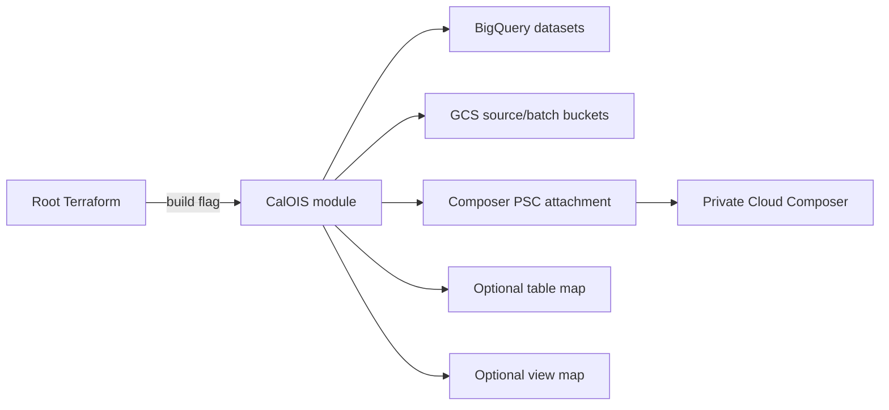

# CalOIS Project Infrastructure

This directory contains the optional CalOIS infrastructure module. It provisions project-specific BigQuery datasets, Cloud Storage buckets, Cloud Composer, and a Private Service Connect network attachment.

Shared framework behavior is documented in [`../README.md`](../README.md).

## Current status

CalOIS is enabled through the root variable:

```hcl
build_in_cur_env = {
  calois = true | false
}
```

Current activation:

| Environment | Enabled |
|---|---:|
| Development | Yes |
| Test | No |
| Production | No |

The module is instantiated by `terraform/application_modules.tf` only when enabled.



---

## Module structure

| File | Responsibility |
|---|---|
| `variables.tf` | Module input contract. |
| `datasets-roles.tf` | CalOIS datasets and dataset IAM. |
| `buckets-roles.tf` | CalOIS buckets and bucket/Composer access. |
| `attachment.tf` | Composer PSC network attachment. |
| `composer.tf` | Private Cloud Composer environment. |
| `table_creation.tf` | Project table-definition map and normalization. Currently empty except for an example. |
| `view_creation.tf` | Project view-definition map. Currently empty except for an example. |
| `outputs.tf` | Exports datasets and normalized table/view maps to the root module. |
| `schemas/bq_schema_example.json` | Example schema, not an active table. |
| `view_definition/view_definition_example.sql` | Example SQL template, not an active view. |
| `main.tf` | Empty placeholder. |

---

## Inputs

The root module passes:

| Input | Purpose |
|---|---|
| `shortenv` | Environment suffix. |
| `longenv` | Environment name. |
| `seed_project_id` | Terraform execution project. |
| `region` | Deployment region. |
| `dplat_projects` | Foundation-provided project ID map. |
| `composer_subnet_id` | Composer subnet from networking remote state. |
| `table_creation` | Root table configuration map; currently not consumed by the module's local map. |

The `table_creation` variable is declared but the local project map in `table_creation.tf` is empty and does not merge the input. Clarify whether tables should be owned by root tfvars or this module before adding production schemas.

---

## Google Cloud project dependencies

The module expects the foundation project map to contain:

| Project key | Use |
|---|---|
| `osha-data-ingestion` | CalOIS source and batch GCS buckets. |
| `dir-data-warehouse` | CalOIS BigQuery datasets. |
| `dir-data-services` | Cloud Composer and its PSC attachment. |

The CalOIS CICD project is referenced directly by naming convention for Composer-bucket access:

```text
prj-gcp-calois-cicd-<env>
```

---

## BigQuery datasets

The module creates three datasets in the data warehouse project:

| Dataset pattern | Purpose |
|---|---|
| `ds_audit_calois_<env>` | Pipeline audit data. |
| `ds_error_calois_<env>` | Error and exception data. |
| `ds_osha_sfdc_raw_calois_<env>` | Raw Salesforce/CalOIS data. |

Configuration:

- location: shared `region` (`us-west2` in current tfvars);
- `delete_contents_on_destroy = false`;
- dataset-level IAM.

### Dataset IAM

Current access grants `roles/bigquery.dataEditor` to:

- `grp-gcp-data-platform-osha-contractors@dir.ca.gov`;
- `sa-calois-df-editor-d@prj-gcp-dir-data-service-d.iam.gserviceaccount.com`.

**Important:** the service-account member is hard-coded to development in all three dataset role definitions. This is acceptable only while the module is development-only. It must be parameterized before enabling test or production.

Recommended pattern:

```hcl
format(
  "serviceAccount:sa-calois-df-editor-%s@%s.iam.gserviceaccount.com",
  var.shortenv,
  var.dplat_projects.dir-data-services
)
```

---

## Cloud Storage buckets

The module creates nine buckets in the `osha-data-ingestion` project:

| Bucket pattern | Intended source/use |
|---|---|
| `gcs-dosh-calois-ar-<env>` | AR batch/source data. |
| `gcs-dosh-calois-calatlas-<env>` | CalAtlas data. |
| `gcs-dosh-calois-fedois-<env>` | FedOIS data. |
| `gcs-dosh-calois-legend-<env>` | Legend data. |
| `gcs-dosh-calois-oasis-<env>` | OASIS data. |
| `gcs-dosh-calois-onetime-batch-<env>` | One-time batch loads. |
| `gcs-dosh-calois-payment-<env>` | Payment data. |
| `gcs-dosh-calois-realtime-batch-<env>` | Batch fallback/reconciliation data. |
| `gcs-dosh-calois-realtime-<env>` | Near-real-time data. |

All buckets use:

- regional deployment;
- uniform bucket-level access;
- `force_destroy = false`.

The project-specific `calois_bucket_iam_roles` map is currently empty, so no ordinary bucket IAM assignments are generated by the bucket factory.

Additional IAM resources grant:

- OSHA contractors object-admin access to the Composer environment bucket;
- the CalOIS CICD service account object-admin access to the Composer environment bucket.

### Bucket maintenance requirements

Before production use, define:

- retention and lifecycle rules;
- expected folder/file conventions;
- encryption requirements;
- source-system writers and pipeline readers;
- replay/archive behavior;
- data sensitivity and DLP scanning;
- access-logging requirements.

---

## Cloud Composer

The module creates a private Composer 3 environment:

| Setting | Current value |
|---|---|
| Name | `comp-calois-batch-<env>` |
| Project | Data Services project |
| Region | shared region |
| Image | `composer-3-airflow-2.10.5-build.24` |
| Environment size | Small |
| Private environment | Enabled |
| Private builds only | Enabled |
| Cloud Data Lineage integration | Enabled |
| Service account | `sa-calois-df-editor-<env>@<data-services-project>` |
| Network | PSC network attachment |

### Composer PSC attachment

`attachment.tf` creates:

```text
composer-net-attach-<env>
```

with automatic connection acceptance in the Data Services project and the Composer subnet supplied by remote state.

### Current environment constraint

The root `main.tf` resolves `composer_subnet_id` only when `shortenv == "d"`. The module is disabled in test/production, so this currently works. Before enabling another environment:

1. expose the applicable Composer subnet from networking state;
2. update root subnet selection;
3. parameterize all IAM identities;
4. validate IP ranges and PSC capacity;
5. test Composer service-agent permissions.

### Composer maintenance

- Review the Composer image/version regularly.
- Test Airflow/Python/provider compatibility before upgrades.
- Define DAG deployment ownership and CI/CD.
- Restrict access to the Composer environment bucket.
- Monitor environment health, scheduler lag, DAG failures, and dependency installation.
- Document whether this environment handles Salesforce batch extraction, GCS orchestration, reconciliation, or all of these.

---

## Tables and views

No active CalOIS tables or views are defined in this module.

The files contain examples showing the expected contract:

### Table example

```hcl
"CALOIS" = {
  "table_name" = {
    project_id      = "base-project"
    dataset_id      = "base-dataset"
    location        = "us-west2"
    taxonomy_id     = "taxonomy-id"
    pii_columns     = {}
    partition_field = "timestamp-column"
    partition_type  = "DAY"
  }
}
```

### View example

```hcl
"view-name" = {
  project_id        = "base-project"
  dataset_id        = "base-dataset"
  view_id           = "v_name"
  sql_template_path = "${path.module}/view_definition/v_name.sql"
  template_variables = {
    source_table = "source_table"
  }
}
```

### Adding a table

1. Add `schemas/<table>.json`.
2. Add the table to the CalOIS local table map.
3. Confirm the module output exports it.
4. Confirm the root shared table factory merges it when CalOIS is enabled.
5. Add PII policy tags and partitioning.
6. Plan and apply in development.
7. Update this README.

### Adding a view

1. Add `view_definition/<view>.sql`.
2. Add the view to the CalOIS local map.
3. Use the shared template placeholders.
4. Confirm source dataset/table existence.
5. Test the rendered SQL.
6. Update this README.

---

## DLP, Dataplex, and Dataform status

CalOIS does not currently provide active project-specific maps for:

- DLP team onboarding;
- DLP discovery or scheduled scanners;
- GCS redaction;
- Dataplex lake/assets/profile/quality scans;
- Dataform workflows.

The root DLP file contains a commented CalOSHA example, and root tfvars contain a commented Dataform example. These are not active infrastructure.

Before production onboarding, define:

- CalOIS findings dataset and response contacts;
- sensitive/masked viewer groups;
- Salesforce raw-data inspection strategy;
- GCS source scanners/redaction needs;
- policy tags and sensitive columns;
- Dataplex assets and scans;
- Dataform or other downstream transformation schedules.

---

## Deployment

### Development

CalOIS is created as part of the normal development root apply because `build_in_cur_env.calois = true`.

```bash
cd terraform
cp envs/dev/backend.tf .
cp envs/dev/dev.tfvars .
terraform init
terraform plan -var-file=dev.tfvars
```

Review the plan for:

- nine GCS buckets;
- three BigQuery datasets;
- dataset IAM;
- Composer PSC attachment;
- Composer environment;
- Composer bucket IAM;
- module output changes merged into root factories.

### Test and production

Do not enable CalOIS by only changing the Boolean flag. Complete the readiness checklist first.

---

## Environment enablement checklist

- [ ] Networking remote state exposes an environment-specific Composer subnet.
- [ ] CalOIS editor service account exists.
- [ ] CICD service account exists.
- [ ] Dataset IAM is parameterized for the environment.
- [ ] Composer service-agent IAM is configured.
- [ ] GCS writers/readers and retention are defined.
- [ ] Data classification and DLP requirements are approved.
- [ ] Table/view schemas are defined if required.
- [ ] Dataplex assets/scans are defined if required.
- [ ] Downstream transformation/orchestration is defined.
- [ ] Monitoring and alerting are configured.
- [ ] Cost and capacity have been reviewed.
- [ ] Rollback and data-preservation procedures are documented.

---

## Operational runbook

### Module count or output errors

1. Confirm `build_in_cur_env` contains the `calois` key.
2. Confirm module references use `[0]` only when enabled.
3. Verify root table/view merge conditions match the activation flag.

### Composer environment fails to create

1. Verify the Composer subnet ID.
2. Check PSC attachment status.
3. Verify the Composer service account.
4. Check Composer service-agent and Shared VPC IAM.
5. Confirm region and quotas.
6. Review image-version availability.

### Composer bucket access fails

1. Confirm the environment bucket exists.
2. Verify the OSHA contractors group and CalOIS CICD service account.
3. Ensure the service-account email uses the current environment.
4. Confirm uniform bucket-level access and role scope.

### Dataset access fails

1. Verify the final dataset ID.
2. Inspect hard-coded development service-account members.
3. Confirm the member exists in the environment.
4. Validate BigQuery project and dataset IAM separately from project IAM.

### GCS source pipeline fails

1. Verify the source-specific bucket name.
2. Confirm writer and reader IAM.
3. Check expected object path and file format.
4. Review retention/lifecycle behavior.
5. Check Composer/Data Fusion network and service account.

---

## Known risks and recommended improvements

### High priority before test/production

1. Parameterize the hard-coded development BigQuery service-account IAM members.
2. Extend root networking logic to provide environment-specific Composer subnets.
3. Define bucket IAM, retention, lifecycle, and encryption requirements.
4. Add DLP and data-governance configuration for Salesforce and batch sources.
5. Clarify whether CalOIS tables/views are managed in this module, root tfvars, or another repository.

### Medium priority

6. Remove or implement the unused `table_creation` module input.
7. Replace example schema/view files with tests or clearly mark them as templates.
8. Parameterize the Composer image version.
9. Add monitoring/alerting resources for Composer, buckets, and BigQuery loads.
10. Add module-level validations and required-provider declarations.
11. Add project outputs for buckets, Composer environment, and network attachment.
12. Document CalOIS data-source ownership and file naming conventions.

---

## CalOIS release checklist

- [ ] CalOIS README updated.
- [ ] Activation flag is intentional.
- [ ] Environment-specific identities are correct.
- [ ] Composer networking and IAM validated.
- [ ] Bucket inventory and access reviewed.
- [ ] Dataset inventory and access reviewed.
- [ ] Table/view maps and schemas validated when used.
- [ ] DLP/Dataplex requirements addressed.
- [ ] Terraform plan contains no unintended replacement or deletion.
- [ ] Rollback and data-preservation steps documented.
