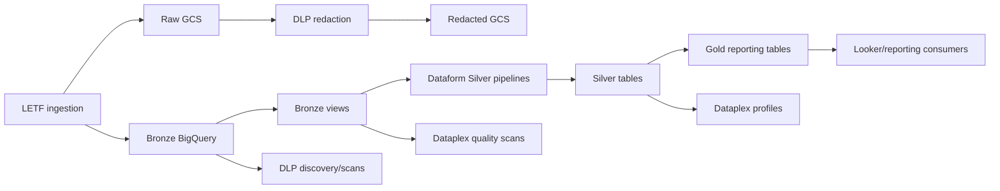

# LETF Infrastructure Reference Implementation

This directory contains LETF-specific BigQuery schemas and SQL view templates. LETF is the most complete project implementation in the infrastructure repository and may be used as a reference for onboarding other projects.

Do not copy LETF resource names, IAM groups, schedules, policy-tag IDs, or business tables into another project without review. The shared management conventions are documented in [`../README.md`](../README.md).

## Current implementation layout

LETF has not yet been fully moved into a child Terraform module. Its implementation is distributed across:

| Location | LETF responsibility |
|---|---|
| `terraform/letf/schemas/` | BigQuery table schemas. |
| `terraform/letf/view_definition/` | BigQuery view SQL templates. |
| `terraform/datasets-roles.tf` | LETF dataset inventory and dataset IAM. |
| `terraform/buckets-roles.tf` | LETF bucket inventory and bucket IAM. |
| `terraform/roles-dataplex.tf` | LETF Dataplex lake access and shared policy-tag access. |
| `terraform/envs/*/*.tfvars` | LETF tables, views, Dataplex, DLP, Dataform schedules, taxonomy IDs, and project-specific environment values. |
| `terraform/table_creation.tf` | Shared factory that reads LETF schema files. |
| `terraform/view_creation.tf` | Shared factory that renders LETF view templates. |
| `terraform/dataplex.tf` | Dataplex lake, zones, assets, profiles, and data-quality scans. |
| `terraform/data-loss-prevention.tf` | DLP discovery, scans, alerts, tags, masking, and GCS redaction. |
| `terraform/dataform-etl-infra.tf` | Scheduled LETF Dataform workflows. |

A future refactor should move LETF inventory maps into this project directory while preserving Terraform state with `moved` blocks.

---

## Purpose and platform role

LETF infrastructure supports:

- ServiceNow/Public Works source data landing and Bronze storage;
- Silver/staging and Gold/curated BigQuery layers;
- legacy eCPR and related historical datasets;
- Dataform transformation scheduling;
- Dataplex governance and quality scans;
- DLP discovery, PII masking, sensitive-data access, and GCS redaction;
- reporting access for LETF, Public Works, LCO, OIS, OSHA, WCIS, and Looker groups.



---

## Environments

| Environment | Short code | Warehouse branch | Dataform release schedule | Silver workflows | Gold workflows |
|---|---:|---|---|---|---|
| Development | `d` | `dev` | Daily at 7:00 AM PT | Daily at 10:00 AM PT | Daily at 10:30 AM PT |
| Test | `t` | `test` | Daily at 7:00 AM PT | Daily at 10:00 AM PT | Daily at 10:30 AM PT |
| Production | `p` | `main` | Daily at 11:00 PM PT | Daily at 1:00 AM PT | Daily at 1:30 AM PT |

All current Dataform workflow configurations use `America/Los_Angeles`.

The development, test, and production tfvars contain nearly identical LETF inventories with environment-specific:

- project suffixes;
- dataset suffixes;
- backend state;
- taxonomy and policy-tag IDs;
- service accounts;
- Dataform Git secrets;
- schedules and branches;
- Data Fusion networking.

---

## Project dependencies

LETF uses project IDs returned by the platform foundation remote state. Important logical project roles include:

| Logical project key | Purpose |
|---|---|
| `dir-data-services` | Dataplex, Dataform, DLP, Data Fusion, Pub/Sub notifications, and shared services. |
| `letf-data-ingestion` | LETF raw/history/redacted GCS buckets. |
| `dir-data-warehouse` | LETF BigQuery datasets, tables, views, DLP findings, and warehouse data. |
| environment seed/CICD project | Terraform execution and Dataflow Flex Template bucket. |

Project names are environment-suffixed by the foundation repository and shared resource factories.

---

## BigQuery datasets

The root `datasets-roles.tf` creates the following base datasets as `<base>_letf_<env>`:

| Base dataset | Intended role |
|---|---|
| `ds_audit` | Audit and execution records. |
| `ds_dlp` | Sensitive Data Protection findings/profile results. |
| `ds_error` | Ingestion and processing error data. |
| `ds_snow_raw` | ServiceNow Bronze/raw tables and source views. |
| `dw_snow_stg` | ServiceNow Silver/current-state tables. |
| `dw_snow_curated` | Gold/curated LETF reporting tables. |
| `ds_snow_history` | ServiceNow historical storage. |
| `ds_ecpr_history` | Legacy eCPR source history. |
| `dw_ecpr_stg` | Normalized eCPR staging data. |
| `dw_ecpr_curated` | Combined/curated eCPR data. |
| `ds_etl_utils` | ETL support objects. |
| `ds_pwc100_history` | PWC-100 history. |
| `ds_pwc100_das_dmz_unify_history` | PWC-100/DAS/DMZ unified history. |
| `ds_pwcr_history` | PWCR history. |
| `ds_im_api_history` | IM API history. |
| `ds_dpipes_utils_history` | Data-pipeline utility history. |
| `ds_looker_scratch` | Development-only Looker scratch dataset. |

`delete_contents_on_destroy` is `false`, which helps prevent dataset destruction while data exists. Dataset IAM remains extensive and must be reviewed carefully whenever groups are added or removed.

### Dataset access model

The current IAM catalog includes combinations of:

- LETF analysts, data specialists, contractors, end users, and sensitive-data viewers;
- LETF and Public Works Looker developer/user/viewer groups;
- DLSE/LCO, OIS, OSHA, WCIS, and platform-admin Looker groups;
- Dataform and eCPR search service accounts;
- environment-dependent editor/viewer access for data specialists.

The exact group list is maintained in `terraform/datasets-roles.tf`. Any IAM change should include:

1. business owner approval;
2. data owner/steward review;
3. least-privilege assessment;
4. production access validation;
5. applicable project README update.

---

## Cloud Storage buckets

The root `buckets-roles.tf` creates:

| Bucket pattern | Purpose | Primary access |
|---|---|---|
| `gcs-letf-history-load-<env>` | Historical file loads. | LETF data specialists and analysts as object viewers. |
| `gcs-letf-raw-output-<env>` | Raw unredacted output. | Sensitive-data-viewer group as object viewer. |
| `gcs-letf-raw-output-redacted-<env>` | Redacted output. | LETF data specialists as object viewers. |

All use:

- regional placement in `us-west2`;
- uniform bucket-level access;
- `force_destroy = false`.

The root also creates a shared Dataflow Flex Template bucket named `dataflow-flex-templates-dir-<longenv>` in the CICD project.

### Bucket maintenance gaps

Current bucket definitions do not explicitly configure:

- object lifecycle/retention;
- versioning;
- access logging;
- customer-managed encryption keys;
- public access prevention;
- soft-delete policy expectations.

Add these as shared factory options before using the pattern for regulated or long-retention data.

---

## BigQuery tables

The environment tfvars configure 20 active LETF tables through the shared table factory. The table factory reads schemas from `letf/schemas/<table>.json`.

### Silver/staging tables

| Table | Dataset base | Partition field | PII policy-tagged columns |
|---|---|---|---|
| `customer_account` | `dw_snow_stg_letf` | `sys_updated_on` | `tax_id` |
| `customer_contact` | `dw_snow_stg_letf` | `sys_updated_on` | none configured |
| `sn_gsm_business_profile` | `dw_snow_stg_letf` | `sys_updated_on` | none configured |
| `x_cdoi2_csm_portal_customer_account_lookup` | `dw_snow_stg_letf` | `sys_updated_on` | `tax_id` |
| `x_cdoi2_csm_portal_his_reg_dates` | `dw_snow_stg_letf` | `sys_updated_on` | none configured |
| `x_cdoi2_csm_portal_project` | `dw_snow_stg_letf` | `sys_updated_on` | none configured |
| `x_cdoi2_csm_portal_transaction_record` | `dw_snow_stg_letf` | `sys_updated_on` | none configured |
| `x_cdoi2_letf_core_classification` | `dw_snow_stg_letf` | unpartitioned | none configured |
| `x_cdoi2_letf_core_craft` | `dw_snow_stg_letf` | unpartitioned | none configured |
| `x_cdoi2_letf_ecpr_payroll_run` | `dw_snow_stg_letf` | `sys_updated_on` | `employee_name`, `ssn`, `employee_address` |
| `x_cdoi2_ldm_registry` | `dw_snow_stg_letf` | `sys_updated_on` | none configured |

### Gold/curated tables

| Table | Dataset base | Partitioning | PII policy-tagged columns |
|---|---|---|---|
| `ab_compliance` | `dw_snow_curated_letf` | none | none configured |
| `contractor_compliance` | `dw_snow_curated_letf` | none | none configured |
| `contractor_registration_fees_penalties_v2` | `dw_snow_curated_letf` | none | none configured |
| `contractor_registrations_by_fiscal_year` | `dw_snow_curated_letf` | none | `tax_id` |
| `contractor_registrations_renewals_v2` | `dw_snow_curated_letf` | none | `tax_id` |
| `lapsed_contractor_ecpr_submissions` | `dw_snow_curated_letf` | none | none configured |
| `registered_contractors_late_ecpr_submissions` | `dw_snow_curated_letf` | none | none configured |
| `user_accounts` | `dw_snow_curated_letf` | none | none configured |

### Legacy eCPR table

| Table | Dataset base | Partition field | PII policy-tagged columns |
|---|---|---|---|
| `ecpr_payroll_legacy` | `dw_ecpr_stg_letf` | `end_date` | `employee_name`, `ssn`, `employee_address` |

### Schema inventory

`letf/schemas/` currently contains 21 JSON files. `customer_account_pii.json` is present but its table configuration is commented out. Treat it as an unused example/legacy artifact until ownership is confirmed.

### Table maintenance procedure

When changing a table:

1. Update the schema JSON.
2. Update the corresponding Dataform model in the warehouse repository.
3. Review partitioning and clustering requirements.
4. Update `pii_columns` when sensitive fields are added or renamed.
5. Confirm taxonomy and policy-tag IDs for all environments.
6. Run a Terraform plan and inspect whether the provider proposes an in-place update or replacement.
7. Plan data backfill/migration explicitly; the create configuration is not a full schema-migration system.
8. Update this README.

---

## BigQuery views

The tfvars define 14 LETF views. SQL templates are stored in `letf/view_definition/`.

| View | Dataset role | Source table template |
|---|---|---|
| `v_customer_account` | Bronze/raw | `customer_account` |
| `v_customer_contact` | Bronze/raw | `customer_contact` |
| `v_sn_gsm_business_profile` | Bronze/raw | `sn_gsm_business_profile` |
| `v_x_cdoi2_csm_portal_customer_account_lookup` | Bronze/raw | matching source table |
| `v_x_cdoi2_csm_portal_his_reg_dates` | Bronze/raw | matching source table |
| `v_x_cdoi2_csm_portal_project` | Bronze/raw | matching source table |
| `v_x_cdoi2_csm_portal_transaction_record` | Bronze/raw | matching source table |
| `v_x_cdoi2_letf_core_classification` | Bronze/raw | matching source table |
| `v_x_cdoi2_letf_core_craft` | Bronze/raw | matching source table |
| `v_x_cdoi2_letf_ecpr_payroll_run` | Bronze/raw | matching source table |
| `v_x_cdoi2_ldm_registry` | Bronze/raw | matching source table |
| `v_bq_audit_letf` | Audit | `bq_audit_letf` |
| `v_weeklypayrollinfo` | eCPR history | `WEEKLYPAYROLLINFO` |
| `v_employee_payroll_rs` | eCPR history | `EMPLOYEE_PAYROLL_RS` |

All templates use `${project_id}`, `${dataset_id}`, and `${source_table}` variables supplied by the shared view factory.

### View maintenance

- Keep view output columns aligned with Dataform Bronze declarations.
- Preserve supported data-type conversions.
- Validate source columns before ingestion schema changes.
- Test in development using the fully suffixed project/dataset names.
- Review downstream Dataform impact before renaming a view.

---

## Dataplex configuration

### Lake and zones

Current base lake: `dl-letf`.

Zones:

| Zone key | Type | Intended contents |
|---|---|---|
| `raw` | `RAW` | Bronze BigQuery and raw GCS assets. |
| `stage` | `CURATED` | Silver/staging BigQuery assets. |
| `curated` | `CURATED` | Gold/curated BigQuery assets. |

### Assets

Configured assets:

- Bronze BigQuery dataset;
- Silver BigQuery dataset;
- Gold BigQuery dataset;
- raw landing GCS bucket.

### Profile scans

Eleven profile scans are configured. Most run weekly at `0 18 * * 1`; the transactions profile is currently configured hourly at minute 35.

Profiled tables:

- customer account;
- customer contact;
- customer account lookup;
- business profile;
- registration dates;
- project;
- core classification;
- core craft;
- transactions;
- payroll run;
- local debarment registry.

System/ingestion fields are excluded from profiles, including created/updated metadata, source application, business object, schema version, publish time, and event type.

### Data-quality scans

Ten scans target LETF Bronze views. Current schedules are hourly at minute 35 or 50. Rule sets include non-null, uniqueness, range, regular expression, allowed-set, and row-condition checks.

Maintenance rules:

- Confirm hourly scans are cost-appropriate.
- Keep quality rules aligned with source and Dataform assertions.
- Add a scan for local debarment registry if required; it currently has a profile scan but no listed quality scan.
- Ensure Dataplex service agents can access cross-project assets.

---

## Sensitive Data Protection and PII controls

### Team onboarding

LETF has one DLP team entry with:

- the Data Platform response-team notification email;
- a sensitive-data-viewer group;
- masked-data-viewer groups;
- an eCPR masked-search service account.

### Discovery and scans

Current configuration includes:

- continuous BigQuery discovery for the LETF raw dataset;
- daily table scans for customer account and customer account lookup in development/test;
- daily GCS scan of the raw-output bucket;
- daily GCS redaction from raw-output to raw-output-redacted.

The production tfvars currently omit the two explicit table scanners while retaining project-level discovery and GCS scanning/redaction.

### Taxonomy and masking

The framework creates:

- a central PII taxonomy;
- high, medium, and low tags for LETF;
- SHA-256 masking policies;
- masked-reader and sensitive-viewer IAM grants.

Table creation currently references taxonomy and policy-tag numeric IDs stored in tfvars rather than directly consuming Terraform-created resource IDs.

**Risk:** replacing/recreating policy tags can invalidate table configuration. Refactor to pass resource IDs directly.

### Sensitive columns

Policy-tagged fields currently include:

- tax identifiers in customer/registration tables;
- employee names;
- Social Security numbers;
- employee addresses.

Review untagged contact, address, payment, and identity fields as part of privacy governance. The current list should not be assumed complete simply because no policy tag is configured.

---

## Dataform infrastructure and schedules

The shared Dataform infrastructure connects to the data-warehouse Git repository and creates one workflow per configured tag.

### Silver/current-state workflows

Ten workflows run in the first schedule tier:

- customer account;
- business profile;
- core classification;
- core craft;
- customer account lookup;
- customer contact;
- payroll run;
- project;
- registration dates;
- transactions.

### Gold/reporting workflows

Nine workflows run 30 minutes later:

- awarding-body compliance;
- contractor compliance;
- registration fees and penalties;
- registrations by fiscal year;
- registration renewals;
- lapsed contractor eCPR submissions;
- registered-contractor late eCPR submissions;
- user accounts;
- fiscal date dimension.

### Scheduling risk

All workflows within each tier are individually scheduled and can execute concurrently. The 30-minute offset assumes the upstream Silver workflows finish in time. It does not create a true cross-workflow dependency.

Recommended improvement:

- use one orchestrated workflow or dependency-aware invocation for related pipeline groups;
- alert when Silver completion misses the Gold start window;
- document maximum expected runtime and retry behavior.

---

## LETF IAM maintenance

LETF IAM is spread across:

- BigQuery dataset IAM;
- GCS bucket IAM;
- Dataplex lake IAM;
- DLP data-policy IAM;
- policy-tag IAM;
- Dataform workflow service accounts.

Before changing access:

1. identify whether access should apply to raw, redacted, Silver, Gold, audit, error, DLP, or historical data;
2. distinguish masked versus unmasked access;
3. confirm whether access is for BigQuery, Dataplex metadata, Looker, GCS, or Dataform execution;
4. validate environment-specific service-account identities;
5. remove stale groups through a controlled access review.

Avoid adding users directly; use approved Google groups or service accounts.

---

## Deployment and validation

### Development plan

```bash
cd terraform
cp envs/dev/backend.tf .
cp envs/dev/dev.tfvars .
terraform init
terraform fmt -check -recursive
terraform validate
terraform plan -var-file=dev.tfvars
```

### Minimum LETF validation

- All 21 JSON schemas parse.
- Every active table has a schema.
- Every configured view has a SQL template.
- Partition fields exist and use compatible BigQuery types.
- PII column names exist in the corresponding schema.
- Taxonomy and policy-tag IDs are environment-correct.
- Dataplex target tables/views exist.
- DLP findings dataset exists.
- Dataform tags exist in the warehouse repository.
- Workflow service accounts can read source data and write targets.
- No unexpected IAM revocation appears in the plan.

---

## Operational runbook

### LETF table creation fails

1. Confirm the dataset exists.
2. Validate the schema JSON.
3. Check the table name matches the schema filename.
4. Confirm the partition field exists.
5. Verify policy-tag IDs and Data Catalog permissions.
6. Check whether an incompatible existing table requires a migration.

### LETF view creation fails

1. Render the template with the final environment project/dataset.
2. Confirm the source table exists.
3. Run the SQL in BigQuery development.
4. Compare output columns to the warehouse Bronze declaration.

### DLP notification or findings missing

1. Confirm the LETF DLP findings dataset exists.
2. Confirm the Pub/Sub topic and alert policy.
3. Check DLP service-agent IAM in source and findings projects.
4. Verify scanner schedule/status.
5. Confirm project-level discovery and table scanners are not conflicting.

### Redacted files missing

1. Verify raw source object arrival.
2. Verify the redaction trigger schedule.
3. Confirm the source and redacted bucket URLs after suffixing.
4. Verify de-identification template access.
5. Review DLP job errors and unsupported file formats.

### Gold workflow starts before Silver completion

1. Pause or rerun the affected Gold tag.
2. Confirm all required Silver workflows succeeded.
3. Validate target table freshness.
4. Document the missed dependency window.
5. Adjust orchestration rather than only increasing a fixed offset when recurrence is possible.

---

## Known risks and improvement priorities

### High priority

1. Move LETF dataset, bucket, IAM, Dataplex, DLP, table, view, and workflow maps into a LETF child module.
2. Replace hard-coded taxonomy and policy-tag IDs with resource references.
3. Add table deletion protection or documented backups/snapshots for production.
4. Replace schedule offsets with dependency-aware Dataform orchestration.
5. Review all potentially sensitive columns, not only currently tagged fields.

### Medium priority

6. Add bucket retention, lifecycle, versioning, encryption, and logging.
7. Review the hourly Dataplex scan cost and cadence.
8. Reconcile project-level DLP discovery with explicit table scans.
9. Remove the unused `customer_account_pii.json` or document its intended purpose.
10. Parameterize LETF-specific Dataplex descriptions and IAM maps.
11. Add schema compatibility checks against ingestion and Dataform repositories.
12. Add automated validation that every `pii_columns` key exists in the JSON schema.

---

## LETF release checklist

- [ ] LETF README updated.
- [ ] Schema and view changes synchronized with ingestion and warehouse repositories.
- [ ] JSON schemas parse.
- [ ] SQL templates render and execute in development.
- [ ] PII fields and policy tags reviewed.
- [ ] Partitioning and replacement behavior reviewed.
- [ ] Dataplex assets/scans updated where needed.
- [ ] DLP scanners and redaction jobs updated where needed.
- [ ] Dataform tags, schedules, and service accounts verified.
- [ ] IAM additions/removals approved.
- [ ] Development and test plans reviewed.
- [ ] Production rollback/data-preservation plan documented.
