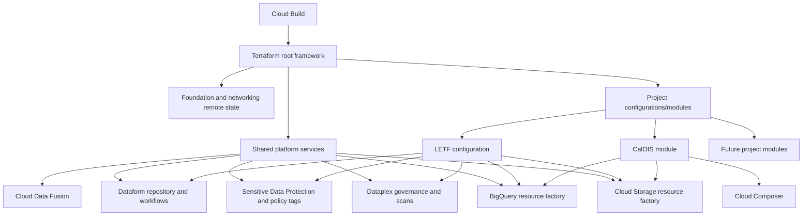

# DIR Data Platform Infrastructure Framework

This repository manages shared Google Cloud infrastructure for the DIR enterprise data platform and the project-specific infrastructure required by individual data domains.

The repository is intended to support multiple projects through a common Terraform framework rather than requiring every project to create and maintain a separate infrastructure repository.

## Documentation model

Documentation is divided into two levels:

1. **Shared framework documentation** describes conventions and components that apply to every onboarded project.
2. **Project documentation** describes only the datasets, buckets, schemas, views, schedules, IAM assignments, governance rules, and operational requirements unique to that project.

| Documentation | Scope |
|---|---|
| [`terraform/README.md`](terraform/README.md) | Shared Terraform framework, deployment process, configuration contracts, governance services, and project onboarding. |
| [`terraform/letf/README.md`](terraform/letf/README.md) | LETF-specific infrastructure and configuration. LETF is the most complete reference implementation. |
| [`terraform/calois/README.md`](terraform/calois/README.md) | CalOIS-specific infrastructure and configuration. |

## Framework responsibilities

The shared framework can manage:

- environment-specific Terraform state and remote-state dependencies;
- Google Cloud project discovery from the platform foundation repository;
- BigQuery datasets, tables, views, partitioning, schemas, and column policy tags;
- Cloud Storage buckets and project-specific IAM assignments;
- Dataplex lakes, zones, assets, data-profile scans, and data-quality scans;
- Sensitive Data Protection discovery, scheduled inspection, redaction, notifications, taxonomies, policy tags, and masking policies;
- Dataform repositories, release configurations, and scheduled workflow configurations;
- private Cloud Data Fusion and Private Service Connect network attachments;
- optional project modules such as CalOIS;
- Cloud Build plan and apply workflows for development, test, and production.

Project-specific resource inventories must remain in the applicable project README and configuration files. Shared documentation should not become a catalog of one project's objects.

## High-level architecture



## Repository structure

```text
.
├── README.md
├── cb-files/
│   ├── cloudbuild_pipeline_plan.yaml
│   ├── cloudbuild_pipeline_apply.yaml
│   └── cloudbuild_df_flex_template.yaml
└── terraform/
    ├── README.md
    ├── provider.tf
    ├── main.tf
    ├── variables.tf
    ├── outputs.tf
    ├── application_modules.tf
    ├── datasets-roles.tf
    ├── buckets-roles.tf
    ├── table_creation.tf
    ├── view_creation.tf
    ├── dataplex.tf
    ├── roles-dataplex.tf
    ├── data-loss-prevention.tf
    ├── dataform-etl-infra.tf
    ├── attachment.tf
    ├── datafusion.tf
    ├── envs/
    │   ├── dev/
    │   ├── test/
    │   └── prod/
    ├── letf/
    │   ├── README.md
    │   ├── schemas/
    │   └── view_definition/
    └── calois/
        ├── README.md
        ├── schemas/
        └── view_definition/
```

## Environment and branch mapping

| Git branch or target | Terraform environment directory | Short environment | State backend |
|---|---|---:|---|
| `dev` | `terraform/envs/dev` | `d` | Development state bucket/prefix. |
| `test` | `terraform/envs/test` | `t` | Test state bucket/prefix. |
| `main` | `terraform/envs/prod` | `p` | Production state bucket/prefix. |

Resource factories generally expect base project and dataset names and add `-d/-t/-p` to projects or `_d/_t/_p` to datasets. Project documentation must identify exceptions and hard-coded names.

## Deployment

Pull-request validation uses `cb-files/cloudbuild_pipeline_plan.yaml`. Branch deployments use `cb-files/cloudbuild_pipeline_apply.yaml`.

Typical local validation:

```bash
cd terraform
cp envs/dev/backend.tf .
cp envs/dev/dev.tfvars .
terraform init
terraform fmt -check -recursive
terraform validate
terraform plan -var-file=dev.tfvars
```

Do not apply production changes from a workstation unless the approved operational process explicitly permits it.

## Adding another project

A new project should follow the onboarding process in [`terraform/README.md`](terraform/README.md). At minimum it must have:

- an isolated project directory;
- a project README;
- environment activation controls;
- resource inventories and naming conventions;
- schema and view definitions kept within the project directory;
- project-specific IAM and governance configuration;
- schedules and service-account ownership;
- test, rollback, and decommissioning procedures.

LETF may be used as a functional reference, but its names, groups, taxonomies, schedules, and business-specific resources must not be copied without review.

## Maintenance principles

- Keep shared resource-generation logic generic.
- Keep project inventories and business configuration in project folders or clearly separated environment maps.
- Pin Terraform and provider versions.
- Review plans for resource replacement, deletion, IAM changes, and state movement.
- Use immutable schemas and explicit migrations for production BigQuery tables.
- Use least-privilege service accounts and groups.
- Keep sensitive values in Secret Manager rather than tfvars.
- Prevent concurrent Terraform applies to the same state.
- Update the applicable project README in the same pull request as a project configuration change.

## Current structural limitations

The repository is moving toward a multi-project module structure, but it is not fully refactored yet:

- LETF datasets, buckets, IAM assignments, Dataplex configuration, DLP configuration, tables, views, and Dataform schedules are primarily configured in root files and environment tfvars.
- CalOIS is an optional child module controlled by `build_in_cur_env`.
- Some shared files still contain LETF-specific names and IAM groups.
- The Dataflow Flex Template Cloud Build file references a `dataflow-flex-template/` directory that is not present in this repository.

These limitations are documented in the framework and project READMEs so future refactoring can occur without obscuring the current production behavior.
