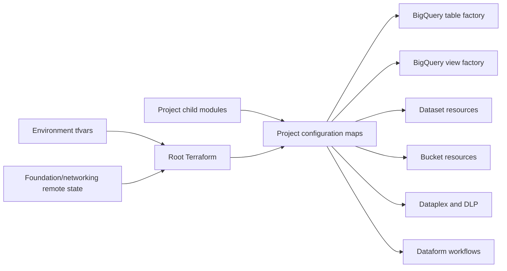

# Shared Terraform Infrastructure Framework

This directory is the shared infrastructure framework for DIR data-platform projects. It assembles common Google Cloud services and merges project-specific configuration into reusable BigQuery table, BigQuery view, governance, security, orchestration, and storage resource patterns.

Project-specific details belong in the project README files:

- [`letf/README.md`](letf/README.md)
- [`calois/README.md`](calois/README.md)

## Framework scope

The framework manages infrastructure, not source extraction code or Dataform SQL transformations. The related ingestion and warehouse repositories provide those implementation layers.

### Shared capabilities

| Capability | Terraform files | Purpose |
|---|---|---|
| Provider and state composition | `provider.tf`, `main.tf`, `envs/*/backend.tf` | Configure providers and read platform foundation/networking outputs. |
| Optional project modules | `application_modules.tf` | Enable project child modules through environment flags. |
| BigQuery datasets and IAM | `datasets-roles.tf`, project module equivalents | Create project datasets and assign dataset-level access. |
| BigQuery tables | `table_creation.tf` | Create schema-driven tables, partitioning, labels, and policy-tag bindings. |
| BigQuery views | `view_creation.tf` | Create templated SQL views from project SQL files. |
| Cloud Storage | `buckets-roles.tf`, project module equivalents | Create project buckets and assign bucket-level access. |
| Dataplex | `dataplex.tf`, `roles-dataplex.tf` | Create lake, zones, assets, scans, and governance access. |
| Sensitive Data Protection | `data-loss-prevention.tf`, `pii_infotypes.json` | Detect, report, classify, mask, and redact sensitive data. |
| Dataform orchestration | `dataform-etl-infra.tf` | Connect the warehouse repository and schedule tag-based workflows. |
| Data Fusion | `attachment.tf`, `datafusion.tf` | Deploy a private enterprise instance through PSC. |
| Deployment | `../cb-files/cloudbuild_pipeline_*.yaml` | Plan and apply Terraform by environment branch. |

## How the framework assembles resources



### Current project composition

- LETF configuration is primarily stored directly in root Terraform files and `envs/*/*.tfvars`.
- CalOIS uses `module "calois_config"` and exports table/view maps into the root factories.
- `build_in_cur_env` determines whether optional modules are instantiated.

A future project should use a child module wherever practical rather than expanding root LETF-specific locals.

---

## File-by-file maintenance guide

### `provider.tf`

Declares:

- `hashicorp/google` version `7.4.0`;
- `hashicorp/google-beta` version `7.4.0`;
- default project and region from `seed_project_id` and `region`.

Maintenance rules:

- Add a Terraform `required_version` constraint.
- Explicitly declare and pin the `hashicorp/time` provider because `time_sleep` is used by Dataplex provisioning.
- Commit `.terraform.lock.hcl` when allowed by repository policy.
- Upgrade Google and Google Beta together unless a tested compatibility reason requires otherwise.

### `main.tf`

Reads two GCS-backed remote states:

- data-platform networking;
- data-platform foundation.

Important outputs consumed:

- `cdf_subnet_id`;
- `composer_subnet_id`;
- `dplat_project_ids`.

It also:

- resolves Data Services and Looker project metadata;
- derives environment-specific subnet availability;
- contains `moved` blocks used to preserve Terraform state during the CalOIS and Data Fusion refactors.

Maintenance rules:

- Never remove a `moved` block until every applicable state has migrated and the removal is reviewed.
- Treat changes to remote-state bucket/prefix or output names as cross-repository changes.
- Confirm remote-state access for the deployment service account.
- `composer_subnet_id` is currently resolved only in development.
- Data Fusion resources are currently created only in development and production.

### `variables.tf`

Defines the shared input contract for environment, governance, DLP, tables, views, Data Fusion, remote state, Dataform, and project activation.

Important variable groups:

| Group | Variables |
|---|---|
| Environment | `shortenv`, `longenv`, `seed_project_id`, `region` |
| Remote state | `dplat_networking_state`, `dplat_foundation_state` |
| Tables/views | `table_creation`, `view_definitions` |
| Dataplex | `lake_name_ref`, `dataplex_zones`, `dataplex_asset_definitions`, profile and quality scan maps |
| DLP | team onboarding, discovery datasets, dataset/GCS scanners, GCS redaction jobs |
| Data Fusion | `datafusion_version` and several legacy/unused settings |
| Dataform | repository URL/secret, branch, release schedule, pipeline schedules, service account |
| Project activation | `build_in_cur_env` |

Current unused or legacy variables include:

- `lake_name`;
- `raw_zone_name`;
- `stg_zone_name`;
- `curated_zone_name`;
- `gcs_raw_bucket_name`;
- `bq_bronze_dataset_id`;
- `bq_staging_dataset_id`;
- `bq_curated_dataset_id`;
- `cicd_service_account`;
- `datafusion_project_id`;
- `is_private_instance`;
- `network`;
- `ip_allocation`.

Remove these only after confirming they are not used by external automation. Add validation blocks for environment values, cron schedules, resource-name formats, partition types, and project activation keys.

### `application_modules.tf`

Instantiates optional project modules.

Current module:

```hcl
module "calois_config" {
  count  = coalesce(var.build_in_cur_env["calois"], false) ? 1 : 0
  source = "./calois"
}
```

Maintenance rules:

- Every environment tfvars must include a Boolean entry for each key referenced directly in `build_in_cur_env`.
- Prefer `lookup(var.build_in_cur_env, "project", false)` to avoid missing-key failures.
- A new project module should export normalized table/view maps when it needs the shared factories.
- Keep module inputs generic and pass remote-state-derived project IDs rather than embedding project IDs in child modules.

### `table_creation.tf`

Creates BigQuery tables from `table_creation` maps and project-module schema maps.

Resource behavior:

- project name: `<base-project>-<shortenv>`;
- dataset name: `<base-dataset>_<shortenv>`;
- schema path: `<terraform>/<lowercase-team>/schemas/<table>.json`;
- optional time partitioning;
- project/team labels;
- policy tags injected into matching schema fields;
- `deletion_protection = false`.

Configuration contract:

```hcl
<Project> = {
  <table_name> = {
    project_id       = "base-project"
    dataset_id       = "base_dataset_project"
    location         = "us-west2"
    taxonomy_id      = "taxonomy-resource-id"
    pii_columns      = { column_name = "policy-tag-id" }
    partition_field  = "event_timestamp"
    partition_type   = "DAY"
  }
}
```

Maintenance rules:

- Team keys are lowercased to locate the project folder.
- Every configured table must have a valid JSON schema file.
- `CREATE` configuration does not provide an automatic migration plan for existing tables.
- Changing partition fields can require table replacement.
- Policy-tag IDs are supplied by tfvars; they are not automatically read from the policy-tag resources created in `data-loss-prevention.tf`.
- Enable deletion protection for critical production tables or document why it is disabled.
- Validate schema files and PII-column names in CI.

### `view_creation.tf`

Creates BigQuery logical views from project SQL templates.

Each view definition supplies:

- base project;
- base dataset;
- view ID;
- SQL template path;
- optional template variables.

The framework adds fully suffixed `project_id` and `dataset_id` variables to every template.

Maintenance rules:

- Store SQL templates under the applicable project directory.
- Use `${project_id}`, `${dataset_id}`, and `${source_table}` placeholders consistently.
- Add explicit dependencies if a view references resources created in the same Terraform run and ordering cannot be inferred.
- Compile the template and execute it in a test project before production.
- The `debug_project_ids` output currently reflects only root `view_definitions`, not child-module view maps.

### `datasets-roles.tf`

Currently implements the LETF dataset inventory and IAM catalog directly in the root module. It is project-specific in content even though it is at the framework level.

Long-term recommendation:

- move LETF dataset and role maps to `letf/`;
- keep a generic dataset factory at root;
- have every project export a normalized dataset/IAM map.

### `buckets-roles.tf`

Currently implements LETF buckets and IAM directly and also creates the shared Dataflow template bucket.

Long-term recommendation:

- move LETF bucket maps to the LETF project folder;
- keep the shared template bucket in a shared platform module;
- expose retention, lifecycle, encryption, logging, and versioning settings in the bucket contract.

### `dataplex.tf`

Creates:

- one Dataplex lake;
- a 30-second provisioning wait;
- configured zones;
- configured BigQuery/GCS assets;
- scheduled data-profile scans;
- scheduled data-quality scans.

Naming is generated with the short environment suffix.

Maintenance rules:

- Lake descriptions and labels currently contain LETF-specific text and should be parameterized before onboarding another project to the same pattern.
- Resource path formatting assumes base project/dataset/bucket names.
- Profile scans sample 100% of records.
- Quality scan rule types supported are `non_null`, `uniqueness`, `range`, `regex`, `set`, and `row_condition`.
- Quality scans depend on all dynamic views, which can over-couple unrelated projects.
- Add timezone and cost expectations to every scan schedule.
- Use a project/domain key in resource maps to avoid naming collisions.

### `roles-dataplex.tf`

Grants Dataplex lake access and policy-tag/data-policy access.

Current limitations:

- Lake IAM groups are hard-coded for LETF.
- Masked-reader grants are generated for all `dlp_team_onboarding` entries.
- Sensitive-reader grants are tied to a separate high-sensitivity catalog tag resource rather than clearly to the same tag used by configured BigQuery columns.
- Medium and low policy-tag IAM are not configured here.

Refactor this file before treating it as a fully generic project onboarding mechanism.

### `data-loss-prevention.tf`

Shared Sensitive Data Protection framework.

Resources include:

- one findings dataset lookup per team;
- per-team Pub/Sub finding-notification topics;
- email notification channels and alert policies;
- a central inspection template populated from `pii_infotypes.json`;
- BigQuery discovery profiles;
- scheduled table inspections;
- scheduled GCS inspections;
- one central taxonomy;
- high, medium, and low tags per team;
- SHA-256 masking policies;
- a de-identification template;
- scheduled GCS redaction jobs.

Maintenance rules:

- `pii_infotypes.json` is a shared detection contract; review changes with security/privacy stakeholders.
- Findings datasets must already exist before the data sources can resolve them.
- Cross-project DLP service-agent IAM is not declared in this repository and must be verified.
- The discovery exclusion pattern references `ds_dlp_findings_*`, while current project findings datasets follow a different naming convention; verify that findings tables are actually excluded.
- Project-level discovery and table-level scanners can overlap and duplicate cost/findings.
- Alert policies notify on Pub/Sub message count, not on a reviewed severity workflow.
- Redaction jobs append environment suffixes to configured GCS URLs; project configurations must provide base URLs in the expected form.
- Taxonomy and policy-tag IDs used by table creation are currently static tfvars values, creating drift risk from the dynamically created resources.

### `dataform-etl-infra.tf`

Creates:

- a Dataform repository connected to the warehouse Git repository over SSH;
- a release configuration;
- one scheduled workflow per configured project/pipeline/tag.

The workflow map is flattened from:

```hcl
dataform_etl_pipelines = {
  project = {
    pipeline = {
      schedule                       = "cron"
      time_zone                      = "America/Los_Angeles"
      tag                            = "dataform_tag"
      pipeline_service_account_email = "service-account"
    }
  }
}
```

Maintenance rules:

- Keep the Dataform repository, CLI/Core version, release branch, and infrastructure configuration aligned with the warehouse repository.
- The Git SSH secret is looked up in the Data Services project.
- Release configurations use `America/Los_Angeles`; workflow time zones are configurable.
- Every pipeline tag must exist in the Dataform repository.
- Schedules within the same dependency tier can run concurrently; use explicit orchestration or staggered schedules where ordering matters.
- Project workflow service accounts should be project-scoped and least privilege.

### `attachment.tf` and `datafusion.tf`

Deploy a private enterprise Cloud Data Fusion instance and PSC network attachment in development and production only.

Maintenance rules:

- The actual resource always uses private PSC regardless of the legacy `is_private_instance`, `network`, and `ip_allocation` variables.
- The unreachable CIDR is hard-coded to `192.168.0.0/25`.
- Validate network attachment and service-agent permissions before upgrades.
- Test Data Fusion version upgrades in development.
- Test environment does not deploy a Data Fusion instance under current `count` logic.

### `outputs.tf`

Exports LETF and optional CalOIS dataset IDs. Shared output conventions should be expanded as additional project modules are added.

---

## Environment files

Each environment directory contains:

- `backend.tf` — GCS backend bucket and prefix;
- `<env>.tfvars` — environment and project configuration.

| Environment | Short code | Branch | Region |
|---|---:|---|---|
| Development | `d` | `dev` | `us-west2` |
| Test | `t` | `test` | `us-west2` |
| Production | `p` | `main` | `us-west2` |

### Configuration ownership

Shared values:

- environment identifiers;
- seed project;
- region;
- remote states;
- provider/service versions;
- Dataform repository connection;
- project activation flags.

Project-specific values:

- datasets, buckets, schemas, views;
- IAM groups and service accounts;
- DLP onboarding and scanners;
- Dataplex assets/scans;
- Dataform tags and schedules;
- policy-tag IDs and PII columns.

Project-specific values currently stored in root tfvars must be documented in the project README.

---

## Cloud Build workflows

### Plan workflow

`../cb-files/cloudbuild_pipeline_plan.yaml`:

- maps `_BASE_BRANCH` to an environment folder;
- copies backend/tfvars to the Terraform root;
- runs `terraform init` and `terraform plan`.

### Apply workflow

`../cb-files/cloudbuild_pipeline_apply.yaml`:

- maps `BRANCH_NAME` to an environment folder;
- runs init, plan, and `apply -auto-approve`.

### Flex Template workflow

`../cb-files/cloudbuild_df_flex_template.yaml` builds a Dataflow image and template, but the required `dataflow-flex-template/` directory is absent from this repository. Treat this file as stale or cross-repository until ownership is clarified.

### CI/CD improvements

- Pin the Terraform container instead of `latest`.
- Add `terraform fmt -check -recursive`.
- Add `terraform validate`.
- Add security/policy scanning.
- Save and apply the reviewed plan artifact.
- Fail unsupported branches rather than logging “Skipping” and succeeding.
- Prevent concurrent applies to the same environment.
- Parameterize Cloud Build service accounts.
- Remove or relocate the nonfunctional Flex Template workflow.

---

## Project onboarding standard

### 1. Create the project directory

```text
terraform/<project>/
├── README.md
├── variables.tf
├── outputs.tf
├── datasets-roles.tf
├── buckets-roles.tf
├── table_creation.tf
├── view_creation.tf
├── schemas/
└── view_definition/
```

Only include files the project actually needs.

### 2. Define the project activation flag

Add a default-false project key to `build_in_cur_env` for every environment. Enable it only where networking, IAM, and dependencies are ready.

### 3. Add a child module

Add a module block in `application_modules.tf`. Pass:

- `shortenv` and `longenv`;
- region;
- remote-state project map;
- required subnet IDs;
- shared taxonomy/policy references where appropriate.

### 4. Define resources

Document and configure:

- BigQuery dataset inventory;
- bucket inventory and retention;
- table schemas and partitioning;
- views and source dependencies;
- PII columns and sensitivity levels;
- Dataplex assets and scan schedules;
- DLP findings, scans, and notifications;
- Dataform pipeline tags, schedules, and service accounts;
- optional Composer/Data Fusion/network resources.

### 5. Export normalized maps

A project module should export maps compatible with shared factories rather than requiring root code to understand project-specific fields.

### 6. Add the project README

The README must include:

- business/system purpose;
- owners;
- environments enabled;
- project IDs and dependencies by role, not secrets;
- datasets, buckets, tables, views, and schemas;
- IAM model;
- governance and DLP configuration;
- schedules and orchestration order;
- deployment and rollback procedures;
- known risks and open gaps.

### 7. Validate

- JSON schema parsing;
- SQL template rendering;
- Terraform formatting and validation;
- plans in all environments;
- IAM and service-agent permissions;
- resource creation in development;
- scheduled workflow execution;
- DLP and Dataplex scans;
- deletion/replacement behavior.

---

## Operational runbook

### Terraform plan proposes deletion or replacement

1. Identify the resource and triggering attribute.
2. Check moved blocks and state addresses.
3. Confirm whether the change is project-specific or shared.
4. Inspect BigQuery table data, bucket contents, and retention implications.
5. Add an explicit migration instead of accepting replacement when data preservation is required.
6. Obtain project owner and platform approval.

### Remote-state failure

1. Verify backend bucket access.
2. Verify the configured state prefix.
3. Confirm the foundation/networking workspace was applied.
4. Compare expected output names to actual outputs.
5. Do not replace missing remote-state values with hard-coded IDs without approval.

### BigQuery table creation failure

1. Confirm the project and dataset exist.
2. Validate the JSON schema.
3. Confirm the project folder name matches the lowercase team key.
4. Verify partition-field existence and type.
5. Verify taxonomy and policy-tag IDs.
6. Verify Data Catalog and BigQuery Data Policy permissions.

### View creation failure

1. Render the SQL template with final project/dataset/source values.
2. Verify the source table exists.
3. Confirm region compatibility.
4. Run the SQL manually in development.
5. Add resource dependencies where Terraform ordering is insufficient.

### Dataform workflow failure

1. Verify release compilation status.
2. Confirm the included tag exists.
3. Check service-account IAM.
4. Verify source datasets/tables and schedule order.
5. Review the project warehouse README for pipeline-specific recovery.

### DLP or Dataplex scan failure

1. Verify target resource IDs after environment suffixing.
2. Verify service-agent and cross-project IAM.
3. Confirm findings datasets and Pub/Sub topics.
4. Check schedule and region.
5. Review scan costs and overlapping project/table scans.

---

## Framework risks and recommended improvements

### High priority

1. **LETF configuration is embedded in shared root files.** Move LETF maps into a project module to prevent future projects from editing project-neutral code.
2. **Static policy-tag IDs can drift from dynamically created tags.** Export and consume Terraform resource IDs directly.
3. **Cloud Build applies a newly generated plan with auto-approve.** Apply a reviewed saved plan and add approval controls.
4. **The Flex Template build is not runnable from this repository.** Remove it or move it to the ingestion repository.
5. **BigQuery table deletion protection is disabled.** Enable it for production-critical data or establish compensating controls.

### Medium priority

6. Pin Terraform and the time provider.
7. Add CI formatting, validation, and policy checks.
8. Replace hard-coded LETF Dataplex IAM and descriptions with project maps.
9. Remove unused variables and obsolete commented blocks.
10. Replace direct `build_in_cur_env["key"]` indexing with safe lookups.
11. Add standardized bucket lifecycle, logging, retention, encryption, and versioning.
12. Separate project-level DLP discovery from table-level scanning to avoid duplicated cost.
13. Parameterize Data Fusion CIDRs and deployment environments.
14. Introduce a generic dataset factory for all project modules.

---

## Release checklist

- [ ] Root and applicable project READMEs are updated.
- [ ] Terraform and provider versions are pinned and reviewed.
- [ ] `terraform fmt -check -recursive` passes.
- [ ] `terraform validate` passes.
- [ ] JSON schemas and SQL templates validate.
- [ ] Plans were reviewed for development, test, and production.
- [ ] No unintended state move, deletion, replacement, or IAM revocation exists.
- [ ] Project activation flags are correct.
- [ ] Service accounts and groups are environment-correct.
- [ ] DLP/Dataplex resource paths resolve correctly.
- [ ] Dataform tags and schedules match the warehouse repository.
- [ ] Rollback and data-preservation steps are documented.
