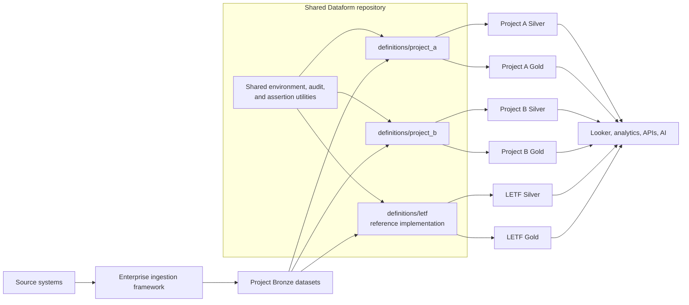

# DIR Data Warehouse Transformation Framework

This repository is the shared **Dataform and BigQuery transformation framework** for projects that use the DIR Data Platform. It is intended to host downstream transformations for multiple business programs in one governed repository rather than requiring each program to create and maintain a separate codebase.

The framework provides common conventions for:

- organizing project-specific Bronze, Silver, and Gold transformations;
- environment-aware BigQuery naming;
- reusable data-quality assertions;
- ETL audit logging and incremental watermarks;
- Dataform dependency management and tags;
- Cloud Build compilation and release validation;
- onboarding additional projects without copying the entire repository.

Project-specific data models, rules, source objects, schedules, and support procedures belong under `definitions/<project>/`. The existing [LETF implementation](definitions/letf/README.md) is the first reference implementation and may be used as a working example when adding other projects.

> **Framework maturity note**
>
> The repository began as an LETF implementation. Its directory layout already supports multiple projects, but some root configuration and shared include files still contain LETF-specific names. The [framework generalization roadmap](#framework-generalization-roadmap) identifies the changes recommended before onboarding several additional projects.

---

## Table of contents

- [Framework architecture](#framework-architecture)
- [Repository organization](#repository-organization)
- [Separation of shared and project-specific concerns](#separation-of-shared-and-project-specific-concerns)
- [Project folder contract](#project-folder-contract)
- [Transformation conventions](#transformation-conventions)
- [Shared modules](#shared-modules)
- [Configuration and environments](#configuration-and-environments)
- [Compilation and deployment](#compilation-and-deployment)
- [Adding a new project](#adding-a-new-project)
- [Adding a new entity](#adding-a-new-entity)
- [Testing strategy](#testing-strategy)
- [Operations and governance](#operations-and-governance)
- [Framework generalization roadmap](#framework-generalization-roadmap)
- [Repository-wide maintenance checklist](#repository-wide-maintenance-checklist)

---

## Framework architecture



### Framework responsibilities

The repository manages transformation logic after source data is available in BigQuery. It should provide:

1. **Source declarations** for externally managed Bronze tables or views.
2. **Silver transformations** that standardize, type, cleanse, deduplicate, and integrate source records.
3. **Gold transformations** that implement reusable business entities, metrics, and reporting-ready data products.
4. **Data-quality controls** that verify keys, required values, accepted values, relationships, counts, and project-specific rules.
5. **Audit and observability** for run status, row movement, watermarks, and incident investigation.
6. **Environment promotion** using the same source code across development, test, and production.

### Out of scope

The repository should not become the primary location for:

- source-system extraction or Dataflow/Data Fusion ingestion code;
- infrastructure provisioning that belongs in Terraform repositories;
- Looker dashboards and LookML unless explicitly adopted as part of this repository;
- ad hoc analyst queries with no production owner or support model;
- project-specific credentials or secrets;
- unmanaged copies of SQL maintained outside the Dataform dependency graph.

---

## Repository organization

```text
.
├── README.md                         # Shared framework documentation
├── dataform.json                     # Dataform project configuration and variables
├── package.json                      # Dataform Core dependency
├── package-lock.json                 # Locked npm dependency graph
├── cloudbuild_dw_etl.yaml            # Cloud Build compilation workflow
├── includes/                         # Shared JavaScript utilities
│   ├── env.js
│   ├── audit.js
│   └── assertion_validator_*.js
└── definitions/
    ├── README.md                     # Contract for project folders
    ├── audit/                        # Shared audit relation(s)
    ├── letf/                         # LETF reference implementation
    │   ├── README.md
    │   ├── bronze/
    │   ├── silver/
    │   └── gold/
    └── <future-project>/             # Additional project implementation
        ├── README.md
        ├── bronze/
        ├── silver/
        └── gold/
```

### Root-level code

Root-level code must remain reusable across projects whenever practical. Changes here can affect every project and require wider regression testing.

### Project-level code

Files under `definitions/<project>/` should be independently understandable, owned, scheduled, and supportable. A project README is required and should document its business context, datasets, entities, dependencies, tags, schedules, quality rules, and runbooks.

---

## Separation of shared and project-specific concerns

| Concern | Shared framework | Project folder |
|---|---|---|
| Dataform dependency and CLI version | Yes | No |
| Environment naming API | Yes | Supplies project configuration |
| Generic assertion generators | Yes | Selects columns and business rules |
| Audit schema/pattern | Yes | Uses project pipeline names and datasets |
| Bronze source names | No | Yes |
| Silver entity definitions | No | Yes |
| Gold business rules | No | Yes |
| Project-specific column descriptions | No | Yes |
| Project schedules and SLAs | No | Yes |
| Business ownership and approvals | No | Yes |
| Shared CI compile checks | Yes | Participates in checks |
| Project release/runbook | Template only | Yes |

### Naming principles

Use names that identify the project and data layer without embedding an environment in source code.

Recommended patterns:

```text
definitions/<project>/<layer>/<domain-or-entity>/...
<project>_<entity>_<action>
<project>_<pipeline-purpose>_pipeline
```

Environment suffixes should be resolved centrally at compilation or workflow configuration time rather than manually repeated throughout SQLX files.

---

## Project folder contract

Each project folder should contain at minimum:

```text
definitions/<project>/
├── README.md
├── bronze/
├── silver/
└── gold/
```

Additional folders may be added when justified:

```text
├── assertions/       # Cross-entity project assertions
├── operations/       # Project-wide operations
├── seeds/            # Controlled static/reference inputs
├── intermediate/     # Reusable internal transformations
└── tests/            # Project fixtures or compile-time tests
```

The detailed contract is documented in [`definitions/README.md`](definitions/README.md).

### Required project README sections

Every project README should identify:

- project purpose and scope;
- business and technical owners;
- source systems and Bronze contracts;
- target datasets and layers;
- entity/table catalog and grain;
- pipeline tags and schedules;
- dependency and execution order;
- incremental, replay, and deletion behavior;
- data-quality and reconciliation rules;
- sensitive-data controls;
- downstream consumers;
- deployment, backfill, rollback, and incident procedures;
- known limitations and technical debt.

---

## Transformation conventions

### Bronze

Bronze is the minimally transformed source-aligned layer. In this repository, Bronze objects are normally registered as Dataform `declaration` actions because ingestion infrastructure owns their physical creation.

Bronze declarations should:

- point to an explicit project, dataset, and table/view;
- use environment resolution through a shared helper;
- avoid business transformations;
- document the source system and schema contract;
- fail clearly when an unsupported environment is supplied.

### Silver

Silver should provide reusable, standardized business entities suitable for multiple downstream use cases.

Common Silver responsibilities include:

- type normalization;
- standard names and formats;
- record deduplication;
- schema-drift handling;
- current-state upserts or history preservation;
- source lineage and audit metadata;
- PII classification and controls;
- cross-source integration;
- reusable quality assertions.

A project must explicitly state whether an entity is:

- Type 1 current state;
- Type 2 history;
- append-only event history;
- snapshot;
- bridge/reference data;
- another documented pattern.

### Gold

Gold should contain governed, reusable data products rather than dashboard-specific copies wherever practical.

Gold models should document:

- business definition and owner;
- target grain;
- source dependencies;
- calculation rules;
- refresh method;
- acceptable latency;
- security classification;
- downstream reports/models;
- versioning or breaking-change process.

### Dataform action types

Use action types consistently:

| Type | Appropriate use |
|---|---|
| `declaration` | Existing source objects not created by Dataform. |
| `view` | Reusable logical transformation with acceptable runtime cost. |
| `table` | Full rebuild or managed table output. |
| `incremental` | Incremental model with an explicit key and tested incremental predicate. |
| `operations` | DDL, MERGE, scripting, controlled table publication, or other procedural SQL. |
| `assertion` | Query that returns zero rows when valid and actionable rows when invalid. |

### Dependency rules

- Use `${ref(...)}` whenever Dataform manages or declares the relation.
- Use explicit `dependencies` for actions invoked procedurally or whose output is not referenced in a selectable query.
- Do not rely only on naming or schedules to establish order.
- Bootstrap actions must be connected to normal pipelines or clearly documented as required one-time execution.
- Avoid cyclic dependencies and hidden dependencies through hard-coded table names.

### Idempotency and concurrency

Every recurring pipeline must define:

- a durable business key;
- duplicate behavior;
- replay behavior;
- late-arriving-data behavior;
- deletion/tombstone behavior;
- whether overlapping executions are allowed;
- staging-table isolation;
- failure recovery without manual data loss.

---

## Shared modules

### `includes/env.js`

Provides environment-based project and schema naming. The current implementation supports `d`, `t`, and `p` and contains an LETF-specific source-project function.

**Framework direction:** replace project-specific behavior with a generic resolver that accepts a project configuration object, validates environment values, and returns all resolved BigQuery identifiers.

### Assertion helpers

Current reusable validators include:

- not-null checking;
- uniqueness checking;
- allowed/invalid column-value checking;
- referential-integrity checking;
- audit row-balance checking.

All assertion generators should eventually:

- validate arguments;
- quote identifiers and escape literals safely;
- return the affected business key, failing column, and reason;
- avoid returning sensitive values;
- use fully qualified relations;
- fail when prerequisite audit information is missing;
- align uniqueness checks with actual target grain.

### `includes/audit.js`

Contains a reusable audit-insert generator, although the current LETF implementation duplicates much of its audit SQL inline.

**Framework direction:** standardize one audit API that records at least:

- project and pipeline name;
- invocation/run ID;
- code version;
- environment;
- source and target;
- watermark/window;
- source/stage/pre-load/post-load counts;
- inserts, updates, deletes, and rejected rows;
- success/failure status;
- error class and sanitized detail;
- start/end timestamps and duration.

### Shared audit definition

`definitions/audit/bq_etl_audit.sqlx` defines the current ETL audit table shape. It is presently configured with LETF-specific variables and should be generalized before other projects depend on it.

Possible future patterns:

1. one enterprise audit dataset/table partitioned by project;
2. one audit table per project using a shared macro/schema;
3. a common audit event table plus project-specific reconciliation tables.

The selected pattern should preserve centralized monitoring while supporting project ownership and access boundaries.

---

## Configuration and environments

### `dataform.json`

The file currently contains LETF dataset variables. As the repository becomes multi-project, keep shared settings at the top level and introduce explicit configuration blocks per project.

Recommended future structure:

```json
{
  "warehouse": "bigquery",
  "defaultLocation": "us-west2",
  "vars": {
    "environment": "d",
    "projects": {
      "letf": {
        "sourceSchema": "...",
        "silverSchema": "...",
        "goldSchema": "...",
        "auditSchema": "..."
      },
      "anotherProject": {
        "sourceSchema": "...",
        "silverSchema": "...",
        "goldSchema": "...",
        "auditSchema": "..."
      }
    }
  }
}
```

Dataform variable capabilities and the deployment mechanism should be validated before adopting this exact representation; the example describes the desired ownership model.

### Environment convention

The current Cloud Build process supplies a one-character schema suffix:

| Environment | Suffix |
|---|---|
| Development | `d` |
| Test | `t` |
| Production | `p` |

A shared resolver should be the only place that converts an environment to project and dataset names. Project SQL should not concatenate suffixes independently.

### Secrets

Do not store service-account keys, passwords, OAuth tokens, or other secrets in:

- `dataform.json`;
- SQLX files;
- JavaScript includes;
- Cloud Build substitutions committed to source;
- project README files.

Use managed identities and Secret Manager where secrets are unavoidable.

---

## Compilation and deployment

### Current Cloud Build behavior

`cloudbuild_dw_etl.yaml`:

1. installs Dataform CLI 3.0.0;
2. creates `.df-credentials.json`;
3. compiles the repository using a target BigQuery project and schema suffix.

It does **not** execute Dataform actions in BigQuery.

### Required CI gates

At minimum, pull-request validation should perform:

```text
npm ci
Dataform compile for development
Dataform compile for test
Dataform compile for production
JavaScript syntax/unit tests
SQL formatting/lint checks
unresolved-reference checks
project README/change documentation checks
```

A controlled integration environment should also execute representative actions against test fixtures before production promotion.

### Version alignment

Keep `@dataform/core` and `@dataform/cli` on compatible, intentionally pinned versions. Upgrade both in one reviewed change and compile every project/environment.

### Promotion

Recommended promotion sequence:

1. compile and execute in development;
2. validate data-quality results and downstream impact;
3. promote the same commit to test;
4. obtain project/business approval for material rule changes;
5. compile production identifiers;
6. execute through an approved release mechanism;
7. monitor audit records, assertions, row counts, and downstream consumers;
8. retain rollback evidence and release metadata.

---

## Adding a new project

Use LETF as a reference implementation, not as a copy-and-rename template without review.

### 1. Establish ownership and scope

Document:

- project acronym and full name;
- executive/business owner;
- application/source owner;
- data-product owner;
- engineering support team;
- target consumers and use cases;
- sensitivity and regulatory requirements;
- service levels and expected volume.

### 2. Create the project directory

```text
definitions/<project>/
├── README.md
├── bronze/
├── silver/
└── gold/
```

Use lowercase directory names and stable identifiers.

### 3. Add configuration

Define project-owned source, Silver, Gold, audit, and optional history/reference datasets. Do not reuse LETF variables for another project.

### 4. Register Bronze contracts

Create declarations for source tables/views. Confirm:

- environment availability;
- schema ownership;
- keys and event/watermark fields;
- retention and replay window;
- expected latency and volume;
- supported schema-evolution policy.

### 5. Implement reusable Silver entities

For each entity, document the grain and choose the correct persistence pattern. Avoid copying the LETF Type 1 pattern when the new project needs history or event-level retention.

### 6. Implement Gold data products

Create business-approved data products with clear definitions and owners. Avoid one Gold table per visualization unless the table has broader reuse or a documented performance need.

### 7. Add assertions and audit

Use shared validators where they meet the requirement. Add project-specific checks for cross-field, temporal, financial, status-transition, or reconciliation rules.

### 8. Add schedules and runbooks

Document tags, ordering, expected frequency, dependencies, maximum runtime, retry behavior, backfill method, alerting, and escalation.

### 9. Add CI fixtures

Create representative valid and invalid datasets that exercise first load, replay, updates, deletion, late arrival, duplicates, nulls, schema changes, and business-rule failures.

### 10. Update framework documentation

Add the project to the catalog below.

### Project catalog

| Project | Folder | Status | Documentation |
|---|---|---|---|
| Labor Enforcement Task Force | `definitions/letf` | Reference implementation | [LETF README](definitions/letf/README.md) |

---

## Adding a new entity

The exact pattern belongs in the project README, but every new entity should follow this checklist.

1. Define source contract and target grain.
2. Create or update the Bronze declaration.
3. Select the persistence model: view, full table, incremental, MERGE, Type 2, or event history.
4. Implement transformations with explicit type and null handling.
5. Define business key, deduplication, and ordering.
6. Define watermark and late-data behavior.
7. Define deletion handling.
8. Add audit records.
9. Add assertions aligned to the target grain.
10. Add dependencies and tags.
11. Test initial load, replay, update, delete, duplicate, null, late arrival, and failure recovery.
12. Update project documentation and downstream data contracts.

---

## Testing strategy

### Static tests

- JSON and YAML parsing;
- JavaScript syntax and unit tests;
- Dataform compile in every environment;
- no unresolved references/dependencies;
- naming-convention validation;
- no duplicated action names;
- documentation present for every project;
- SQL formatting/linting;
- secret scanning.

### Contract tests

- Bronze source schema matches declaration/transform assumptions;
- target DDL matches transformation output;
- MERGE insert/update lists match target schema;
- key and partition fields exist and use compatible types;
- shared audit and assertion schemas remain compatible.

### Integration tests

Use isolated BigQuery datasets and representative fixtures. Test:

- empty and first load;
- unchanged replay;
- metadata-only change;
- business-field change;
- deletion/tombstone;
- duplicate keys;
- null/invalid fields;
- out-of-order and late data;
- partial failure and retry;
- concurrent invocation behavior;
- downstream Gold rule edge cases.

### Security tests

- IAM and authorized-view access;
- policy-tag enforcement;
- project/environment isolation;
- sensitive fields absent from unauthorized Gold products;
- assertion and audit output does not expose restricted values.

---

## Operations and governance

### Required operational metadata

Every scheduled pipeline should have:

- owner and support group;
- tag/workflow name;
- schedule and timezone;
- upstream readiness dependency;
- expected source and target volume;
- acceptable latency/runtime;
- alert thresholds;
- retry policy;
- backfill procedure;
- rollback procedure;
- downstream consumers;
- incident severity and escalation path.

### Change governance

Treat the following as data-contract changes:

- column add/remove/rename/type change;
- grain or key change;
- nullability change;
- deduplication or precedence change;
- business-rule/filter change;
- refresh timing change;
- sensitive-data classification/access change;
- table/view replacement or dataset move.

Material changes require impact analysis, test evidence, documentation, and downstream notification.

### Documentation ownership

Root documentation is owned by the Data Platform framework team. Project READMEs are co-owned by the project engineering team and data-product/business owner.

---

## Framework generalization roadmap

The following items should be addressed as additional projects are onboarded.

### Priority 1

1. **Generalize `dataform.json` variables.** Move LETF-specific configuration into a project-owned structure.
2. **Replace `whouseCorrection()`.** Implement a validated generic environment/project resolver.
3. **Generalize the audit table.** Remove LETF-specific schema coupling and choose enterprise-versus-per-project audit ownership.
4. **Move project metadata out of shared includes.** `letf_column_definitions.js` should live under the LETF implementation or a project-specific include namespace.
5. **Create a reusable pipeline scaffold.** Provide reviewed examples/macros without forcing every project into the same persistence model.

### Priority 2

6. Improve assertion diagnostics and safe SQL generation.
7. Standardize audit generation rather than duplicating SQL blocks.
8. Add a complete bootstrap mechanism for managed tables.
9. Add compile/test matrices for all projects and environments.
10. Establish a standard execution and scheduling mechanism beyond compile-only Cloud Build.

### Priority 3

11. Add repository-wide lint, formatting, test, and documentation checks.
12. Add project catalogs and ownership metadata in machine-readable form.
13. Add reusable controls for policy tags, row-level security, and authorized views.
14. Add automated lineage and downstream-impact reporting.
15. Add release metadata and code-version fields to audit events.

---

## Repository-wide maintenance checklist

### Before merging a shared change

- [ ] Every project compiles in development, test, and production configurations.
- [ ] Shared JavaScript tests pass.
- [ ] No action names, dependencies, or generated identifiers changed unexpectedly.
- [ ] Audit and assertion contracts remain compatible.
- [ ] Security and environment isolation were reviewed.
- [ ] Project owners were notified when behavior changes.
- [ ] Root and affected project READMEs were updated.

### Before onboarding a project

- [ ] Project folder and README exist.
- [ ] Configuration is independent of other projects.
- [ ] Source contracts and ownership are documented.
- [ ] Silver persistence patterns are explicitly selected.
- [ ] Gold products have approved definitions.
- [ ] Audit, assertions, and monitoring are configured.
- [ ] CI fixtures and integration tests exist.
- [ ] Schedule, backfill, rollback, and support runbooks exist.
- [ ] Sensitive-data controls are approved.

### Before a production release

- [ ] Production compile identifiers were reviewed.
- [ ] Target schema migrations were applied safely.
- [ ] No destructive operation lacks a tested recovery path.
- [ ] No recurring incremental model can duplicate data on replay.
- [ ] Overlapping execution behavior is controlled.
- [ ] Assertions validate the actual target grain.
- [ ] Audit records identify success, failure, version, and invocation.
- [ ] Downstream consumers have been assessed and notified.
